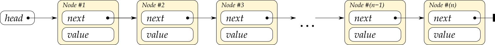
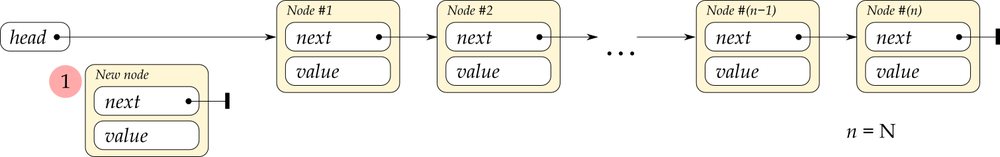
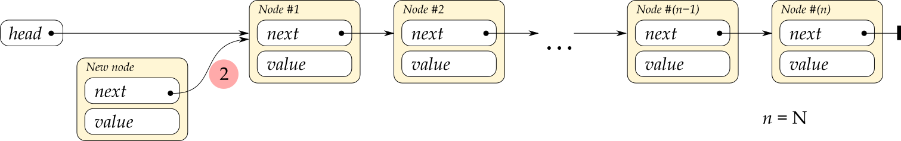
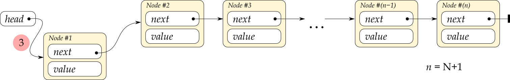
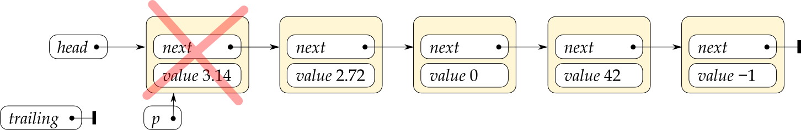
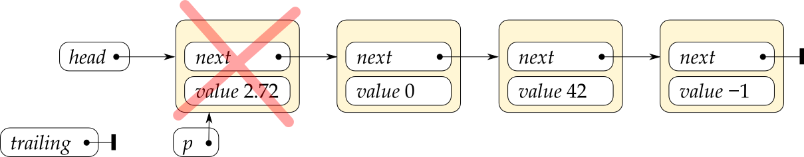
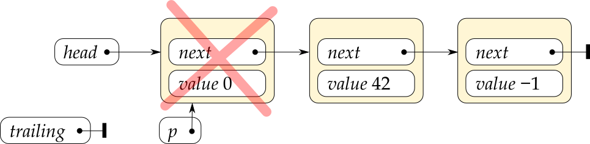
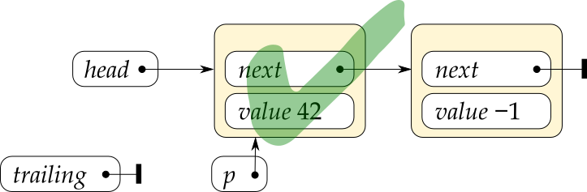
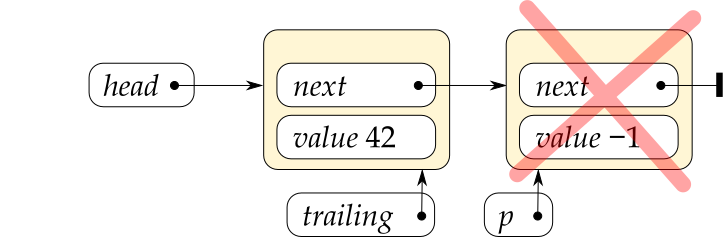
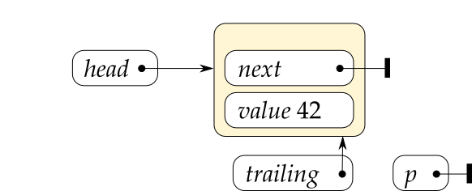

# A biggish C++17 linked lists tutorial

*This tutorial is in mid-writing, under construction. The large header at the top is added automatically by Github. Unfortunately, three suggested ways to get rid of it did not work.*

When you now learn about how to implement linked lists, remember that

* The C++ standard library has two linked list class templates, `std::list` and `std::forward_list` — there’s rarely any need to reinvent those wheels.
* And in most cases a `std::vector` is simpler, safer and more efficient than a linked list, even with a perfect list implementation, so the two mentioned classes are among the least used in the library.
* Do It Yourself™ linked list code is generally complex and error prone, a bug attractor, so a habit of implementing linked lists yourself would be a negative behaviour pattern like  procrastination, overspending, stereotyping, nail-biting and spending too much time watching television or (!) using a computer.

Wikipedia notes about the last point, that

> **”** The best time to correct a bad habit is immediately, before it becomes established. So, bad habits are best prevented from developing in childhood.

Unfortunately correcting the habit of implementing linked lists is difficult to do already in childhood, but one can try to not establish this habit in high school or college.

So why are your teachers insisting that you do this?

It’s mostly about *understanding* things, which is necessary for analysis and for choosing appropriate data structures, and gaining experience in actual *problem solving*, necessary for general software development. Since linked list code is complex, yet with effects that can be stated simply, it’s almost ideal for problem solving exercises. Then there's a little bit of *preparing* you for the possible but unlikely situation where a DIY linked list implementation is needed. As an example: inside an overload of `::operator new` (the global object allocation function in C++), if you should ever need to implement that, you would likely create an incorrect circular chain of calls if you used a list class from the standard library with defaulted template arguments. So, cases where DIY lists are required or convenient do exist, but are rare.

<!-- START doctoc generated TOC please keep comment here to allow auto update -->
<!-- DON'T EDIT THIS SECTION, INSTEAD RE-RUN doctoc TO UPDATE -->
**Table of Contents**  *generated with [DocToc](https://github.com/thlorenz/doctoc)*

- [1. What is a linked list?](#1-what-is-a-linked-list)
- [2. Use of a singly linked list type, `std::forward_list`.](#2-use-of-a-singly-linked-list-type-stdforward_list)
  - [2.1. Iterate with standard iterators.](#21-iterate-with-standard-iterators)
  - [2.2 Do something before the end in an iterator based traversal.](#22-do-something-before-the-end-in-an-iterator-based-traversal)
  - [2.3 Do something before the end in a range based `for` traversal.](#23-do-something-before-the-end-in-a-range-based-for-traversal)
  - [2.4 Insert and remove efficiently at the start of a list.](#24-insert-and-remove-efficiently-at-the-start-of-a-list)
  - [2.5 Reverse a list to get the desired order.](#25-reverse-a-list-to-get-the-desired-order)
  - [2.6 Keep a link to last node to append to a list in constant time.](#26-keep-a-link-to-last-node-to-append-to-a-list-in-constant-time)
  - [2.7. Keep a list sorted by inserting in sorted position.](#27-keep-a-list-sorted-by-inserting-in-sorted-position)
- [3 Basic linked lists with pointers.](#3-basic-linked-lists-with-pointers)
  - [3.1. Make pointers and referents `const` in a good way.](#31-make-pointers-and-referents-const-in-a-good-way)
  - [3.2 Use `new` and `delete` expressions to allocate and deallocate nodes.](#32-use-new-and-delete-expressions-to-allocate-and-deallocate-nodes)
  - [3.3 Define functions to link in and unlink nodes.](#33-define-functions-to-link-in-and-unlink-nodes)
  - [3.4 Keep a pointer to last node to append to a list in constant time.](#34-keep-a-pointer-to-last-node-to-append-to-a-list-in-constant-time)
  - [3.5 Do something before the end in a pointer based traversal (that’s easy).](#35-do-something-before-the-end-in-a-pointer-based-traversal-thats-easy)
  - [3.6 Insert in sorted position in a pointer based list.](#36-insert-in-sorted-position-in-a-pointer-based-list)
  - [3.7 Find and remove nodes in a pointer list.](#37-find-and-remove-nodes-in-a-pointer-list)
- [4. Sorting a singly linked list.](#4-sorting-a-singly-linked-list)
  - [4.1 Use the Corncob free list of >58 000 English words as data.](#41-use-the-corncob-free-list-of-58%C2%A0000-english-words-as-data)
  - [4.2. `Node` and `List` classes, and an `english_words_list()` function.](#42-node-and-list-classes-and-an-english_words_list-function)
  - [4.3. Randomize a list efficiently.](#43-randomize-a-list-efficiently)
  - [4.4. A function producing a random order linked list.](#44-a-function-producing-a-random-order-linked-list)
  - [4.5. Measure the execution time of merge shuffling.](#45-measure-the-execution-time-of-merge-shuffling)
  - [4.6. Digression: measure the time of fast code like array shuffling, also in Windows.](#46-digression-measure-the-time-of-fast-code-like-array-shuffling-also-in-windows)
  - [4.7. Merge-sort a list recursively.](#47-merge-sort-a-list-recursively)
  - [4.8. Time the recursive merge-sort.](#48-time-the-recursive-merge-sort)
  - [4.9. Merge-sort a list iteratively with “natural runs”.](#49-merge-sort-a-list-iteratively-with-natural-runs)
  - [4.9. Quicksort of a singly linked list ⇒ “Complex-sort”.](#49-quicksort-of-a-singly-linked-list-%E2%87%92-complex-sort)
- [5. Special techniques related to singly linked lists.](#5-special-techniques-related-to-singly-linked-lists)
  - [5.1. Use a free-list to speed up node allocations and deallocations.](#51-use-a-free-list-to-speed-up-node-allocations-and-deallocations)
  - [5.x. Maintain a pointer to last node in a safe way.](#5x-maintain-a-pointer-to-last-node-in-a-safe-way)
  - 
- [asd](#asd)

<!-- END doctoc generated TOC please keep comment here to allow auto update -->

## 1. What is a linked list?

With a **linked list** a sequence of *n* values is represented as a collection of objects where each object carries one of the values + a (common speech, not C++) reference to the object with the next value:

A linked list is the simplest case of a collection of objects that refer to each other. The objects are called **nodes**, and the logical references are **links** between the nodes. In C++ code the links can be pointers or indices or hash values or names, or even pairs of names, whatever serves best to identify the link relation.

For a simplest possible linked list representation such as shown above, the links are stored in the nodes, and because of that there is a link out from the last node even though there is no next node!

This *next* link in the last node is a **null-link**: a special pointer or index or name, whatever, that says “this link doesn’t refer to anything, stop here”. With pointers as links there is a strong convention to use nullpointers, C++ `nullptr`, as null-links. For other link representations there is no established convention.

You can **visit** the nodes in a list like the above in order, also called **traversing** the list, by starting with a link to the first node and just following the *next* links until you encounter the null-link in the last node:

[*<small>linked_list_idea.cpp</small>*](source/linked_list_idea.cpp)
~~~cpp
#include <iostream>
#include <map>
#include <string>
using std::cout, std::endl, std::map, std::string;

struct Node
{
    string  name_of_next;
    double  value;
};

auto main()
    -> int
{
    const string    null_link       = "";
    const string    name_of_head    = "pi";

    const map<string, Node> nodes =
    {
        {"pi",          {"e", 3.14 }},      // A node named "pi" that links to node "e".
        {"e",           {"zero", 2.72}},    // ...
        {"zero",        {"the_answer", 0}}, // ...
        {"the_answer",  {"-1", 42}},        // ...
        {"-1",          {null_link, -1}}    // The last node, that just has a null-link.
    };
    
    // Traverse the list & output the values:
    for(    string link = name_of_head;
            link != null_link;
            link = nodes.at( link ).name_of_next ) {
        cout << nodes.at( link ).value << endl;
    }
}
~~~

Result:

~~~txt
3.14
2.72
0
42
-1
~~~

This example uses an unnatural inefficient list representation with name strings as links, and the nodes stored in a `std::map`, to keep things simple. One nice property of names as links is that one can add a node that links to some other node, before that other node exists! With pointers as links a node must exist before it can be linked to, which can complicate things.

---

The term **head** for the first node in a list is standard. A little less clear-cut, the rest of the list is usually called the **tail** of the list. However, one often also speaks about the last single node as the list’s **tail node**, which some people shorten to just “tail”, so there is a possible ambiguity, some room for some misunderstanding.

---

In mathematics one can define a very similar concept in terms of functions. The crucial point of similarity is that one only has direct access to the front of a list, the first node in the list. One can just define a name for the empty list, e.g. **nil**, and a function that constructs a new list from a value *v* and an existing list *rest* (which can be nil), e.g. **cons**(*v*, *rest*). Getting at the head of a list is then easy by defining **head**(**cons**(*v*, *rest*)) = *v*. Getting the tail is also easy, math-wise: **tail**(**cons**(*v*, *rest*)) = *rest*.

Another math view of a linked list is as a simplest possible *directed graph* of *vertices* connected by *edges*.

Programming languages that are based on math concepts like old Lisp (functional) and Prolog (logic programming), and like newer Haskell, Ocaml, Erlang etc., generally use the head/tail view of lists. And it can be worth also knowing about the terminology employed in Lisp. From the names of processor registers used in machine code level programming on the  IBM 704 computer, in the late 1950s, the **head** function is called **`CAR`**, short for “contents of the address register”, and the **tail** function is called **`CDR`**, short for “contents of the decrement register”. The **cons** function is just called **`CONS`**, short for “construct”.

## 2. Use of a singly linked list type, `std::forward_list`.

I imagine it can be a good idea to learn how to drive a car before sitting down to design a car. Assuming that that’s true, then in the same way it can be a good idea to learn how to use a linked list before sitting down and implementing one’s own linked list. And for that, the simplest linked list in the C++ standard library is `std::forward_list`.

`std::forward_list` is called a “forward” list because it can only be traversed efficiently in one direction, the *forward* direction. That’s because there is only a single, one-way chain of *next* links to follow. This is what’s meant by a **singly linked list**.

The older `std::list` is a two-way linked list, a **doubly linked list**.

### 2.1. Iterate with standard iterators.

The nodes in a `forward_list` are not accessible or even at all visible. C++17 introduced some access to the nodes of associative containers like `std::map`, but not for the lists. And anyway the level of internal links between nodes, that you’d use to iterate through a simple DIY linked list, is not available.

A `forward_list` is instead designed to appear as just an ordinary standard library collection of values. For such a container one uses ordinary **iterators**, essentially small identifier values, to refer to “positions” in the container. Each “position” holds a value, which is all that one has access to.

The iterators are usually obtained from the methods `.begin()` and `.end()`:

[*<small>01_std_forward_list/traversing_a_std_forward_list.with_iterators.cpp</small>*](source/01_std_forward_list/traversing_a_std_forward_list.with_iterators.cpp)
~~~cpp
#include <forward_list>         // std::forward_list
#include <iostream>
using std::cout, std::endl, std::forward_list;

auto main()
    -> int
{
    const forward_list<double> list = {3.14, 2.72, 0, 42, -1};

    for( auto it = list.begin(); it != list.end(); ++it ) {
        cout << *it << " ";
    }
    cout << endl;
}
~~~

Output:

~~~txt
3.14 2.72 0 42 -1
~~~

Here the call to **`begin`** obtains an iterator that refers to the node (if there is one) that contains the first value in the list, and the call to **`end`** obtains an iterator that works as if it referred to a node after the last one actually in the list. The increment operation `++it` moves the iterator to the next node by following the internal *next*-link in the node, and the **dereferencing** `*it` produces a C++ reference to the value in the node that `it` refers to; the `*` “follows” the iterator into the node it refers to, so to speak. These various parts of the `for` loop code correspond directly to the parts in the earlier named nodes example.

| *In the above iterators-based example:* | *In the earlier named nodes example:* |
|--------------------|------------------------------|
| `auto it = list.begin()` | `string link = name_of_head` |
| `it != list.end()` | `link != null_link` |
| `++it` | `link = nodes.at(link).name_of_next` |

For this particular usage, since the list offers standard `begin` and `end` methods one can alternatively just use a range based `for` loop, which gives shorter and cleaner code:

[*<small>01_std_forward_list/traversing_a_std_forward_list.with_range_based_for.cpp</small>*](source/01_std_forward_list/traversing_a_std_forward_list.with_range_based_for.cpp)
~~~cpp
#include <forward_list>         // std::forward_list
#include <iostream>
using std::cout, std::endl, std::forward_list;

auto main()
    -> int
{
    const forward_list<double> list = {3.14, 2.72, 0, 42, -1};

    for( const double v: list ) {
        cout << v << " ";
    }
    cout << endl;
}
~~~

And there are more ways to do this, e.g. using the `std::copy` algorithm to copy to a `std::ostream_iterator`, but to my mind that would be much less clear than the range based `for` loop.

### 2.2 Do something before the end in an iterator based traversal.

Say you want the values in an arbitrary length list presented like this:

~~~txt
3.14, 2.72, 0, 42 and -1.
~~~

In order to output the “and” one must know that one’s traversal is currently at the next to last or last node (or value). This is not a problem with e.g. a `vector`, but `forward_list` is a hardcore minimal implementation of a linked list. It does not waste time and space on keeping a direct link to the last node, or for that matter, on keeping a count of nodes.

So, the only way to know that one is at the end of the list is to check whether the *next* iterator value compares equal to `.end()`. In effect one must look forward in the list 👀, from the current traversal point. Happily the standard library offers the **`std::next`** function that produces the value that `++`-incrementing an iterator variable would have produced:

[*<small>01_std_forward_list/comma_separated_values_of_a_std_forward_list.with_iterators.cpp</small>*](source/01_std_forward_list/comma_separated_values_of_a_std_forward_list.with_iterators.cpp)
~~~cpp
#include <forward_list>         // std::forward_list
#include <iostream>
#include <iterator>             // std::next
#include <string>               // std::string
using std::cout, std::endl, std::forward_list, std::next;

auto main()
    -> int
{
    const forward_list<double> list = {3.14, 2.72, 0, 42, -1};

    for( auto it = list.begin(); it != list.end(); ++it ) {
        if( it != list.begin() ) {
            // Not at the first node, so add text to separate the previous value.
            const bool is_at_last_node = (next( it ) == list.end());
            cout << (is_at_last_node? " and " : ", ");
        }
        cout << *it;
    }
    cout << "." << endl;
}
~~~

### 2.3 Do something before the end in a range based `for` traversal.

With a range based `for` traversal one doesn’t have an iterator to compare to `.end()`; one only has a reference to a value. And the C++ range based `for` doesn’t offer any mechanism for determining whether the current loop iteration is the last one, which arguably could be useful. In order to do the above “and” example program with a range based `for` one therefore needs some way to know that one is at the end of the list, some other way than checking against `.end()`.

Possibilities include:

* Copy the values to a more convenient container such as a `vector`.
* Generate the output fully or partially in e.g. a `string`, and adjust it after the loop.  
  This is like copying the values, only worse.
* Use a special **sentinel value** (of your choosing) at the end of the list.  
  This is just a possibility for the *general* problem of detecting the list end, e.g. for appending a node. It’s a technique worth knowing about but I see no way that it can help with the problem at hand.
* Let each loop iteration output the *previous* value. Output the very last value after the loop.
* Count the nodes first, and then maintain a running count during the traversal.

The first and second possibilities, copying of values or text, are kludgy and involve inefficient dynamic memory allocation, even if those allocations happen automatically behind the scenes. The third possibility, a sentinel value, is just not helpful for producing the “and” at the right time. The fourth possibility of one-iteration-deferred output is a bit complex, e.g. in the loop one must take care to not output the first value in the first iteration, and more.

So it’s natural to just count the nodes, and the standard library’s `distance` function can do that — since for a pure *forward iterator* it just applies `++` repeatedly to its first iterator until it reaches the second:

[*<small>01_std_forward_list/comma_separated_values_of_a_std_forward_list.with_range_based_for.cpp</small>*](source/01_std_forward_list/comma_separated_values_of_a_std_forward_list.with_range_based_for.cpp)
~~~cpp
#include <stddef.h>             // ptrdiff_t
using Size = ptrdiff_t;

#include <forward_list>         // std::forward_list
#include <iostream>
#include <iterator>             // std::distance
#include <string>               // std::string
using std::cout, std::endl, std::forward_list, std::distance;

auto main()
    -> int
{
    const forward_list<double> list = {3.14, 2.72, 0, 42, -1};

    const Size n_nodes = distance( list.begin(), list.end() );
    Size node_number = 0;
    for( const double value: list ) {
        ++node_number;
        if( node_number > 1 ) {
            // Not at the first node, so add text to separate the previous value.
            const bool is_at_last_node = (node_number == n_nodes);
            cout << (is_at_last_node? " and " : ", ");
        }
        cout << value;
    }
    cout << "." << endl;
}
~~~

Output, as before:

~~~txt
3.14, 2.72, 0, 42 and -1.
~~~

This is an example where the range based `for` is less efficient (because one needs to count the number of nodes first) and less convenient, and more verbose!, than using iterators directly. And that’s because it abstracts away the information that one needs, namely the iterator value for the current node. In return for that limitation the loop construct is clean and simple.

### 2.4 Insert and remove efficiently at the start of a list.

With a `vector` one can append an item in (amortized) **constant time** via `push_back`. It’s efficient because there are no items after it that would need to be moved in the vector’s internal array. Conversely, straightforward insertion at the front of a `vector` takes time roughly proportional to the number of items in the vector, **linear time**, because they all need to be moved.

In **big Oh** notation constant time and linear time is denoted by respectively **O(1)** and **O(*n*)**, where for vector insertion *n* is the number of items.

A `forward_list` has the opposite big Oh behavior of `vector`, or of an array in general. Insertion at the front, e.g. via `push_front`, is O(1), because it just involves a couple of adjustments of internal links, “linking in” the new node. Straightforward insertion at the end is O(*n*), because it involves traversing the whole list in order to *find* the end…

For both `vector` and `forward_list` one can do things in less straightforward ways so as to get O(1) insertion also at the other end. For `vector` it involves a technique called “cursor gap”, and for `forward_list` it involves maintaining an iterator to the last node. In both cases this reduces other functionality and adds complexity that is best wrapped up in a class.

Anyway, corresponding to the efficient O(1) list insertion via `push_front` you can remove the first node in constant time via `pop_front`, and you can inspect the first value via just `front`:

[*<small>01_std_forward_list/insert_and_remove_numbers.cpp</small>*](source/01_std_forward_list/insert_and_remove_numbers.cpp)
~~~cpp
#include <forward_list>
#include <iostream>
using std::forward_list, std::cout, std::endl;

auto main()
    -> int
{
    forward_list<int> list;
    cout << "Inserting..." << endl;
    for( int i = 1; i <= 12; ++i ) {
        list.push_front( i );
        cout << i << " ";
    }
    cout << endl;

    cout << endl;
    cout << "Removing..." << endl;
    while( not list.empty() ) {
        cout << list.front() << " ";
        list.pop_front();
    }
    cout << endl;
}
~~~

Output:

~~~txt
Inserting...
1 2 3 4 5 6 7 8 9 10 11 12

Removing...
12 11 10 9 8 7 6 5 4 3 2 1
~~~

The values **pop** out of the list in the opposite order that they were **push**ed onto the list. In other words, the first value into the list, here `1`, is the last value out. This is called **LIFO** (last in first out) behavior, or **stack** behavior, because it’s similar to how the last dinner plate placed on a stack of dinner plates, the one on top, is the first one to be removed. The terms “push” and “pop” refer to how one deals with a spring-loaded such stack, a *pushdown stack*, in a restaurant kitchen.

However, this close correspondence & big Oh efficiency doesn’t mean that a `forward_list` should be your first choice for an implementation of a stack. Use a `std::stack` instead. Or maybe a `std::vector`, for ease of inspecting the values in the stack. With a `vector` you just use `push_back` and `pop_back` instead of the list’s `push_front` and `pop_front`. And since a `vector` plays well with modern machine’s caching strategies it’s generally more efficient than the list.

### 2.5 Reverse a list to get the desired order.

The LIFO behavior of the efficient insert and remove operations like `push_front` and `pop_front`, means that it’s easy to reverse a list. Just pop all its nodes and push them onto another list, and when all is done, `move`-assign the result list back in O(1) time. However you don’t have to implement that, because there’s the `.reverse()` convenience method that does it for you, and it does it without any copying of values.

To avoid copying of values in your own implementation you’d have to use `.splice_after()` to move nodes, instead of `pop_front` and `push_front`.

For an example where a reversal is practically needed, consider generating a Collatz sequence of integers in a `forward_list`. If a number *x* is even then the next Collatz sequence number is *x*/2, and if it’s odd then the next Collatz sequence number is 3*x* + 1. The **Collatz conjecture** is that no matter which positive integer you start with, if you follow this system then you’ll always eventually end up at 1, and that’s so well tested and likely true that it can just be assumed:

[*<small>01_std_forward_list/collatz.list.iterative.cpp</small>*](source/01_std_forward_list/collatz.list.iterative.cpp)
~~~cpp
#include <assert.h>         // assert
#include <stdlib.h>         // EXIT_...

#include <forward_list>     // std::forward_list
#include <iostream>
#include <string>           // std::stoi
using std::forward_list, std::cout, std::cerr, std::endl, std::stoi;

auto is_even( const int x )
    -> bool
{ return x % 2 == 0; }

auto reversed_collatz_sequence( int x )
    -> forward_list<int>
{
    forward_list<int> result;
    for( ;; ) {
        result.push_front( x );
        if( x == 1 ) {
            return result;
        }
        x = (is_even( x )? x/2 : 3*x + 1);
    }
}

auto collatz_sequence( const int x )
    -> forward_list<int>
{
    forward_list<int> result = reversed_collatz_sequence( x );
    result.reverse();                       // Ta da! Correction!
    return result;
}

auto main( int n_command_parts, char** command_parts )
    -> int
{
    if( n_command_parts != 2 ) {
        cerr << "!Usage: " << command_parts[0] << " STARTING_NUMBER" << endl;
        return EXIT_FAILURE;
    }
    const int starting_number = stoi( command_parts[1] );
    assert( starting_number >= 1 );

    for( const int v: collatz_sequence( starting_number ) ) {
        if( v != starting_number ) {        // We trust mr. Collatz.
            cout << " -> ";
        }
        cout << v;
    }
    cout << "." << endl;
}
~~~

Example building and output (this is in Cmd in Windows 10):

~~~txt
[X:\source\std_forward_list]
> g++64 collatz.list.iterative.cpp

[X:\source\std_forward_list]
> a
!Usage: a STARTING_NUMBER

[X:\source\std_forward_list]
> for /L %c in (1, 1, 11) do @a %c
1.
2 -> 1.
3 -> 10 -> 5 -> 16 -> 8 -> 4 -> 2 -> 1.
4 -> 2 -> 1.
5 -> 16 -> 8 -> 4 -> 2 -> 1.
6 -> 3 -> 10 -> 5 -> 16 -> 8 -> 4 -> 2 -> 1.
7 -> 22 -> 11 -> 34 -> 17 -> 52 -> 26 -> 13 -> 40 -> 20 -> 10 -> 5 -> 16 -> 8 -> 4 -> 2 -> 1.
8 -> 4 -> 2 -> 1.
9 -> 28 -> 14 -> 7 -> 22 -> 11 -> 34 -> 17 -> 52 -> 26 -> 13 -> 40 -> 20 -> 10 -> 5 -> 16 -> 8 -> 4 -> 2 -> 1.
10 -> 5 -> 16 -> 8 -> 4 -> 2 -> 1.
11 -> 34 -> 17 -> 52 -> 26 -> 13 -> 40 -> 20 -> 10 -> 5 -> 16 -> 8 -> 4 -> 2 -> 1.
~~~

Doing this with a `vector` is simpler because it doesn’t need to be reversed, and it’s also likely more efficient. I find it almost impossibly hard to come up with an example where a `forward_list` would be a good choice in practical programming. As a means to learn about use of linked lists before implementing them, it is however very nice indeed.

### 2.6 Keep a link to last node to append to a list in constant time.

An alternative to reversing is to just add the values in the right order in the first place. For the Collatz sequence that means *appending* values to the end of the list. In order to do that with reasonable efficiency, namely O(1), one needs to keep an iterator to the last node and use the `.insert_after()` method.

For an empty list there is no last node yet, so in general, e.g. for your own DIY linked list implementation, this must be handled as a special case. However, `forward_list` offers the method `.before_begin()` which produces an iterator that works *as if* it refers to a node before the first one, a pseudo-node that pseudo-exists also for an empty list. With that one can just initialize the iterator to last node, to the one from `.before_begin()`.

The code now approaches — though it doesn’t quite reach — the simplicity of expressing this with `vector`:

[*<small>01_std_forward_list/collatz.list.iterative_appending.cpp</small>*](source/01_std_forward_list/collatz.list.iterative_appending.cpp)
~~~cpp
#include <assert.h>         // assert
#include <stdlib.h>         // EXIT_...

#include <forward_list>     // std::forward_list
#include <iostream>
#include <string>           // std::stoi
using std::forward_list, std::cout, std::cerr, std::endl, std::stoi;

auto is_even( const int x )
    -> bool
{ return x % 2 == 0; }

auto collatz_sequence( int x )
    -> forward_list<int>
{
    using Iterator = forward_list<int>::iterator;

    forward_list<int> result;
    Iterator          it_lastnode = result.before_begin();
    for( ;; ) {
        it_lastnode = result.insert_after( it_lastnode, x );        // Append.
        if( x == 1 ) {
            return result;
        }
        x = (is_even( x )? x/2 : 3*x + 1);
    }
}

auto main( int n_command_parts, char** command_parts )
    -> int
{
    if( n_command_parts != 2 ) {
        cerr << "!Usage: " << command_parts[0] << " STARTING_NUMBER" << endl;
        return EXIT_FAILURE;
    }
    const int starting_number = stoi( command_parts[1] );
    assert( starting_number >= 1 );

    for( const int v: collatz_sequence( starting_number ) ) {
        if( v != starting_number ) {        // We trust mr. Collatz.
            cout << " -> ";
        }
        cout << v;
    }
    cout << "." << endl;
}
~~~

Output as before.

Note that the iterator to last node is updated for every append. Otherwise after the first append it would be an iterator to the next to last node, and after that things would go haywire. The pattern `it = some_func( it, ... )` is very common.

### 2.7. Keep a list sorted by inserting in sorted position.

Inserting a value in a sorted position in a list has the problem that with a simple-minded search one doesn’t know that one has found the sorted position until one is one node past it… 

~~~cpp
using Iterator = forward_list<double>::iterator;

auto sorted_insert_position_for( const double value, forward_list<double>& list )
    -> Iterator
{
    for(    Iterator it = list.begin();
            it != list.end();
            ++it ) {
        if( *it >= value ) {
            // Dang, already one node too far! And can't go back. So, bye bye...
            terminate();
        }
    }
    // Double dang, again the search has overshot the desired location. Well.
    terminate();
}
~~~

A common solution is to use a link that lags one step behind the link used for the traversal. With pointers as links this is known as a **trailing pointer**, and I guess with a `forward_list` one can talk about a trailing iterator, and generally about a trailing link. Then when the one-node-too-far is found, the trailing iterator at this point correctly refers to the node whose internal *next* link should be adjusted to now refer to the new node.

~~~cpp
auto sorted_insert_position_for( const double value, forward_list<double>& list )
    -> Iterator
{
    Iterator trailing = list.before_begin();
    for(    Iterator it = list.begin();
            it != list.end() and *it < value;
            ++it ) {
        trailing = it;
    }
    return trailing;
}
~~~

Without a trailing link, as with the example of detecting the end of the list one must then effectively look forward in the list 👀. But unlike with detection of the end one must now also look *into* the next node, to check the value there. And this adds a further complication, an extra check, because at the end of the list there just is no next node to look into: trying to look into that non-existing node would yield Undefined Behavior.

~~~cpp
auto sorted_insert_position_for( const double value, forward_list<double>& list )
    -> Iterator
{
    Iterator it_next_node;
    for(    Iterator it = list.before_begin();
            ;
            it = it_next_node ) {
        it_next_node = next( it );
        if( it_next_node == list.end() or *it_next_node >= value ) {
            return it;
        }
    }
    // Execution will never reach this point.
}
~~~

The above implementation depends on the short-circuit behavior of the built-in C++ `or`, that the second operand is not evaluated if the first operand is `true`. More generally for both built-in `or` and `and`, the second operand isn’t evaluated if the first operand already determines the value of the expression, assuming that both operands would have produced some `bool` value. I.e., the assumption is that there is no program exit or hang in the evaluation of the second operand.

A complete program using the trailing link technique:

[*<small>std_forward_list/insert_sorted.using_trailing_link.cpp</small>*](source/std_forward_list/insert_sorted.using_trailing_link.cpp)
~~~cpp
#include <forward_list>         // std::forward_list
#include <initializer_list>     // Required for deduced type of brace initializer.
#include <iostream>
using std::cout, std::endl, std::forward_list;

using Iterator = forward_list<double>::iterator;

auto sorted_insert_position_for( const double value, forward_list<double>& list )
    -> Iterator
{
    Iterator trailing = list.before_begin();
    for(    Iterator it = list.begin();
            it != list.end() and *it < value;
            ++it ) {
        trailing = it;
    }
    return trailing;
}

auto main()
    -> int
{
    const auto data = {3.14, 2.72, 0., 42., -1.};
    forward_list<double> list;

    for( const double v: data ) {
        const Iterator insert_position = sorted_insert_position_for( v, list );
        list.insert_after( insert_position, v );
    }

    for( const double v: list ) {
        cout << v << " ";
    }
    cout << endl;
}
~~~

Output:

-1 0 2.72 3.14 42

For large data sets this is not a good idea since the time to insert a new value/item is proportional to the number of values/items that you already have, O(*n*), linear time. And if you use repeated sorted insertions to sort an entire existing list then you have O(*n*²), **quadratic time**. I discovered in high school, for a Basic program I made to keep track of radio amateur QSL cards, that quadratic time sorting *really* slows down things as the number of items increases. I’d used much time on developing this program that now turned out to be practically unusable, and there was also some prestige in it (I’d made it to help the radio amateurs at the school), so it was a lesson that stuck. If you need to sort a `forward_list` then use its `.sort()` method, and for your own DIY linked list use a merge sort.

Well, of course, if you have a sorted list and a new item, then O(*n*) inserting is preferable to O(*n* log *n*) full sorting.

There are an almost unbounded number of further linked list topics that could be discussed with `forward_list` examples. We haven’t even explored a majority of the `forward_list` methods, much less what they can be used for, and how. But with this it’s now time to get down to the nitty gritty of implementing your own linked list, which after all is what teachers tend to require students to do, and which probably is why you’re reading this.

## 3 Basic linked lists with pointers.

A C++ **pointer** is a memory address with some nice operations:

|*Operation:* | *Name:* | *Result:* |
|----------|------|--------|
| `&thing` | Address operator. | The address of `thing`, i.e. a pointer that refers to `thing`. There are more ways to obtain pointers. This is the basic way. |
| `*p` | Dereferencing. | Denotes the `thing` that `p` refers to when `p` is the value `&thing`. |
| `p->m` | — | Equivalent to `(*p).m`, but is often a more clear notation. |
| `p + 1`  | Increment. | If `p` refers to an array item, then `p + 1` refers to the next array item.
| `not p` | Implicit conversion to `bool`. | `not p` is the same as `p == nullptr`. Using `not` is just one example of a context where a `bool` is expected, causing an implicit conversion to `bool` of the pointer. In particular one may write just `if(p){`… |

The type of a pointer that refers to an `int` object is `int*`. More generally the type of a pointer that refers to an object of a type `T` is **`T*`**. And, crucially for use of pointers as links in nodes, because the size of a pointer itself is known to the compiler you can use the type `T*` even before `T` has been fully defined, at a point where `sizeof(T)` is not yet known:

[*<small>02_pointer_list/concrete_pointer_list.cpp</small>*](source/02_pointer_list/concrete_pointer_list.cpp)
~~~cpp
#include <iostream>
using std::cout, std::endl;

struct Node
{
    Node*   pointer_to_next;
    double  value;
};

auto main()
    -> int
{
    Node    minus1      = { nullptr, -1 };
    Node    the_answer  = { &minus1, 42 };
    Node    zero        = { &the_answer, 0 };
    Node    e           = { &zero, 2.72 };
    Node    pi          = { &e, 3.14 };
    
    Node* pointer_to_head = &pi;

    // Traverse the list & output the values:
    for(    Node* p = pointer_to_head;
            p != nullptr;
            p = p->pointer_to_next ) {
        cout << p->value << endl;
    }
}
~~~
 
 Output, as with the first name string based linked list example:

~~~txt
3.14
2.72
0
42
-1
~~~

### 3.1. Make pointers and referents `const` in a good way.

`const` introduces a constraint, fewer ways that values can change, so that it becomes easier to understand the code.

There is a cost: verbosity. But generally the consensus is that sprinkling `const` as liberally as possible throughout the code, is a Good Thing&trade;. The time lost to having to type and read a little bit more source code is generally more than paid for by time saved on not tracking down weird bugs and generally on not having to try very hard to understand the code.

The language’s basic systematic `const` notation is that a `const` is placed *to the right* of what it refers to. Naturally this is called **east `const`** notation (heads-up: it’s not my preferred notation). Applied to the concrete linked list example it can go like this:

[*<small>02_pointer_list/concrete_pointer_list.east_const.cpp</small>*](source/02_pointer_list/concrete_pointer_list.east_const.cpp)
~~~cpp
#include <iostream>
using std::cout, std::endl;

struct Node
{
    Node const* pointer_to_next;
    double      value;
};

auto main()
    -> int
{
    Node const  minus1      = { nullptr, -1 };
    Node const  the_answer  = { &minus1, 42 };
    Node const  zero        = { &the_answer, 0 };
    Node const  e           = { &zero, 2.72 };
    Node const  pi          = { &e, 3.14 };
    
    Node const* const pointer_to_head = &pi;

    // Traverse the list & output the values:
    for(    Node const* p = pointer_to_head;
            p != nullptr;
            p = p->pointer_to_next ) {
        cout << p->value << endl;
    }
}
~~~

---

There is a problem here.

With a `const` node such as `minus1`, taking the address as is done in the initializer for the immediately following `the_answer` node yields a `Node const*` pointer value, a pointer to `Node const`. This pointer value cannot be assigned to (or used to initialize) a `Node*` data member, because that would give a way to modify the referent, which was declared `const` to express a guarantee that it would not be modified. And so to be compatible with the pointer values one gets from taking the addresses of `const` node objects, the `Node::pointer_to_next` data member had to be declared as type `Node const*`.

But this means that when one traverses a list of such nodes, even nodes that were not originally `const`, all that one will get will be pointers to `Node const`. And those pointers can’t be used to modify the `value` in a node (or for that matter, adjusting the `pointer_to_next`). So, with reasonable direct use of pointers, without jumping through a kilometersize tangle of hoops, a given `Node` definition supports originally `const` nodes, or originally mutable nodes, but not both.

In practice one therefore chooses to let the node type support mutable nodes, i.e. that *next* pointer will be of type `Node*`, and address `const`-ness at ***some higher level of abstraction***. For example, a `forward_list` can be `const` and still usable. Internally in that list the nodes that one doesn't see but can infer must exist, are probably like nodes with `Node*` *next*-pointers.

With a higher level abstraction like that it’s important to not let access to nodes and their *next* pointers escape out, otherwise one risks that some code will use that access to modify an originally `const` object, which is Undefined Behavior:

[*<small>02_pointer_list/concrete_pointer_list.east_const.ub_with_mutable_nodes.cpp</small>*](source/02_pointer_list/concrete_pointer_list.east_const.ub_with_mutable_nodes.cpp)
~~~cpp
#include <iostream>
using std::cout, std::endl;

struct Node
{
    Node*       pointer_to_next;
    double      value;
};

auto main()
    -> int
{
    struct List
    {
        Node minus1      = { nullptr, -1 };
        Node the_answer  = { &minus1, 42 };
        Node zero        = { &the_answer, 0 };
        Node e           = { &zero, 2.72 };
        Node pi          = { &e, 3.14 };
        
        auto pointer_to_head() const
            -> Node const*
        { return &pi; }
    };
    
    List const list = {};

    // Traverse the list & output the values:
    for(    Node const* p = list.pointer_to_head();
            p != nullptr;
            p = p->pointer_to_next ) {
        cout << p->value << endl;
    }
    
    Node* const pointer_to_e = list.pi.pointer_to_next;
    pointer_to_e->value = 6.28;     // Oops, UB for modifying originally `const` object.
    cout << endl;
    cout << "The value of e is " << list.e.value << ", possibly." << endl;
}
~~~

Both compilers I tried this with, Visual C++ 2019 and MinGW g++ 9.2, produced the following output:

~~~txt
3.14
2.72
0
42
-1

The value of e is 6.28, possibly.
~~~

But there’s just no guarantee. If the compiler is smart in the wrong way it may note that it “knows” that `list.e.value` is `2.72`, because after all `list` is an originally `const` object that can’t change, and then as an optimization it might use that value in the final output statement. Or, it might note that there is UB and optimize away all effects of the program, say.

Just to summarize the problem:

* At initialization time for the `list` a pointer to non-`const`, namely a `Node*` pointer, was initialized to point to an at that time mutable object, namely `list.e`.
* The pointer was allowed to be accessible from outside the abstraction `List`: it escaped out!
* It was then used to modify the now originally (after initialization) `const` object, causing Undefined Behavior.

Possible solutions, ways to completely hide the nodes and their *next* pointers while giving access to the values, include

* The abstraction can provide iterators, like `forward_list` does.
* The abstraction can provide an internal iteration state.
* The abstraction can provide a way to call a specified function for each value.

Iterators are not very complex but they involve much boilerplate code, and in order to conform to the requirements on standard iterators one must get a lot of details right. An internal iteration state can be simple but it precludes having a `const` object, which throws out the baby with the bath water. So, below is one way to have a specified function called for each value in the list:

[*<small>02_pointer_list/concrete_pointer_list.east_const.mutable_nodes_hidden_via_callback.cpp</small>*](source/02_pointer_list/concrete_pointer_list.east_const.mutable_nodes_hidden_via_callback.cpp)
~~~cpp
#include <iostream>
using std::cout, std::endl;

struct Node
{
    Node*       pointer_to_next;
    double      value;
};

class List
{
    Node minus1      = { nullptr, -1 };
    Node the_answer  = { &minus1, 42 };
    Node zero        = { &the_answer, 0 };
    Node e           = { &zero, 2.72 };
    Node pi          = { &e, 3.14 };
    
public:
    template< class Func >
    void for_each_value( Func const& f ) const
    {
        for( Node const* p = &pi; p != nullptr; p = p->pointer_to_next ) {
            f( p->value );
        }
    }
};

auto main()
    -> int
{
    List const list = {};

    // Traverse the list & output the values:
    list.for_each_value( [&](double v){ cout << v << endl; } );
}
~~~

Here the construct

    [&](double v){ cout << v << endl; }

… is a **lambda expression**, a way to define a function locally within an expression in the code. The `&` in the lambda designator `[&]` says that this lambda references things outside itself, namely `cout` and `endl`, and we say that it **captures** those things by reference. This is a **callback** function since it's “called back” by the `List::for_each_value` function. The list is like, “don’t call me, I’ll call you”. Instead of the lambda I could have defined an ordinary named function to use as callback.

There is no way here for the `List`-using code to modify the `const` object.

For example, if the lambda is changed to take a reference-to-non-`const` argument,

    [&](double& v){ v = 6.28; }

… then the `for_each_value` code simply doesn’t compile, so it’s a safe technique.

---

My preferred notation is **west `const`**, with the `const` always to the left of what it refers to.

This notation is possible because C++ supports it for the leftmost type in a declaration, *as a special case*. For example, the declaration `char const* p;` can be written as `const char* p;`. Similarly, `Node const* p` in the above code can be written as `const Node* p`.

You can’t rewrite something like `char const* const s = "Hi!";`  as a west `const` declaration like `const (const char*) s = "Hi!";`, because C++ doesn’t support parentheses in type expressions. The only built-in support for general substitution in type expressions is to name the parts with `typedef` or `using`. But to be able to use west `const` for any declaration without naming parts of the declaration, you can define a single line of support,

~~~cpp
template< class T > using Type_ = T;
~~~

… where then `Type_<`*some-type-expression*`>` is the same as, if C++ had allowed parentheses, `(`*some-type-expression*`)`.

For example, something like `char const* const s = "Hi!";` can then be written in west `const` style as `const Type_<const char*> s = "Hi!";`. And as an added bonus declarations where the language’s special case rule allows west `const` already, like the declaration `const Node* p`, can then be written like `Type_<const Node>* p` where it’s slightly more clear that `p` itself isn’t `const` (because the `*` more clearly applies to the whole `Type_<const Node>`). However, I generally don’t do that because to people who generally use west `const`, type expressions like `const Node*` are clear enough already — much like the meaning of `double` as a floating point number is clear to those who are *familiar* with it.

As far as I know the `Type_` support, modulo the name, was first proposed by Johannes “litb” Schaub.

The type substitution support is not technically required to express this section’s example program with west `const`, but applying it for clarity it can go like this:

[*<small>util/Type_.hpp</small>*](source/util/Type_.hpp)
~~~cpp
#pragma once

namespace util{
    template< class T > using Type_ = T;
}  // namespace util
~~~

[*<small>02_pointer_list/concrete_pointer_list.west_const.mutable_nodes_hidden_via_callback.cpp</small>*](source/02_pointer_list/concrete_pointer_list.west_const.mutable_nodes_hidden_via_callback.cpp)
~~~cpp
#include "../util/Type_.hpp"
using util::Type_;

#include <iostream>
using std::cout, std::endl;

struct Node
{
    Node*       pointer_to_next;
    double      value;
};

class List
{
    Node minus1      = { nullptr, -1 };
    Node the_answer  = { &minus1, 42 };
    Node zero        = { &the_answer, 0 };
    Node e           = { &zero, 2.72 };
    Node pi          = { &e, 3.14 };
    
public:
    template< class Func >
    void for_each_value( const Func& f ) const
    {
        for( Type_<const Node>* p = &pi; p != nullptr; p = p->pointer_to_next ) {
            f( p->value );
        }
    }
};

auto main()
    -> int
{
    const List list = {};

    // Traverse the list & output the values:
    list.for_each_value( [&](double v){ cout << v << endl; } );
}
~~~

### 3.2 Use `new` and `delete` expressions to allocate and deallocate nodes.

With a successful **dynamic allocation** you get a pointer to a new object somewhere in memory. That object will persist even if the code manages to forget the pointer, and after function returns, which makes it ideal as a node in a linked list. To avoid such objects accumulating and using up all available memory they should be **deallocated** when they’re no longer needed, in a way that corresponds to the dynamic allocation.

---

In C++ dynamic allocation is strongly tied to initialization, via a **`new`-expression** that allocates memory and calls a specified constructor to create an object of your specified type *T*, in the allocated memory chunk. Conversely, deallocation is strongly tied to cleanup, via a **`delete`-expression** that calls the object’s *T* destructor and deallocates the memory. In the possible case where the object’s constructor signals failure by throwing an exception the `new`-expression temporarily catches the exception, calls destructors on all successfully initialized sub-objects (since the top level object is not successfully initialized its *T* destructor, which tends to assume that, is not called), deallocates the memory, and re-throws the exception — so that you get an **all-or-nothing** effect where either you get a new successfully initialized object, or else you just get an exception.

Example showing that an object dynamically allocated by one function can be deallocated in another function:

[*<small>02_pointer_list/new_and_delete.cpp</small>*](source/02_pointer_list/new_and_delete.cpp)
~~~cpp
#include "../util/Type_.hpp"
using util::Type_;

#include <iostream>
using std::clog, std::endl;

void trace( const Type_<const char*> s ) { clog << s << endl; }

struct Noisy_object
{
    Noisy_object()
    {
        trace( "--> Object created." );
    }
    
    ~Noisy_object()
    {
        trace( "--> Object destroyed." );
    }
};

auto foo()
    -> Noisy_object*
{
    trace( "In function `foo`, executing a `new`-expression." );
    return new Noisy_object;
}

void bar( const Type_<Noisy_object*> p )
{
    trace( "In function `bar`, executing a `delete`-expression." );
    delete p;
}

auto main()
    -> int
{
    trace( "In `main`." );

    const Type_<Noisy_object*> p = foo();
    trace( "Back in `main` again." );

    bar( p );
    trace( "Back in `main` again." );
    trace( "Finished! :)" );
}
~~~

Output:

~~~txt
In `main`.
In function `foo`, executing a `new`-expression.
--> Object created.
Back in `main` again.
In function `bar`, executing a `delete`-expression.
--> Object destroyed.
Back in `main` again.
Finished! :)
~~~

---

Direct use of `new` and `delete` expressions like above, is necessary for implementing linked data structures like linked lists. But it’s extraordinarily easy to get this wrong. For example, it’s easy to inadvertently `delete` the same object twice, which is UB, or to forget to `delete` it, which then causes a **memory leak**.

Therefore, for purposes other than linked data structures, first and foremost consider safe standard library containers like `std::vector`.

And if the containers don’t cut it, consider pointer wrapper classes such as the standard library’s `std::unique_ptr` and `std::smart_ptr`, which *automate* the deallocations. These are called **smart pointers**. They’re not very smart at all, but because of the automation they are generally much safer than the core language’s **raw pointers** used above.

| *Rank*: | *Kind of solution:* |
|---------|---------------------|
| Best and safest. | Standard library containers like `std::vector` and `std::string`. |
| So so. | Smart pointers like `std::unique_ptr` and `std::shared_ptr`. |
| Risky, dubious code. | Raw pointers and `new` and `delete` expressions. |

Except, importantly: *don't* use smart pointers as links in linked data structures.

Because if you do then you risk automated recursive destructor calls all the way through the data structure, which can easily cause UB via a **stack overflow**, which you absolutely don’t want.

### 3.3 Define functions to link in and unlink nodes.

A nice thing about dynamic allocation is that the individual objects don’t need corresponding top level named pointer variables. For example, with a linked list one only needs a pointer variable that designates the head node. The other nodes are found by following the *next* pointers in the nodes.

Adding a new node at the start of the list then consists of just

1. Allocate & initialize the node.  

2. Set its *next* pointer to point to the current head node.  

3. Set the head node pointer to point to the new node.  

Removing the head node is just opposite, so:

[*<small>02_pointer_list/insert_and_remove_numbers.in_pointer_list.cpp</small>*](source/02_pointer_list/insert_and_remove_numbers.in_pointer_list.cpp)
~~~cpp
#include "../util/Type_.hpp"
using util::Type_;

#include <iostream>
using std::cout, std::endl;

struct Node
{
    Node*   next;
    int     value;
};

auto main()
    -> int
{
    Node* head = nullptr;
    cout << "Inserting..." << endl;
    for( int i = 1; i <= 12; ++i ) {
        const Type_<Node*> new_node = new Node{ nullptr, i };
        new_node->next = head;
        head = new_node;
        cout << i << " ";
    }
    cout << endl;

    cout << endl;
    cout << "Removing..." << endl;
    while( head != nullptr ) {
        cout << head->value << " ";
        const Type_<Node*> doomed_node = head;
        head = head->next;
        delete doomed_node;
    }
    cout << endl;
}
~~~

Output:

~~~txt
Inserting...
1 2 3 4 5 6 7 8 9 10 11 12

Removing...
12 11 10 9 8 7 6 5 4 3 2 1
~~~

---

As a matter of C++ coding, the two first statements in

~~~cpp
    const Type_<Node*> new_node = new Node{ nullptr, i };
    new_node->next = head;
    head = new_node;
~~~

… can be reduced to a single statement, as in

~~~cpp
    const Type_<Node*> new_node = new Node{ head, i };
    head = new_node;
~~~

… and here the `new_node` variable serves no purpose, so this can in turn be reduced to just

~~~cpp
    head = new Node{ head, i };
~~~

So, that’s the basic insert-a-new-node-at-the-start-of-the-list code. It’s short enough that one may tend to just write it directly wherever it’s needed. Hopefully the experienced C++ programmers that read this won’t have experienced a heart attack or something before getting to this point of more natural short code instead of pedagogical 1, 2, 3 code.

---

Even though the insertion code snippet is very short, as far as I know the corresponding code for node removal can’t be reduced that way.

So, for the teaching examples I prefer (and also if I had occasion to *actually* implement a linked list I would prefer) to define functions for insertion and removal. These functions operate on the *next* fields, and they’re only concerned with **linking** and **unlinking**, the links manipulation. Where a node to link in comes from, e.g. from a `new`-expression or another list, and what will happen to an unlinked node, e.g. destroyed or moved to another list, is of no concern to these functions.

Ideally, to prevent these functions from being inadvertently applied to pointer variables other than *next* fields and *head* pointers, the *next* fields and *head* pointer should be a distinct type, some kind of trivial pointer wrapper. Counting against that idea is the fact that I’ve never inadvertently misapplied the functions, so at least for me there would be no significant advantage; a case of [YAGNI](https://en.wikipedia.org/wiki/You_aren%27t_gonna_need_it). Plus the distinct type would be more code and abstraction, i.e. less simple and clear, so:

[*<small>02_pointer_list/link_and_unlink_functions.cpp</small>*](source/02_pointer_list/link_and_unlink_functions.cpp)
~~~cpp
#include <iostream>
using std::cout, std::endl;

struct Node
{
    Node*   next;
    int     value;

    void link_in_before( Node*& a_next_field )
    {
        next = a_next_field;
        a_next_field = this;
    }
    
    friend auto unlinked( Node*& a_next_field )
        -> Node*
    {
        const auto result = a_next_field;
        a_next_field = result->next;
        return result;
    }
};

auto main()
    -> int
{
    Node* head = nullptr;
    cout << "Inserting..." << endl;
    for( int i = 1; i <= 12; ++i ) {
        (new Node{ nullptr, i })->link_in_before( head );
        cout << i << " ";
    }
    cout << endl;

    cout << endl;
    cout << "Removing..." << endl;
    while( head != nullptr ) {
        cout << head->value << " ";
        delete unlinked( head );
    }
    cout << endl;
}
~~~

Output, as before:

~~~txt
Inserting...
1 2 3 4 5 6 7 8 9 10 11 12

Removing...
12 11 10 9 8 7 6 5 4 3 2 1
~~~

The naming here may at first seem odd, `link_in_before` versus (which does just about the same) `forward_list::insert_after`. That's because `insert_after` reads as inserting *after* a specified node, while `link_in_before` reads as linking a new node in *before* the node that a specified *next* field points to. The naming is all about how the calling code reads, and e.g. the call in this program, `link_in_before(head)`, is self-explanatory.

### 3.4 Keep a pointer to last node to append to a list in constant time.

As with the `forward_list`, to append in a reasonably efficient way, namely O(1) time, you can keep a link to the last node.

With a pointer based list that link is naturally a pointer.

For a list abstraction one may choose to maintain a last node pointer along with the node list. `forward_list` doesn’t, because it’s easy to add on top but impossible to remove, and also because it would constrain the operation set. Without any abstraction one will typically just temporarily maintain a last node pointer during a sequence of append operations.

[*<small>02_pointer_list/list_copy_of_the_five_important_numbers.hpp</small>*](source/02_pointer_list/list_copy_of_the_five_important_numbers.hpp)
~~~cpp
#pragma once
#include "Node.hpp"
#include "../util/Type_.hpp"
#include <initializer_list>         // Required for deduced type of brace initializer.

inline auto list_copy_of_the_five_important_numbers()
    -> Node*
{
    using util::Type_;

    Node*   head    = nullptr;
    Node*   last    = nullptr;
    for( const double v: {3.14, 2.72, 0., 42., -1.} ) {
        const Type_<Node*> new_node = new Node{ nullptr, v };
        if( head == nullptr ) {
            head = new_node;
        } else {
            new_node->link_in_before( last->next );
        }
        last = new_node;
    }
    return head;
}
~~~

This code may possibly be like those math proofs that are so short that they fly by without one realizing that anything has been proved. So, an explanation just to provide a stop-and-think-about-it-a-little opportunity. Appending a new node involves two steps:

1. linking it in at the end of the list, and  
2. updating the `last` pointer to point to that new last node.

For an empty list the end of the list is the front, so then the linking step involves just updating `head` to point at the new node.

Otherwise one uses the `last` pointer, more precisely `last->next`, for the linking.

Here `Node` is defined very similarly to the `Node` of the previous section:

[*<small>02_pointer_list/Node.hpp</small>*](source/02_pointer_list/Node.hpp)
~~~cpp
#pragma once
#include "../util/Type_.hpp"
#include "../util/value.hpp"    // Workaround for MSVC 2019: express `+p` as `value(p)`.

struct Node
{
    Node*   next;
    double  value;

    void link_in_before( Node*& a_next_field ) noexcept
    {
        next = a_next_field;
        a_next_field = this;
    }
    
    friend auto unlinked( Node*& a_next_field ) noexcept
        -> Node*
    {
        using util::Type_;

        const Type_<Node*> result = a_next_field;
        a_next_field = result->next;
        return result;
    }
    
    friend void delete_list_and_zero( Node*& head ) noexcept
    {
        while( head ) { delete unlinked( head ); }
    }

    friend void delete_list( Node*&& temp ) noexcept
    {
        delete_list_and_zero( temp );
    }
};
~~~

Originally I let `delete_list` just take its argument (the head pointer) by value, which had the desirable property of allowing values such as function results, as argument. However, this then clashed with my own later expectation that it should zero out a variable passed as argument. So the two cases of pointer variable and pointer value argument are now separated on the principle that generally explicit = good, implicit = bad.

But that means that in order to call `delete_list` one needs a non-`const` temporary  `Node*` object that the function can null out. In standard C++, given a pointer variable `p` one way to get that temporary object is to compute it as `0 + p`, or in short just `+p`. However, Visual C++ 2019 has a bug where it gives that temporary type `Node* const`…

That’s why the above includes the `"../util/value.hpp"` header, which defines a function `value` that one can use instead of just `+` or `0+`:

[*<small>util/value.hpp</small>*](source/util/value.hpp)
~~~cpp
#pragma once
// Workaround for Visual C++ 2019 bug, reported at
// <url: https://developercommunity.visualstudio.com/content/problem/942090/index.html>
//
// With MSVC 2019, `+v` or `0+v` is an rvalue expression with same `const`-ness as `v`.
// To support that compiler, instead of `+v` or `0+v` write `value( v )`.

namespace util {

    template< class T >
    inline auto value( const T& v )
        -> T
    { return v; }

}  // namespace util
~~~

And with that, a program that displays the numbers list:

[*<small>02_pointer_list/five_numbers_as_pointer_list.cpp</small>*](source/02_pointer_list/five_numbers_as_pointer_list.cpp)
~~~cpp
#include "list_copy_of_the_five_important_numbers.hpp"
using util::Type_, util::value;

#include <iostream>
using std::cout, std::endl;

auto main()
    -> int
{
    const Type_<Node*> head = list_copy_of_the_five_important_numbers();

    for( Node* p = head; p != nullptr; p = p->next ) {
        cout << p->value << endl;
    }

    delete_list( value( head ) );
}
~~~

Output:

~~~txt
3.14
2.72
0
42
-1
~~~

For an ordinary desktop system or better it’s not technically necessary to `delete` all the nodes at the end. The operating system, e.g. Mac OS, Linux or Windows, will reclaim the memory automatically when the process terminates. It will also close any open file handles and will in general do a fair general clean-up, and as long as that automatic clean-up covers what the program needs clean-up for (e.g. it doesn't cover removing temporary files) one can technically just rely on it.

However, when you debug a program or run some other diagnostic tool such as Valgrind, the tool may complain about memory leaks if the program doesn’t itself clean up everything.

And then you might waste time chasing a non-existing bug, so, better clean up; hence the `delete_list` function here.

### 3.5 Do something before the end in a pointer based traversal (that’s easy).

From the `forward_list` discussion recall the “do something before the end” problem of presenting output like

~~~txt
3.14, 2.72, 0, 42 and -1.
~~~

With iterators that give access only to the values, detecting the end of the list to output that “and” was difficult. To make that logic reasonably simple we had to use the iterator-to-pseudo-node `.before_begin()`. This supported no-special-case code that looked forward in the list 👀.

But with pointers to nodes the last node’s *next* pointer can be seen and is a `nullptr`, so it’s easy to detect the last node *without looking forward*:

[*<small>02_pointer_list/comma_separated_values_of_a_pointer_list.cpp</small>*](source/02_pointer_list/comma_separated_values_of_a_pointer_list.cpp)
~~~cpp
#include "list_copy_of_the_five_important_numbers.hpp"
using util::Type_, util::value;

#include <iostream>
using std::cout, std::endl;

auto main()
    -> int
{
    const Type_<Node*> head = list_copy_of_the_five_important_numbers();

    for( Node* p = head; p != nullptr; p = p->next ) {
        if( p != head ) {
            // Not at the first node, so add text to separate the previous value.
            const bool is_at_last_node = (p->next == nullptr);
            cout << (is_at_last_node? " and " : ", ");
        }
        cout << p->value;
    }
    cout << "." << endl;

    delete_list( value( head ) );
}
~~~

### 3.6 Insert in sorted position in a pointer based list.

For `std::forward_list` it was easy to choose a return type for the function to find a sorted insertion position. It’s a design with only one choice for position id’s, namely iterators. One might therefore think that a corresponding function for a pointer based list should return a pointer to a node.

After all, pointers are what corresponds to the iterators?

But with a list with *n* nodes there are *n* + 1 possible insert positions, and only *n* possible pointer to node values.

The function *could* return a `nullptr` to signal insertion at the front, but that would complicate the calling code.

One neat alternative is to instead return a reference to the *next* field that the calling code needs to modify, where the *head* pointer is regarded as a *next* field (this brings the number of *next* fields up to *n* + 1, just sufficient!):

[*<small>02_pointer_list/insert_sorted.using_trailing_pointer.cpp</small>*](source/02_pointer_list/insert_sorted.using_trailing_pointer.cpp)
~~~cpp
#include "Node.hpp"

#include <initializer_list>     // Required for deduced type of brace initializer.
#include <iostream>
using std::cout, std::endl;

auto find_position( const double new_value, Node*& list_head )
    -> Node*&
{
    Node* trailing = nullptr;
    for(    Node* p = list_head; 
            p != nullptr and p->value < new_value;
            p = p->next ) {
        trailing = p;
    }
    return (trailing == nullptr? list_head : trailing->next);
}

auto main()
    -> int
{
    const auto data = {3.14, 2.72, 0., 42., -1.};
    Node* head = nullptr;

    // Insert the data sorted.
    for( const double v: data ) {
        Node*& next = find_position( v, head );
        (new Node{ nullptr, v})->link_in_before( next );
    }

    // Display the list.
    for( Node*p = head; p != nullptr; p = p->next ) {
        cout << p->value << " ";
    }
    cout << endl;

    // Clean up, just to be nice.
    delete_list_and_zero( head );
}
~~~

Output:

~~~txt
-1 0 2.72 3.14 42
~~~

It is perhaps worth noting that in C, which doesn’t have references, this technique would be expressed with a pointer to pointer instead of reference to pointer.

And this is one case where such a pointer to pointer is a pointer that refers to a single pointer object, and not to an item in an array of pointers such as the `argv` argument of `main`.

### 3.7 Find and remove nodes in a pointer list.

  

  

  

  

  

  

[*<small>02_pointer_list/remove_specified_nodes.cpp</small>*](source/02_pointer_list/remove_specified_nodes.cpp)
~~~cpp
#include "list_copy_of_the_five_important_numbers.hpp"
using util::Type_;

#include <iostream>
using std::cout, std::endl;

void display( const Type_<const char*> explanation, const Type_<Node*> head )
{
    cout << explanation;
    for( Node* p = head; p != nullptr; p = p->next ) {
        cout << " " << p->value;
    }
    cout << "." << endl;
}

auto main()
    -> int
{
    Node* head = list_copy_of_the_five_important_numbers();
    display( "Original values:", head );

    // Delete all nodes that are not 42, in a way that's O(n) efficient for a large list.
    cout << "O(n)-deleting the too math-ish numbers..." << endl;

    Node*   p           = head;
    Node*   trailing    = nullptr;
    while( p != nullptr ) {
        if( p->value != 42 ) {
            Node*& next_field = (trailing == nullptr? head : trailing->next);
            delete unlinked( next_field );
            p = next_field;
        } else {
            trailing = p;  p = p->next;
        }
    }

    display( "The list is now", head );
    delete_list_and_zero( head );
}
~~~

Output:

~~~txt
Original values: 3.14 2.72 0 42 -1.
O(n)-deleting the too math-ish numbers...
The list is now 42.
~~~

Worth mentioning in passing, *if there guaranteed is a next node*, plus no other node pointers that need to be kept valid, then if you have a pointer directly to a node in a singly linked list you can effectively delete that node’s value from the sequence of values, in O(1) time, by copying the next node’s value here and deleting the next node. As I recall I learned this trick from an exercise in Donald Knuth’s classic “The Art of Computer Programming”.

---

The above code can’t easily be used for other purposes, in other programs, without wholescale modification. Deleting a node is so drastic a thing to do that it affects the code around this operation. For example, in the above code it invalidates the `p` pointer, which then points to a deleted node, a **dangling pointer**, so that to avoid UB it has to be reassigned, `p = next_field;`.

However, instead of a having a search loop that traverses the list node by node, where the loop body deletes a node, one can have a loop where each iteration advances “directly” to the next node to delete, by calling a search function to find that next node. Well, the search function will chase pointers through the list just like the above code does. But with this refactoring the searching part will be **reusable**, code that you can lift right out and use for some different purpose.

For a simple `nullptr`-terminated list the search function can support idiomatic `while(`*side-effect-based-advance*`)` usage code by returning a reference to the last *next* field in the list when it fails. Note that this relies on the C++ support for references. You can’t do the same in C, which is probably why I didn’t see it — I was *thinking in C* for the pointer stuff, learnings from the 1980’s — in my first sketch of this section.

[*<small>02_pointer_list/remove_specified_nodes.using_a_search_function.cpp</small>*](source/02_pointer_list/remove_specified_nodes.using_a_search_function.cpp)
~~~cpp
#include "list_copy_of_the_five_important_numbers.hpp"
using util::Type_;

#include <iostream>
using std::cout, std::endl;

void display( const Type_<const char*> explanation, const Type_<Node*> head )
{
    cout << explanation;
    for( Node* p = head; p != nullptr; p = p->next ) {
        cout << " " << p->value;
    }
    cout << "." << endl;
}

template< class Func >
auto find( const Func& is_target, Node*& head )
    -> Node*&           // Reference to the next-field of the previous node.
{
    Node*   trailing    = nullptr;
    Node*   p           = head;
    for( ;; ) {
        if( p == nullptr or is_target( p->value ) ) {
            return (trailing == nullptr? head : trailing->next);
        }
        trailing = p;  p = p->next;
    }
    // The execution will never get here.
}

auto find_not_42( Node*& head )
    -> Node*&
{ return find( { return x != 42; }, head ); }

auto main()
    -> int
{
    Node* head = list_copy_of_the_five_important_numbers();
    display( "Original values:", head );

    // Delete all nodes that are not 42, in a way that's O(n) efficient for a large list.
    cout << "O(n)-deleting the too math-ish numbers..." << endl;

    Node** p_sublist_head = &head;
    while( Node*& next_field = find_not_42( *p_sublist_head ) ) {
        delete unlinked( next_field );
        p_sublist_head = &next_field;
    }

    display( "The list is now", head );
    delete_list_and_zero( head );
}
~~~

Output, as before,

~~~txt
Original values: 3.14 2.72 0 42 -1.
O(n)-deleting the too math-ish numbers...
The list is now 42.
~~~

---

Further possible refactoring: the unlinking of a set of nodes to delete can be factored out as a separate function. Namely, one can define a function that returns a list of unlinked nodes. From an engineering perspektive this is at the point of (too) diminishing returns, but from a learning perspective it can be useful to have seen an example of just efficiently *moving nodes* from one list to another.

The concept of efficiently moving nodes is what `std::forward_list::splice_after` is all about. And with the C++ standard library it’s just about the only reason to use a linked list. The other things you can do with a `forward_list` are generally both easier and more efficient with `vector`.

The following implementation uses the operations `link_in_before`, `unlinked` and `delete_list` defined earlier in [the `Node` class](source/pointer_list/Node.hpp):

[*<small>02_pointer_list/remove_specified_nodes.using_a_transfer_function.cpp</small>*](source/02_pointer_list/remove_specified_nodes.using_a_transfer_function.cpp)
~~~cpp
#include "list_copy_of_the_five_important_numbers.hpp"
using util::Type_;

#include <iostream>
using std::cout, std::endl;

void display( const Type_<const char*> explanation, const Type_<Node*> head )
{
    cout << explanation;
    for( Node* p = head; p != nullptr; p = p->next ) {
        cout << " " << p->value;
    }
    cout << "." << endl;
}

template< class Func >
auto find( const Func& is_target, Node*& head )
    -> Node*&           // Reference to the next-field of the previous node.
{
    Node*   trailing    = nullptr;
    Node*   p           = head;
    for( ;; ) {
        if( p == nullptr or is_target( p->value ) ) {
            return (trailing == nullptr? head : trailing->next);
        }
        trailing = p;  p = p->next;
    }
    // The execution will never get here.
}

template< class Func >
auto list_of_all( const Func& is_target, Node*& head )
    -> Node*
{
    // Transfer all nodes that fit, in a way that's O(n) efficient for a large list.
    Node*   transferred_head    = nullptr;
    Node**  p_sublist_head      = &head;
    while( Node*& next_field = find( is_target, *p_sublist_head ) ) {
        unlinked( next_field )->link_in_before( transferred_head );
        p_sublist_head = &next_field;
    }
    return transferred_head;
}

auto list_of_all_not_42_in( Node*& head )
    -> Node*
{ return list_of_all( { return x != 42; }, head ); }

auto main()
    -> int
{
    Node* head = list_copy_of_the_five_important_numbers();
    display( "Original values:", head );

    cout << "O(n)-deleting the too math-ish numbers..." << endl;
    delete_list( list_of_all_not_42_in( head ) );

    display( "The list is now", head );
    delete_list_and_zero( head );
}
~~~

Perhaps for clarity in reuse the function should be called `reversed_list_of_all`, but hey.

Output as before,

~~~txt
Original values: 3.14 2.72 0 42 -1.
O(n)-deleting the too math-ish numbers...
The list is now 42.
~~~

## 4. Sorting a singly linked list.

We’ve [already sorted a pointer based linked list](#36-insert-in-sorted-position-in-a-pointer-based-list), namely by repeated insertions in sorted position. But since that approach uses O(*n*²) quadratic time it’s horribly inefficient for longer lists. It can be fast for a short list, even faster than more generally faster sorts, but as the list size increases prepare to waaaaaaaaaaaaaaaaiiiiiiiiiiiit…

That **insertion sort** can be described more systematically as:

1. Form two lists *u* and *s*, where *u* holds the unsorted items and *s* is empty.
2. While *u* is not empty:  
2.1. Extract the front of *u*, call that value *x*.  
2.2. The searching part: insert *x* in sorted position in *s*.

There is a corresponding **selection sort** that’s equally horribly O(*n*²) quadratic time inefficient for large lists:

1. Form two lists *u* and *s*, where *u* holds the unsorted items and *s* is empty.
2. While *u* is not empty:  
2.1. The searching part: select and extract the largest value of *u*, call that value *x*.  
2.2. Add *x* at the front of *s*.

More efficients sorts are generally based on the idea of **divide and conquer**, or “divide et impera” as Caesar may have said:

1. one first divides the data into *n* roughly equal size parts, where *n* is typically 2; then
2. one sorts each part in the same way as the whole (this is a recursive step); and finally
3. one combines the now sorted parts into a sorted whole.

For the **Quicksort** algorithm used by `std::sort` for random access containers, the comparison of values, the real sorting action, happens in the partitioning step. Quick sort does that by moving all values less than an opportunistically chosen **pivot value** to a first part, and the rest to a second part. In contrast, for the **merge sort** algorithm used by `std::forward_list::sort` the comparison of values happens in the re-combination of the parts, the merging, which (with this description/view) just consumes values in sorted order from the fronts of the now sorted part lists.

As exemplified by `std::sort` and `std::forward_list::sort`, Quicksort is the common default choice of sorting algorithm for an array, and merge sort is the common default choice of sorting algorithm for linked lists. However, I show both approaches for linked lists (and we’ll time them). But first of all, in order to have something substantial to sort we’ll employ a divide and conquer approach similar to merge sort, just with random choice of which parts values come from in the merging, to randomize a long list of English words. It’s a kind of inverse sorting. An unsorting.

### 4.1 Use the Corncob free list of >58 000 English words as data.

For the examples we’ll use [the Corncob free list of English words](http://www.mieliestronk.com/wordlist.html) as data to sort.

It has more than 58 000 word in a simple text file, one per line. One perhaps interesting C++ problem is how to `#include` that file as data for a string literal. Instead of anything clever I just copied and pasted the text into a literal in a header, and that worked nicely with the MinGW g++ compiler, but Visual C++ 2019 turned out to still have 1980’s limits on string literal lengths, so for that compiler I had to re-express the literal as an array of single `char` values…

The data here, the re-expression for Visual C++, was generated from the original string literal by regular expression find & replace in the Notepad++ editor:

[*<small>data/english_words.hpp</small>*](source/data/english_words.hpp)
~~~cpp
#pragma once
#include <string_view>

namespace data {
    using std::string_view;

    // From the "Corncob" online dictionary,
    // <url: http://www.mieliestronk.com/wordlist.html>.
    
    // Originally expressed as a single long string literal for the MinGW g++ compiler.
    // But now using an array of `char` to work around Visual C++ 2019 errors
    // “string too big, trailing characters truncated” and “string exceeds 65535 bytes
    // in length”. These limits seem to be unadjusted since the 1980’s.

    inline extern const char english_words_literal[] =
    {
        '\n',
        'a', 'a', 'r', 'd', 'v', 'a', 'r', 'k', '\n',
        'a', 'a', 'r', 'd', 'w', 'o', 'l', 'f', '\n',

            ⋮

        'z', 'u', 'l', 'u', 's', '\n',
        '\0'
    };

    // Two characters to ignore: '\n' at start and '\0' at end of the literal.
    constexpr auto english_words = string_view(
        english_words_literal + 1, sizeof( english_words_literal ) - 2
        );

    inline auto count_the_english_words()
        -> int
    {
        int count = 0;
        for( const char ch: english_words ) {
            count += (ch == '\n');
        }
        return count;
    }
    
    const struct
    {
        operator int() const        // Lazy evaluation to pay only for what's used.
        {
            static int n = count_the_english_words();
            return n;
        }
    } n_english_words;

}  // namespace data
~~~

Here the `english_words` `string_view` reflects the structure of the original pure string literal, which structure I chose to keep in the array of characters.

The `n_english_words` constant of an anonymous `struct` type with conversion to `int`, may look like “clever” code, but it was a compromise after both MinGW g++ and Visual C++ balked at evaluating `count_the_english_words()` at compile time, as `constexpr`. I.e. again its a workaround forced by compiler limitations. The g++ diagnostics when I tried out `constexpr`:

~~~txt
english_words.hpp:58148:58:   in 'constexpr' expansion of 'data::count_n_english_words()'
english_words.hpp:58142:9: error: 'constexpr' loop iteration count exceeds limit of 262144 (use '-fconstexpr-loop-limit=' to increase the limit)
~~~

Where the number 262 144 is 256K, i.e. a default limit of 18 bits for the number of iterations.

If compilers allowed unlimited computation at compile time then that could really slow down builds, so in itself not allowing it is really good. But why not express *that*, a limit on time consumption of a compile time expression? Instead they have bafflingly inane limits on the number of iterations, a kind of limit that doesn’t make sense.

---

The `string_view` of the whole big literal, `english_words`, may be just what one wants, just the data, thank you (e.g. for efficient searching), but at least for this tutorial the individual words are needed.  Since all the data is in an as-if string literal it’s not necessary to inefficiently copy the words, as would happen with representing the words as `std::string` values. All that’s needed for a value is a little separate `string_view` that *refers* to a chunk of above constant:

[*<small>data/english_words_iteration.hpp</small>*](source/data/english_words_iteration.hpp)
~~~cpp
#include "english_words.hpp"

#include <string_view>      // std::string_view

namespace data {
    using std::string_view;
    
    template< class Func >
    inline void for_each_english_word( const Func& f )
    {
        const string_view&  s           = english_words;
        const int           s_length    = int( s.length() );

        struct Word{ int i_start; int i_end; };
        
        Word word = {};
        while( word.i_start < s_length ) {
            word.i_end = word.i_start + 1;
            while( word.i_end < s_length and s[word.i_end] != '\n' ) {
                ++word.i_end;
            }
            const int   word_length = word.i_end - word.i_start;
            const auto  word_view   = string_view( &s[word.i_start], word_length );

            f( word_view );

            word.i_start = word.i_end + 1;
        }
    }
}  // namespace data
~~~

---

As an example usage, the following program displays the five first and last words.

Because several more example programs need to display ***an abbreviated list***, I factored that logic out in a separate header:

[*<small>data/Abbreviated_list_displayer.hpp</small>*](source/data/Abbreviated_list_displayer.hpp)
~~~cpp
#pragma once
#include <ostream>          // std::ostream
#include <string_view>      // std::string_view

namespace data {
    using std::ostream, std::string_view;

    class Abbreviated_list_displayer    // Non-copyable
    {
        ostream&        m_stream;
        int             m_n_items;
        int             m_index;

    public:
        void display( const string_view& item )
        {
            const int sub_size = 5;
            if( m_index < sub_size or m_n_items - sub_size <= m_index ) {
                if( m_index > 0 ) {
                    m_stream << ", ";
                }
                if( m_n_items > 2*sub_size and m_index == m_n_items - sub_size ) {
                    m_stream << "..., ";
                }
                m_stream << item;
            }
            ++m_index;
        }

        Abbreviated_list_displayer( ostream& stream, const int n_items ):
            m_stream( stream ),
            m_n_items( n_items ),
            m_index( 0 )
        {}
    };
}  // namespace data
~~~

[*<small>data/first_and_last_5_words.cpp</small>*](source/data/first_and_last_5_words.cpp)
~~~cpp
#include "english_words_iteration.hpp"
#include "Abbreviated_list_displayer.hpp"
using data::Abbreviated_list_displayer, data::for_each_english_word, data::n_english_words;

#include <iostream>         // std::(cout, endl)
using std::cout, std::endl;

auto main()
    -> int
{
    cout << n_english_words << " words:" << endl;
    Abbreviated_list_displayer abbreviator( cout, n_english_words );
    for_each_english_word( [&](auto word) {
        abbreviator.display( word );
        } );
    cout << "." << endl;
}
~~~

Output:

~~~txt
58112 words:
aardvark, aardwolf, aaron, aback, abacus, ..., zooms, zooplankton, zoos, zulu, zulus.
~~~

### 4.2. `Node` and `List` classes, and an `english_words_list()` function.

The `double` floating point number values of section 3’s `Node` won’t do to handle the textual English words, so a new `Node` type is needed.

In addition to using a `string_view` as value this `Node` class conditionally supports custom `Node` memory allocation and deallocation, which is used (and discussed) in section 5.

[*<small>03_sorting_singly_linked/Node.hpp</small>*](source/03_sorting_singly_linked/Node.hpp)
~~~cpp
#pragma once
#include "../util/signed_size_types.hpp"
#include "../util/Type_.hpp"

#include <string_view>

namespace oneway_sorting_examples {
    using std::string_view;
    using util::Size, util::Type_;

    struct Node final
    {
        Node*           next;
        string_view     value;

        inline void link_in_before( Node*& a_next_field ) noexcept;

        friend inline auto unlinked( Node*& a_next_field ) noexcept -> Node*;
        friend inline void delete_list_and_zero( Node*& head ) noexcept;
        friend inline void delete_list( Node*&& temp ) noexcept;

        #ifdef USE_CUSTOM_NODE_ALLOCATION
            static inline auto operator new( const size_t size ) -> void*;
            static inline void operator delete( const Type_<void*> p );
        #endif
    };
    
    inline void Node::link_in_before( Node*& a_next_field ) noexcept
    {
        next = a_next_field;
        a_next_field = this;
    }

    inline auto unlinked( Node*& a_next_field ) noexcept
        -> Node*
    {
        const Type_<Node*> result = a_next_field;
        a_next_field = result->next;
        return result;
    }
    
    inline void delete_list_and_zero( Node*& head ) noexcept
    {
        while( head ) { delete unlinked( head ); }
    }

    inline void delete_list( Node*&& temp ) noexcept
    {
        delete_list_and_zero( temp );
    }

    // Support for the custom node allocation machinery:

    class Node_allocator
    {
        Node_allocator( const Node_allocator& ) = delete;

    protected:
        Node_allocator() {}

    public:
        virtual auto allocate( Size ) -> void* = 0;
        virtual void deallocate( void* ) = 0;

        static auto instance() -> Node_allocator&;      // Defined by client code.
    };

    #ifdef USE_CUSTOM_NODE_ALLOCATION
        inline auto Node::operator new( const size_t size )
            -> void*
        { return Node_allocator::instance().allocate( size ); }

        inline void Node::operator delete( const Type_<void*> p )
        {
            Node_allocator::instance().deallocate( p );
        }
    #endif

}  // namespace oneway_sorting_examples
~~~

… where the signed size types are defined as

[*<small>util/signed_size_types.hpp</small>*](source/util/signed_size_types.hpp)
~~~cpp
#pragma once
#include <stddef.h>         // ptrdiff_t

namespace util {
    using Size = ptrdiff_t;
    using Index = Size;
}  // namespace util
~~~

We’ll now be passing lists around, including intentionally copying them, so the following `List` type ensures proper automatic copying, moving and destruction — the operations that otherwise can trip you up because it’s so easy to invoke them inadvertently. An alternative could be to `=delete` the implicitly invokable operations and provide corresponding named ordinary functions. That could avoid unintended copying but would be far less convenient.

Anyway the *purpose* is still to learn about linked list handling, and so for most other list operations such abstraction would be premature.

And so this `List` is designed for dealing directly with raw, exposed list machinery, the inner nuts ’n bolts ’n gears, just with some convenience and bottom safety added.

[*<small>03_sorting_singly_linked/List.hpp</small>*](source/03_sorting_singly_linked/List.hpp)
~~~cpp
#pragma once
#include "Node.hpp"

#include <algorithm>        // std::(exchange, swap)
#include <utility>          // std::move

namespace oneway_sorting_examples {
    using std::exchange, std::move, std::swap, std::string_view;
    using util::Index;

    struct List
    {
        Node* head;

        class Appender;                                         // Convenience & DRYness.
        inline auto count() const noexcept -> Size;             // Convenience & DRYness.
        inline auto is_sorted() const noexcept -> bool;         // Convenience & DRYness.

        // Taking charge of construction, copying, moving and destruction:
        inline friend void swap( List& a, List& b ) noexcept;   // Declared for exposition.
        inline auto operator=( const List& other ) -> List&;    // Copy assignment.
        inline auto operator=( List&& other ) noexcept -> List&;// Move assignment.
        inline List() noexcept;                                 // Default constructor.
        inline List( const List& other );                       // Copy constructor.
        inline List( List&& other ) noexcept;                   // Move constructor.    
        inline ~List() noexcept;                                // Destructor.
    };

    class List::Appender
    {
        Node*&  m_head;
        Node*   m_last;

        Appender( const Appender& ) = delete;

    public:
        auto last() const -> Node* { return m_last; }

        Appender( Node*& a_head_pointer ) noexcept:
            m_head( a_head_pointer ),
            m_last( nullptr )
        {
            for( Node* p = m_head; p; p = p->next ) { m_last = p; }
        }

        void append( const Type_<Node*> new_node ) noexcept
        {
            Node*& beyond = (m_last? m_last->next : m_head);
            new_node->link_in_before( beyond );
            m_last = new_node;
        }
    };

    inline auto List::count() const noexcept
        -> Size
    {
        Size n = 0;
        for( const Node* p = head; p; p = p->next ) { ++n; }
        return n;
    }

    inline auto List::is_sorted() const noexcept
        -> bool
    {
        string_view previous = "";
        for( const Node* p = head; p; p = p->next ) {
            if( p->value < previous ) {
                return false;
            }
            previous = p->value;
        }
        return true;
    }

    inline void swap( List& a, List& b ) noexcept
    {
        swap( a.head, b.head );
    }

    inline auto List::operator=( const List& other )
        -> List&
    {
        List temp = other;
        swap( temp, *this );
        return *this;
    }

    inline auto List::operator=( List&& other ) noexcept
        -> List&
    {
        swap( other, *this );
        return *this;
    }

    inline List::List() noexcept:
        head( nullptr )
    {}

    inline List::List( const List& other ):
        List()
    {
        Appender appender( head );
        try {
            for( Node* p = other.head; p; p = p->next ) {
                appender.append( new Node{ nullptr, p->value } );
            }
        } catch( ... ) {
            delete_list_and_zero( head );
            throw;
        }
    }
    
    inline List::List( List&& other ) noexcept:
        head( exchange( other.head, nullptr ) )
    {}

    inline List::~List() noexcept
    {
        delete_list_and_zero( head );
    }

}  // namespace oneway_sorting_examples
~~~

The `Appender` class takes care of efficiently appending a sequence of nodes. It assumes and requires that the list structure is not changed by other means while this goes on. By moving the search for the last node from the constructor to the `append` function one could support insertion of new nodes between calls of that function, while keeping the instance, but then with marginal advantage and a serious cost of more complex usage conditions and less robust usage code.

With that in the toolbox a function `english_words_list` for producing the 58 000+ words as individual nodes in a list, is straightforward:

[*<small>03_sorting_singly_linked/english_words_list.hpp</small>*](source/03_sorting_singly_linked/english_words_list.hpp)
~~~cpp
#pragma once
#include "../data/english_words_iteration.hpp"
#include "List.hpp"

namespace oneway_sorting_examples {
    
    inline auto english_words_list()
        -> List
    {
        List list;
        List::Appender appender( list.head );
        data::for_each_english_word( [&]( const string_view& word )
        {
            appender.append( new Node{ nullptr, word } );
        } );
        return list;
    }

}  // namespace oneway_sorting_examples
~~~

Finally, we should better test — not rigorously, but just, test — that this code works as intended, producing the data that we intend to randomize and then sort.

[*<small>03_sorting_singly_linked/english_words_list_result.cpp</small>*](source/03_sorting_singly_linked/english_words_list_result.cpp.cpp)
~~~cpp
#include "../data/Abbreviated_list_displayer.hpp"
using data::Abbreviated_list_displayer;

#include "english_words_list.hpp"
namespace x = oneway_sorting_examples;
using x::Node, x::List, x::english_words_list;

#include <iostream>
using std::cout, std::endl;

auto main()
    -> int
{
    List words = english_words_list();
    const int n = int( words.count() );
    
    cout << "`english_words_list()` produced " << n << " words:" << endl;
    Abbreviated_list_displayer displayer( cout, n );
    for( Node* p = words.head; p != nullptr; p = p->next ) {
        displayer.display( p->value );
    }
    cout << "." << endl;
}
~~~

Output as before, but now with the data coming from a linked list:

~~~cpp
`english_words_list()` produced 58112 words:
aardvark, aardwolf, aaron, aback, abacus, ..., zooms, zooplankton, zoos, zulu, zulus.
~~~

That worked, yay!

### 4.3. Randomize a list efficiently.

Modern C++ code should use the facilities of the C++11 `<random>` header, and not the old C `rand` and `srand` functions. The old functions are likely to generate value sequences that are far from ideally random, and if I used them here I would be teaching you Bad Habits™. Unfortunately direct use of the modern and more solidly computer science based `<random>` header facilities is very much less convenient, and more verbose, than using the old functions.

I therefore placed more convenient wrappers in namespace `util::std_random` in [a convenience header `"util/std_random.hpp"`](source/util/std__random.hpp).

For the shuffling we’ll use the `std_random::Choices` class whose `.next()` method produces a pseudo-random `bool` value. Other main functionality of that header includes `std_random::Integers`, which produces integers in a specified zero-based range, and `std_random::Numbers`, which produces floating point numbers in range 0 to but not including 1. Particularly relevant parts of the header (these depend on some parts not shown):

~~~cpp
namespace util::std_random {
    namespace _alias { namespace std_random = util::std_random; }
        ⋮

    // A more well-defined, more reliable alternative to std::default_random_engine.
    using Generator     = conditional_t< system_is_64_bit_or_more,
        std::mt19937_64,            // Efficient for 64-bit systems.
        std::mt19937                // Efficient for 32-bit systems.
        >;
    using Bits_value    = Generator::result_type;

        ⋮

    class Bits:
        public Generator
    {
    public:
        using Generator::Generator;

        explicit Bits( const Seed seed = random_seed() ):
            Generator( seed.value() )
        {}

        auto next()
            -> Bits_value
        { return operator()(); }
    };

    class Choices
    {
        Bits            m_bits_generator;
        Bits_value      m_value;
        int             m_n_bits_consumed;
    
    public:
        explicit Choices( const Seed seed = random_seed() ):
            m_bits_generator( seed ),
            m_value( 0 ),
            m_n_bits_consumed( bits_per_<Bits_value> )
        {}

        auto generator()
            -> Generator&
        { return m_bits_generator; }

        auto next()
            -> bool
        {
            if( m_n_bits_consumed == bits_per_<Bits_value> ) {
                m_value = m_bits_generator.next();
                m_n_bits_consumed = 0;
            }
            ++m_n_bits_consumed;
            return !!(exchange( m_value, m_value/2 ) % 2);
        }
    };

    template< class Integer = int >
    struct Integer_
    {
        static auto from( Generator& g, const Integer n_unique_values )
            -> Integer
        { return uniform_int_distribution<Integer>( 0, n_unique_values - 1 )( g ); }
    };

    using Integer   = Integer_<int>;
}  // namespace util::std_random
~~~

The logic in class `Choices` is a possibly premature optimization I added because things seemed slow in a Windows console window. It turned out that what was slow was not invocations of the random generator but Windows’ creation of a new process of a little program. From a human perspective that should be instantaneous; it wasn’t.

But while that possibly needlessly added code complicates things it does no technical harm, increases the sequence length relative to discarding bits, and can possibly improve efficiency (the original intent), so I left it in.

---

When the data to be shuffled is all in main memory, as our 58 000+ words are, then for simplicity shuffling of a list can be expressed as a recursive function that after distributing the words about equally to 2 parts lists calls itself to randomize those lists, and then randomly merges the now randomly ordered part lists.

With *n* words and 2 part lists the recursion depth is roughly log₂*n*, which for *n* = 58 112 is ‭≈15.8, which rounded up is 16.

A typical function call uses a handful or at most some tens of bytes of stack space, and the typical default stack size on a desktop system is a few MB. A maximum call chain of 16 nested calls is therefore far too short to cause undefined behavior via stack overflow. Therefore a simple recursive implementation is OK.

[*<small>03_sorting_singly_linked/merge_shuffle.hpp</small>*](source/03_sorting_singly_linked/merge_shuffle.hpp)
~~~cpp
#pragma once
#include "List.hpp"
#include "../util/std_random.hpp"

#include <array>        // std::array

namespace oneway_sorting_examples {
    using std::array;
    using namespace util::std_random::_alias;
    
    inline void merge_shuffle( List& list, std_random::Choices& choices )
    {
        // Recursion base case: a list with n <= 1 nodes is necessarily randomly ordered.
        if( list.head == nullptr or list.head->next == nullptr ) {
            return;
        }
        array<List, 2> parts;
        
        // Divide the nodes about equally to part lists (a partitioning of nodes):
        for( int i = 0; list.head != nullptr; ) {
            unlinked( list.head )->link_in_before( parts[i%2].head );
            ++i;
        }
        
        // Recurse:
        for( int i = 0; i < 2; ++i ) {
            merge_shuffle( parts[i], choices );
        }
        
        // Merge the now random 2 parts randomly:
        List::Appender appender( list.head );
        for( ;; ) {
            const int n_empty = (parts[0].head == nullptr) + (parts[1].head == nullptr);
            if( n_empty == 2 ) {
                break;      // Hurray, we're finished at this recursion level.
            } else if( n_empty == 1 ) {
                const int i_rest = (parts[0].head != nullptr? 0 : 1);
                do {
                    appender.append( unlinked( parts[i_rest].head ) );
                } while( parts[i_rest].head != nullptr );
            } else { // n_empty == 0
                const int i_random = choices.next();
                appender.append( unlinked( parts[i_random].head ) );
            }
        }
    }

    inline void merge_shuffle(
        List&                       list,
        const std_random::Seed      seq_nr = std_random::random_seed()
        )
    {
        std_random::Choices choices( seq_nr );
        merge_shuffle( list, choices );
    }

}  // namespace oneway_sorting_examples
~~~

----

Possibly this list shuffle and the corresponding list shuffle that’s like Quicksort instead of like merge sort, have special names. However, I’m not familiar with such names. Happily, since linked lists are rarely used, for the practicing programmer — as opposed to the computer scientist — there’s no big practical need for names.

At each of the log₂*n* recursion levels each of the *n* nodes is considered once, so the total time is O(*n*⋅log *n*). This is acceptable. But still, since in our case log₂*n* ≈ 16 one can reasonably *expect* that an O(*n*) algorithm will be 16 times as fast for this data set, and a constant factor of 16 is far from insignificant.

But can a linked list be shuffled in O(*n*) time without using O(*n*) extra memory? I don’t know of any way, and I doubt that it can be done. In contrast, as you’ll see O(*n*) time shuffling of an array is easy.

### 4.4. A function producing a random order linked list.

The sorting examples will use a common function `shuffled_english_words_list` that produces a shuffled list:

[*<small>03_sorting_singly_linked/shuffled_english_words_list.hpp</small>*](source/03_sorting_singly_linked/shuffled_english_words_list.hpp)
~~~cpp
#pragma once
#include "../util/std_random.hpp"

#include "english_words_list.hpp"
#include "merge_shuffle.hpp"

namespace oneway_sorting_examples {
    using namespace util::std_random::_alias;
    
    inline auto shuffled_english_words_list(
        const std_random::Seed seed = std_random::Seed( 42 )
        ) -> List
    {
        List result = english_words_list();
        merge_shuffle( result, seed );
        return result;
    }

}  // namespace oneway_sorting_examples
~~~

As already shown the shuffled list based on pseudo-random sequence #42, that one obtains with the 64-bit MinGW g++ 9.2 compiler, begins and ends with

~~~txt
usurer, undisguised, hosepipe, reasonless, fouled, ..., hawaii, droving, cathartic, accesses, stuffiness.
~~~

### 4.5. Measure the execution time of merge shuffling.

To measure elapsed time modern C++ code should use the C++11 `<chrono>` header, instead of the old C `clock` function. One main reason is that the old `clock` function is very easy to use incorrectly, and another reason is that that function has very limited resolution in Windows, and being old times’ stuff will likely never be improved. However, as with the `<random>` header direct use of `<chrono>` can be inconvenient and verbose, and just figuring out how to use it can be a challenge.

For this tutorial I therefore provide [a convenience header `"util/chrono.hpp"`](source/util/chrono.hpp).

The convenience header provides an alias `my_chrono::Timer_clock` chosen as the monotonically increasing clock with best resolution, a function `my_chrono::as_seconds` that produces an ordinary `double` value, and ditto functions for milliseconds, microseconds and nanoseconds, and using this wrapper functionality is quite easy:

[*<small>03_sorting_singly_linked/merge_shuffle_result.cpp</small>*](source/03_sorting_singly_linked/merge_shuffle_result.cpp)
~~~cpp
#include "../util/std_chrono.hpp"
#include "../util/std_random.hpp"
using namespace util::std_chrono::_alias;
using namespace util::std_random::_alias;
using std_chrono::Timer_clock, std_chrono::Time_point, std_chrono::as_seconds;

#include "../data/Abbreviated_list_displayer.hpp"
using data::Abbreviated_list_displayer;

#include "english_words_list.hpp"
#include "merge_shuffle.hpp"
namespace x = oneway_sorting_examples;
using x::Node, x::List, x::english_words_list, x::merge_shuffle;

#include <iostream>
using std::fixed, std::cout, std::clog, std::endl;

auto main()
    -> int
{
    List words = english_words_list();
    const int n = int( words.count() );
    
    const Time_point start_time = Timer_clock::now();
    const int seq_nr = 42;
    merge_shuffle( words, std_random::Seed( seq_nr ) ); // seq_nr => always same result.
    const Time_point end_time = Timer_clock::now();
    const double n_seconds = as_seconds( end_time - start_time );

    clog << fixed << n_seconds << " seconds." << endl;
    cout << "Merge-shuffled " << n << " words:" << endl;
    Abbreviated_list_displayer displayer( cout, n );
    for( Node* p = words.head; p != nullptr; p = p->next ) {
        displayer.display( p->value );
    }
    cout << "." << endl;
}
~~~

Note: even though this program uses a fixed seed value, 42, and therefore will produce the same result each time it’s run, a 32-bit executable can generate a different result than a 64-bit executable because the logic in the header chooses the `std_random::Generator` type according to the bitness of the executable.

One result with 64-bit MinGW g++ 9.2 in Windows 10, using optimization option `-O3`:

~~~txt
0.012996 seconds.
Merge-shuffled 58112 words:
usurer, undisguised, hosepipe, reasonless, fouled, ..., hawaii, droving, cathartic, accesses, stuffiness.
~~~

The measured time of some code can vary from one run of the program to the next, and it can be so short that it’s difficult to measure accurately using the old `clock` function. This is especially so in Windows, where `clock` has very low resolution.  And it’s so even for some of the following examples here with modern `<chrono>` timing, when using the MinGW g++ 9.2 compiler.

 So usually one should ***put the code to be measured in a simple loop that executes it thousands of times***, measure the total elapsed time and divide by the number of executions. Unless the code takes a long time to complete. Happily the above result shows that looping is not necessary for this particular code and dataset on my old laptop.

Still it doesn’t hurt to check if e.g. 11 consecutive runs produce similar times, here in Windows Cmd:

~~~txt
[X:\source\sorting_singly_linked]
> for /L %x in (1,1,11) do @(a>nul)
0.015972 seconds.
0.015990 seconds.
0.011994 seconds.
0.011993 seconds.
0.012992 seconds.
0.011995 seconds.
0.011994 seconds.
0.011993 seconds.
0.012993 seconds.
0.011993 seconds.
0.011971 seconds.
~~~

They do, OK. And the times obtained with Visual C++ 2019 with option `/O2` are very similar, but up around 0.015 seconds as bottom line instead of 0.012. I.e. the g++ code is a little faster.

### 4.6. Digression: measure the time of fast code like array shuffling, also in Windows.

In general arrays are faster than linked lists at just about anything.

E.g., it turned out that a simple Do It Yourself™ array shuffle of the 58 000+ English words was roughly 7.5 times faster than merge-shuffling a linked list.

Unfortunately that’s fast enough to be *too fast* for reliable measuring via the `<crono>` timers of MinGW g++ 9.2. Or from another point of view, those timers have sufficiently unbelievably low resolution, at worst around 1/64ᵗʰ of a second, that an array shuffle usually finishes before the first tick of the timer. That yields an apparent **0 seconds** (!) per shuffle…

In some/most cases simply repeating the code execution that one wants to measure, is sufficient. E.g. execute it 10 000 times, measure that, and divide by 10 000. But while that’s eminently doable for the shuffling, for sorting, and in general, this may require setting up test data that exceeds the available memory capacity.

Since Windows supports measuring with better than microsecond resolution a practical solution is to instead special-case Windows, to use Windows’ own functionality in Windows, at least for g++. And that's the purpose of the `Timer` class in the `"util/timing.hpp"` header here. Recognizing that Windows’ timers have a dynamic resolution that can only be discovered at run time, while the `<chrono>` functionality is geared towards fixed timer resolutions known at compile time, the `Timer` class simply presents the best raw data that it can with no attempt to fit that into the `<chrono>` scheme of things:

[*<small>util/Number_like_.hpp</small>*](source/util/Number_like_.hpp)
~~~cpp
#pragma once
#include <algorithm>        // std::(min, max)
#include <utility>          // namespace std::rel_ops

namespace util {
    template< class Derived >
    struct Number_like_
    {
        friend auto operator+( const Derived& a, const Derived& b )
            -> Derived
        { return Derived( a.numerical() + b.numerical() ); }

        friend auto operator-( const Derived& a, const Derived& b )
            -> Derived
        { return Derived( a.numerical() - b.numerical() ); }

        friend auto operator*( const int n, const Derived& x )
            -> Derived
        { return Derived( n*x.numerical() ); }

        friend auto operator/( const Derived& x, const int n )
            -> Derived
        { return Derived( x.numerical()/n ); }

        friend auto operator<( const Derived& a, const Derived& b )
            -> bool
        { return a.numerical() < b.numerical(); }

        friend auto operator==( const Derived& a, const Derived& b )
            -> bool
        { return a.numerical() == b.numerical(); }

        friend auto min( const Derived& a, const Derived& b )
            -> Derived
        { using std::min; return Derived( min( a.numerical(), b.numerical() ) ); }

        friend auto max( const Derived& a, const Derived& b )
            -> Derived
        { using std::max; return Derived( max( a.numerical(), b.numerical() ) ); }
    };
}  // namespace util
~~~

[*<small>util/timing/Timer_ticks.hpp</small>*](source/util/timing/Timer_ticks.hpp)
~~~cpp
#pragma once
#include "../std_chrono.hpp"
#include "../Number_like_.hpp"

#include <stdint.h>         // int32_t, int64_t

namespace util::timing {
    namespace _alias { namespace timing = util::timing; }

    class Timer_ticks:
        public Number_like_<Timer_ticks>
    {
    public:
        using Value = int64_t;
        
    private:
        Value   m_value;

        // System specific functions:
        static inline auto get_ticks_per_second() noexcept -> Value;
        static inline auto get_ticks_now() noexcept -> Value;
        
    public:
        Timer_ticks( const Value value ) noexcept:
            m_value( value )
        {}

        static auto now() noexcept
            -> Timer_ticks
        { return Timer_ticks( get_ticks_now() ); }

        static auto per_second() noexcept
            -> Value
        {
            static const Value the_value = get_ticks_per_second();
            return the_value;
        }

        auto count() const noexcept -> Value { return m_value; }
        auto as_seconds() const noexcept -> double { return 1.0*m_value/per_second(); }

        auto numerical() const noexcept -> Value { return m_value; }
    };

    #if defined( FORCE_STD_CHRONO_TIMER_IMPLEMENTATION ) or not defined( _WIN32 )
        inline auto Timer_ticks::get_ticks_per_second() noexcept
            -> Timer_ticks::Value
        {
            using std::ratio_divide, std::ratio;
            using std_chrono::Duration;

            using Freq = ratio_divide<ratio<1>, Duration::period>;
            static_assert( Freq::den == 1 );

            return static_cast<Timer_ticks::Value>( Freq::num );
        }

        inline auto Timer_ticks::get_ticks_now() noexcept
            -> Timer_ticks::Value
        {
            return static_cast<Timer_ticks::Value>(
                std_chrono::Timer_clock::now().time_since_epoch().count()
                );
        }
    #else
        namespace winapi {
            using BOOL          = int;
            using DWORD         = uint32_t;
            using LONG          = int32_t;
            using LONGLONG      = int64_t;

            union LARGE_INTEGER
            {
                struct{ DWORD LowPart; LONG  HighPart; } u;
                LONGLONG QuadPart;
            };

            extern "C"
            auto __stdcall QueryPerformanceCounter( LARGE_INTEGER* ) -> BOOL;

            extern "C"
            auto __stdcall QueryPerformanceFrequency( LARGE_INTEGER* ) -> BOOL;
        }  // namespace winapi
        
        inline auto Timer_ticks::get_ticks_per_second() noexcept
            -> Timer_ticks::Value
        {
            winapi::LARGE_INTEGER result;
            winapi::QueryPerformanceFrequency( &result );
            return static_cast<Timer_ticks::Value>( result.QuadPart );
        }

        inline auto Timer_ticks::get_ticks_now() noexcept
            -> Timer_ticks::Value
        {
            winapi::LARGE_INTEGER result;
            winapi::QueryPerformanceCounter( &result );
            return static_cast<Timer_ticks::Value>( result.QuadPart );
        }
    #endif

}  // namespace util::timing
~~~

[*<small>util/timing/Timer.hpp</small>*](source/util/timing/Timer.hpp)
~~~cpp
#pragma once
#include "../std_chrono.hpp"
#include "Timer_ticks.hpp"

#include <stdint.h>         // int32_t, int64_t

namespace util::timing {
    namespace _alias { namespace timing = util::timing; }

    class Timer
    {
        volatile Timer_ticks::Value     m_start_time;
        
    public:
        Timer() noexcept:
            m_start_time( Timer_ticks::now().count() )
        {}

        auto start_time() const
            -> Timer_ticks
        { return m_start_time; }

        auto elapsed_ticks() const noexcept
            -> Timer_ticks
        { return Timer_ticks::now() - start_time(); }
        
        auto elapsed_seconds() const noexcept
            -> double
        { return elapsed_ticks().as_seconds(); }
    };
}  // namespace util::timing
~~~

[*<small>util/timing/time_per.hpp</small>*](source/util/timing/time_per.hpp)
~~~cpp
#pragma once
#include "Timer.hpp"

#include <stdint.h>         // int32_t, int64_t

namespace util::timing {
    namespace _alias { namespace timing = util::timing; }

    struct Measurement
    {
        const Timer_ticks   duration;
        const int64_t       n_iterations;
        
        auto average_seconds() const
            -> double
        { return duration.as_seconds()/n_iterations; }
    };

    template< class Func >
    inline auto time_per( const Func& f )
        -> Measurement
    {
        Timer_ticks time_a;
        int64_t n = 1;
        for( ;; ) {
            Timer timer;
            for( int64_t i = 1; i <= n; ++i ) {
                f();
            }
            time_a = timer.elapsed_ticks();
            using namespace std::rel_ops;
            if( time_a > Timer_ticks( 0 ) ) {   // Explicit conversion for g++ compiler.
                break;
            }
            n *= 2;
        }

        Timer_ticks time_b = time_a;
        const Timer_ticks time_b_limit = min( Timer_ticks::per_second(), 1000*time_a );
        while( time_b < time_b_limit ) {
            n *= 2;
            Timer timer;
            for( int64_t i = 1; i <= n; ++i ) {
                f();
            }
            time_b = timer.elapsed_ticks();
        }
        return Measurement{ time_b, n };
    }
}  // namespace util::timing
~~~

[*<small>util/timing.hpp</small>*](source/util/timing.hpp)
~~~cpp
#pragma once
#include "timing/Timer_ticks.hpp"
#include "timing/Timer.hpp"
#include "timing/time_per.hpp"
~~~

`volatile` for the ticks value in a `Timer` instance may, or may not, help the compiler refrain from moving a statement that retrieves elapsed time to before the code to be measured. I have not managed to reproduce that potential issue with this timer code, but it’s an issue that still with Visual C++ 2019 sometimes appear, where `volatile` helps for Visual C++. The concrete example I’ve seen involves using `time()` to time a recursive `fibonacci` function, apparently an example from the book “C++ How to Program” by Deitel & Deitel.

---

With arrays you’re much more likely to find standard library support for whatever you want to do. For example, there’s `std::shuffle` to shuffle arrays but no corresponding `std::forward_list::shuffle` or `std::list::shuffle`. However, in order to see what’s involved the following code uses a DIY array shuffling.

The simple idea, known as the [Fisher-Yates shuffle](https://en.wikipedia.org/wiki/Fisher%E2%80%93Yates_shuffle), is to swap the first item of the array with a random other item or itself. Then do the same with the rest of the array regarded as a full array. The “or itself” ensures that every item has an equal chance of ending up in any particular place.

Fisher-Yates array shuffling is O(*n*) linear time, as opposed to O(*n* log *n*) for merge shuffling of a linked list, and furthermore it appears to do less for each item. I therefore expected an array shuffle to be *at least* 16 times faster for this data set. However, the DIY array shuffle turned out to be just slightly more than 7 times faster.

[*<small>03_sorting_singly_linked/array_shuffle_result.cpp</small>*](source/03_sorting_singly_linked/array_shuffle_result.cpp)
~~~cpp
#include "../data/english_words_iteration.hpp"
#include "../data/Abbreviated_list_displayer.hpp"
using   data::for_each_english_word, data::Abbreviated_list_displayer;

#include "../util/timing.hpp"
#include "../util/std_random.hpp"
using   util::timing::Timer;
using   namespace util::std_random::_alias;

#include <stddef.h>         // ptrdiff_t
using   Size = ptrdiff_t;
using   Index = Size;

#include <iostream>         // std::(cout, endl)
#include <vector>           // std::vector
#include <string_view>      // std::string_view
#include <utility>          // std::swap
using   std::fixed, std::cout, std::clog, std::endl,
        std::vector, std::string_view, std::swap;

auto english_words_vector()
    -> vector<string_view>
{
    vector<string_view> words;
    for_each_english_word( [&]( const string_view& w ) {
        words.push_back( w );
        } );
    return words;
}

void array_shuffle( vector<string_view>& words )
{
    using Random_index = std_random::Integer_<Index>;

    std_random::Bits bits( std_random::Seed( 42 ) );
    const Size max_index = words.size() - 1;
    for( Index i = 0; i < max_index; ++i ) {
        const Size  n_available     = words.size() - i;
        const Index offset_other    = Random_index::from( bits, n_available );
        if( offset_other != 0 ) {
            swap( words[i], words[i + offset_other] );
        }
    }
}

auto main()
    -> int
{
    vector<string_view> words = english_words_vector();
    const int n = int( words.size() );
    
    Timer timer;
    array_shuffle( words );
    const double n_seconds = timer.elapsed_seconds();

    clog << fixed << n_seconds << " seconds per shuffle." << endl;
    cout << "Array-shuffled " << n << " words:" << endl;
    Abbreviated_list_displayer displayer( cout, n );
    for( const string_view& word: words ) { displayer.display( word ); }
    cout << "." << endl;
}
~~~

Example build and typical output:

~~~txt
[X:\source\03_sorting_singly_linked]
> g++64 array_shuffle_result.cpp -O3

[X:\source\03_sorting_singly_linked]
> a
0.001595 seconds per shuffle.
Array-shuffled 58112 words:
ruction, phosphate, roosts, charles, towelling, ..., toys, chase, pincered, recognised, stepwise.
~~~

Corresponding average numbers for both 32-bit and 64-bit Visual C++ 2019 are roughly 0.002 second per shuffle.

However, compared to the roughly 0.012 seconds for the linked list merge shuffle with g++, the 0.0016 seconds g++ array shuffle is roughly 7.5 times faster, and that result *is* significant.

Keep in mind that these numbers are just one arbitrary real example. The main point is that not only in theoretical big Oh behavior but also in practice for a not minimal data set, arrays win handily over linked lists. Arrays yield shorter and faster code plus, arrays have standard library support for this task and for much else.

---

The MinGW g++ 9.2 problem that the `util::Timer_tick` code works around can be demonstrated by defining `FORCE_STD_CHRONO_TIMER_IMPLEMENTATION`, which forces `Timer_tick` to use the best resolution steady `<chrono>` timer instead of (in Windows) the Windows API.

~~~txt
[X:\source\03_sorting_singly_linked]
> g++64 array_shuffle_result.cpp -O3 -D FORCE_STD_CHRONO_TIMER_IMPLEMENTATION

[X:\source\03_sorting_singly_linked]
> a
0.000000 seconds per shuffle.
Array-shuffled 58112 words:
ruction, phosphate, roosts, charles, towelling, ..., toys, chase, pincered, recognised, stepwise.
~~~

0 seconds! Wow!

But of course that's ***not true***. It just says that the array shuffle completed before the first tick of the inconceivably low resolution `<chrono>` timer that MinGW g++ 9.2 offers.  When I ran the program repeatedly I got timings where most were exactly 0, and the rest, just a few ones, were very close to 1/64ᵗʰ of a second, 0.015625 seconds:

~~~txt
[X:\source\03_sorting_singly_linked]
> for /L %x in (1,1,11) do @(a>nul)
0.000000 seconds per shuffle.
0.000000 seconds per shuffle.
0.000000 seconds per shuffle.
0.000000 seconds per shuffle.
0.000000 seconds per shuffle.
0.000000 seconds per shuffle.
0.000000 seconds per shuffle.
0.015653 seconds per shuffle.  ←
0.015624 seconds per shuffle.  ←
0.000000 seconds per shuffle.
0.015555 seconds per shuffle.  ←
~~~

This indicates that the best steady timer that this compiler’s `<chrono>` offers has just 6 bits resolution of the fractional part of seconds, with 0.015625 seconds per tick, though it *reports* the time in much more fine grained microsecond units. However, while also some other runs have shown this, some other runs with other builds have instead indicated a resolution of 1 msec. It’s quite perplexing, as if the underlying machinery that the standard library relies on in Windows is somehow chosen dynamically, of varying quality, and with a ± fudge factor imposed on top of the clean tick values.

The 0 result problem is very compiler-specific. I.e. it’s not even Windows-specific. Doing the same with the Visual C++ compiler, or with the g++ compiler in Windows’ own Subsystem for Linux (the “WSL”) does not exhibit such problem.

Visual C++ 2019 in Windows 10, no problem:

~~~txt
[X:\source\03_sorting_singly_linked]
> where cl
C:\Program Files (x86)\Microsoft Visual Studio\2019\Community\VC\Tools\MSVC\14.24.28314\bin\Hostx64\x64\cl.exe

[X:\source\03_sorting_singly_linked]
> cl array_shuffle_result.cpp /O2 /Feb /D FORCE_STD_CHRONO_TIMER_IMPLEMENTATION
array_shuffle_result.cpp

[X:\source\03_sorting_singly_linked]
> b
0.001989 seconds per shuffle.
Array-shuffled 58112 words:
curiosity, others, nightmarish, detachments, accept, ..., hitchhiked, jots, parsec, arbiters, plumbago.
~~~

GNU g++ 8.2 in Ubuntu in the Windows Subsystem for Linux, no problem:

~~~txt
[X:\source\03_sorting_singly_linked]
> bash

[alf@AlfsWindows10PC] ~
$ (lsb_release -a 2>/dev/null) | grep "Description"; g++ --version | grep "g++"
Description:    Ubuntu 18.04.2 LTS
g++ (Ubuntu 8.2.0-1ubuntu2~18.04) 8.2.0

[alf@AlfsWindows10PC] ~
$ cd x/source/03_sorting_singly_linked/

[alf@AlfsWindows10PC] ~/x/source/03_sorting_singly_linked
$ g++ array_shuffle_result.cpp -std=c++17 -Wall -pedantic-errors -O3 -o u -D FORCE_STD_CHRONO_TIMER_IMPLEMENTATION

[alf@AlfsWindows10PC] ~/x/source/03_sorting_singly_linked
$ ./u
0.004165 seconds per shuffle.
Array-shuffled 58112 words:
ruction, phosphate, roosts, charles, towelling, ..., toys, chase, pincered, recognised, stepwise.
~~~

### 4.7. Merge-sort a list recursively.

Recursive merge-sort is so well suited to linked lists that the most straightword code works, and is clean and clear:

[*<small>03_sorting_singly_linked/merge_sort_recursively.hpp</small>*](source/03_sorting_singly_linked/merge_sort_recursively.hpp)
~~~cpp
#pragma once
#include "List.hpp"

#include <array>        // std::array

namespace oneway_sorting_examples {
    using std::array;

    inline void merge_sort_recursively( List& list )
    {
        // Recursion base case: a list with n <= 1 nodes is necessarily sorted.
        if( not list.head or not list.head->next ) {
            return;
        }
        array<List, 2> parts;
        
        // Divide the nodes about equally to part lists (a partitioning of nodes):
        for( int i = 0; list.head; ) {
            unlinked( list.head )->link_in_before( parts[i%2].head );
            ++i;
        }
        
        // Recurse:
        for( int i = 0; i < 2; ++i ) {
            merge_sort_recursively( parts[i] );
        }

        // Merge the now sorted 2 parts in sorted order:
        List::Appender appender( list.head );
        for( ;; ) {
            const int n_empty = (not parts[0].head) + (not parts[1].head);
            switch( n_empty ) {
                case 2: {
                    return;     // Hurray, we're finished at this recursion level.
                }
                case 1: {
                    const int i_rest = (parts[0].head? 0 : 1);
                    do {
                        appender.append( unlinked( parts[i_rest].head ) );
                    } while( parts[i_rest].head );
                    break;
                }
                case 0: {
                    const int i = (parts[0].head->value < parts[1].head->value? 0 : 1);
                    appender.append( unlinked( parts[i].head ) );
                    break;
                }
            }
        }
    }

}  // namespace oneway_sorting_examples
~~~

The part

~~~cpp
do {
    appender.append( unlinked( parts[i_rest].head ) );
} while( parts[i_rest].head );
~~~

… which moves all the remaining nodes of `parts[i_rest]` to the end of the argument `list`, can be reduced to O(1) constant time when each list maintains a pointer to last node — by just joining the two lists. That special case improvement, however, requires that one ensures that the pointer to last node is correct, at least after every group of list operations. It also slightly increases the `sizeof` a list, which conceivably can matter for some recursive functions.

In passing, the O(1) recursion base case checking here, that the list does not have more than 1 node,

~~~cpp
not list.head or not list.head->next
~~~

… illustrates indirectly that even standard library classes can lack crucial functionality To wit, `std::forward_list` does not provide a method to O(1)-check that condition directly. And since `std::forward_list` does not have a constant time `.size()` method it may leave the programmer searching, in vain, for such an O(1) short list check.

With `std::forward_list` the condition can be expressed as `list.empty() or next(list.begin()) == list.end()`, directly analogous to the pointer based code above, but one would not expect a novice to understand that one is *supposed* to implement such things on top of the provided functionality — that the `forward_list` design is RISC-like minimal.

### 4.8. Time the recursive merge-sort.

Recall that with MinGW g++ 9.2 in Windows 10, using optimization option -O3 a merge-*shuffle* of the 58 000+ words took about 0.012 seconds.

So, with the same compiler, options and system, how does a merge-*sort* fare?

[*<small>util/calc.hpp</small>*](source/util/calc.hpp)
~~~cpp
#pragma once
#include <limits>           // std::numeric_limits

namespace util::calc
{
    namespace _alias{ namespace calc = util::calc; }
    using std::numeric_limits;

    constexpr double nan = numeric_limits<double>::quiet_NaN();
    
    inline auto percent( const double a, const double b )
        -> double
    { return 100*(b - a)/a; }
}  // namespace util::calc
~~~

[*<small>03_sorting_singly_linked/common/display_timing_results.hpp</small>*](source/03_sorting_singly_linked/common/display_timing_results.hpp)
~~~cpp
#pragma once
#include "../../util/calc.hpp"
#include "../../util/timing.hpp"

#include "../shuffled_english_words_list.hpp"

#include <iomanip>          // std::setw
#include <iostream>         // std::(fixed, cout, clog, endl)
#include <functional>       // std::function
#include <string_view>      // std::string_view

namespace oneway_sorting_examples::common
{
    namespace _alias { namespace common = oneway_sorting_examples::common; }

    using   namespace util::calc::_alias;
    using   calc::percent;
    using   util::Timer;
    
    namespace x = oneway_sorting_examples;
    using   data::n_english_words;
    using   x::english_words_list, x::shuffled_english_words_list, x::List;
    
    using   std::setw, std::fixed, std::cout, std::endl,
            std::function,
            std::string_view;

    using Sort_function = function< void(List&) >;

    auto seconds_for( const Sort_function& sort, List&& words )
        -> double
    {
        Timer timer;
        sort( words );
        const double seconds = timer.elapsed_seconds();

        return (words.is_sorted()? seconds : calc::nan);
    }

    void display_timing_results( const string_view& algorithm_name, const Sort_function& sort )
    {
        cout    << algorithm_name << " results in seconds, for "
                << n_english_words << " words:" << endl;
        cout    << endl;

        const auto w = setw( 16 );
        cout << fixed;
        cout << w << "Sorted data:" << w << "Shuffled data:" << w << "% difference:" << endl;
        for( int i = 1; i <= 12; ++i ) {
            const double time_for_sorted    = seconds_for( sort, english_words_list() );
            const double time_for_shuffled  = seconds_for( sort, shuffled_english_words_list() );
            const double pct_diff           = percent( time_for_sorted, time_for_shuffled );
            cout << w << time_for_sorted << w << time_for_shuffled << w << pct_diff << endl;
        }
    }
}  // namespace oneway_sorting_examples::common
~~~

[*<small>03_sorting_singly_linked/merge_sort_recursively_result.cpp</small>*](source/03_sorting_singly_linked/merge_sort_recursively_result.cpp)
~~~cpp
#include "common/display_timing_results.hpp"
#include "merge_sort_recursively.hpp"
namespace x = oneway_sorting_examples;
using   namespace x::common::_alias;
using   x::merge_sort_recursively;

auto main()
    -> int
{
    common::display_timing_results( "Recursive merge-sort", merge_sort_recursively );
}
~~~

A typical Windows result — with the aforementioned compiler, options and system, and the 58 000+ words:

~~~txt
Recursive merge-sort results in seconds, for 58112 words:

    Sorted data:  Shuffled data:   % difference:
        0.039389        0.034632      -12.076884
        0.038205        0.038420        0.562496
        0.050645        0.034588      -31.706397
        0.035455        0.039391       11.101114
        0.063346        0.035627      -43.757528
        0.040302        0.034559      -14.248282
        0.033935        0.038732       14.137488
        0.033452        0.035393        5.802361
        0.035312        0.035108       -0.575448
        0.035225        0.035311        0.243294
        0.038863        0.034080      -12.307205
        0.039259        0.033583      -14.459068
~~~

Compared to 0.012 seconds for a shuffle, 0.035 or so for the sort is roughly 3 times slower. In theory a shuffle is just a sort, namely reorganizing the data into a chosen random permutation. But while a comparison function that would have that effect can be implicitly defined in mathematics, in programming it has to be explicitly spelled out, and it appears to be inordinately difficult to implement such a function without using an existing already shuffled sequence. And in practice the data doesn’t need to be considered for shuffling. Thus the shuffle differs both in being simpler and in being faster.

Interestingly in most runs of the above executable the number of negative differences is greater than the number of positive differences, indicating – at least in a naïve view – that sorting shuffled data is marginally faster. I observed the same effect with Visual C++ 2019: a mix of negative and positive differences, but apparently with more and larger negative ones. However, with g++ 8.2.0 in Ubuntu running in Windows’ Subsystem for Linux (known as “WSL”) a much more consistent and clear pattern emerged:

~~~txt
[X:\source\03_sorting_singly_linked]
> bash

[alf@AlfsWindows10PC] ~
$ cd x/source/03_sorting_singly_linked/

[alf@AlfsWindows10PC] ~/x/source/03_sorting_singly_linked
$ g++ -std=c++17 -Wall -pedantic-errors -O3 merge_sort_recursively_result.cpp -o u

[alf@AlfsWindows10PC] ~/x/source/03_sorting_singly_linked
$ ./u
Recursive merge-sort results in seconds, for 58112 words:

    Sorted data:  Shuffled data:   % difference:
        0.055074        0.035634      -35.297290
        0.053764        0.035614      -33.758402
        0.049981        0.031923      -36.129946
        0.049274        0.032139      -34.775550
        0.045899        0.030456      -33.645251
        0.043679        0.030755      -29.588980
        0.045227        0.032270      -28.649858
        0.044404        0.032501      -26.804913
        0.045953        0.031635      -31.158290
        0.065942        0.029691      -54.973795
        0.057002        0.031045      -45.537429
        0.042373        0.030944      -26.972537
~~~

That is, in this Ubuntu environment merge sorting shuffled words is consistently around 20 to 40% faster than sorting an already sorted list of words. Which is weird, in a way. It shows that performance can be quite counter-intuitive.

One way to capitalize on the presence of already sorted stretches in the data is to use an iterative merge sort instead of a recursive one.

### 4.9. Merge-sort a list iteratively with “natural runs”.

If one considers only how sequences are merged, then with the sequence of 8 𝜋 digits

&nbsp;&nbsp;&nbsp;&nbsp;&nbsp;&nbsp;&nbsp;&nbsp;**3&nbsp;1&nbsp;4&nbsp;1&nbsp;5&nbsp;9&nbsp;2&nbsp;7**

… the final, bottom recursion level in a recursive merge sort deals with 8 1-digit sequences, which those calls merge pairwise into 4 2-digit sequences:

~~~txt
  13 14    59 27
  ↗   ↑    ↑   ↖
3 1  4 1  5 9  2 7
~~~

The next to last recursion level merges these 4 2-digit sequences into 2 4-digit sequences:

~~~txt
     1134 2579
     ↗       ↖
  13  14    59  27
~~~

And the top level call produces the final sorted sequence:

~~~txt
     11234579
         ↑
     1134 2579
~~~

This does not however reflect the detailed *order* that things happen in. In the executing code the 3\|1 merge is done first, then the 4\|1 merge, but then the 13\|14 merge is done. The function call returns one more level up and delves recursively down all the way again, to the 5\|9 merge, then the 2\|7 merge, then doing the 59\|27 merge, and finally the 1134\|2579 merge.

The nice thing about disregarding that execution order and considering only recursion *levels*, is that each level’s data can be regarded as a single sequence of **runs** of sorted values. At the bottom level each run is 1 item long, at the next to bottom level each run is 2 items long, and so on, and *n* items for the whole sorted sequence at the top level. Or, to be precise, that's the lengths that one knows about without inspecting the data. Assuming that the runs are of these lengths, powers of 2, yields relatively simple iterative merge sort code that effectively does the same as the recursive version.

In the time of magnetic tape drives, which one typically had a very limited number of, this was desirable because each level’s data could be stored on a single tape. Or, to facilitate the merging, rather two tapes, half of it on each tape. An iterative merge sort would then merge the runs on these tapes onto two other tapes, and just switch the tape pairs for the next iteration. With this scheme one could make do with just 4 tape drives regardless of the sequence size, instead of the 16+ tape drives that the recursive scheme would require for our 58 000+ English words, or in general, ⌈log₂(*n*)⌉+ tape drives.

Since the time of tape drives is long past, except possibly for backup in big data centers, and  since the recursive version’s code is so straightforward, one needs some other reason for doing an iterative merge sort. One such reason is that one can leverage already in-sort-order runs of items, the **natural runs**, and merge them. The natural runs can never be smaller than the power of 2 runs, and they will likely be longer, and this means fewer merges. In the ideal case for an already sorted sequence there will be only one merge, a do-nothing merge, i.e. a single pass. So if the data is already near sorted an iterative merge sort with natural runs may outperform the recursive one.

Dealing with natural runs is however a little bit tricky and involves more checking in the code, so there is a cost  —  *There Ain’t No Such Thing As A Free Lunch*:

[*<small>03_sorting_singly_linked/merge_sort_iteratively.hpp</small>*](source/03_sorting_singly_linked/merge_sort_iteratively.hpp)
~~~cpp
#pragma once
#include "List.hpp"

#include <assert.h>     // assert

#include <array>        // std::array
#include <functional>   // std::invoke
#include <utility>      // std::move

namespace oneway_sorting_examples {
    using std::array, std::invoke, std::move, std::string_view;

    struct Merge_sort_input
    {
        string_view         previous_value = "";
        array<List, 2>      in;
        
        auto next()
            -> Node*
        {
            const int n_empty = (not in[0].head + not in[1].head);
            if( n_empty == 2 ) {
                return nullptr;
            } else if( n_empty == 1 ) {
                return unlinked( in[0].head? in[0].head : in[1].head );
            } else { // n_empty == 0
                const array<string_view, 2> v =
                {
                    in[0].head->value, in[1].head->value
                };

                if( (v[0] >= previous_value) == (v[1] >= previous_value) ) {
                    return unlinked( v[0] < v[1]? in[0].head : in[1].head );
                } else if( v[0] >= previous_value ) {
                    return unlinked( in[0].head );
                } else {
                    return unlinked( in[1].head );
                }
            }
        }
    };

    inline auto merge_sort_iteratively( List& list )
        -> int      // Number of passes used.
    {
        if( not list.head or not list.head->next ) {
            return 0;
        }

        Merge_sort_input    input;
        array<List, 2>      out;

        out[0] = move( list );
        for( int n_passes = 1; true; ++n_passes ) {
            input.previous_value = "";
            input.in[0] = move( out[0] );
            input.in[1] = move( out[1] );
            array<List::Appender, 2> out_appenders = {out[0].head, out[1].head};

            int i_out = 0;
            for( ;; ) {
                const Type_<Node*> p = input.next();
                if( not p ) {
                    break;          // Merge finished.
                } else if( p->value < input.previous_value ) {
                    i_out = 1 - i_out;      // Start a new run in the other out-list.
                }
                input.previous_value = p->value;
                out_appenders[i_out].append( p );
            }

            if( not out[0].head or not out[1].head ) {
                list = move( out[0].head? out[0] : out[1] );
                return n_passes;
            }
        }
    }

}  // namespace oneway_sorting_examples
~~~

Almost the same code used to test the recursive merge, can now illuminate just how much (if anything) the added complexity adds to the sorting time when the data does *not* have long natural runs already.

[*<small>03_sorting_singly_linked/merge_sort_iteratively_result.cpp</small>*](source/03_sorting_singly_linked/merge_sort_iteratively_result.cpp)
~~~cpp
#include "../util/std_chrono.hpp"
using namespace util::std_chrono::_alias;
using   std_chrono::Timer_clock, std_chrono::Time_point, std_chrono::as_seconds;

#include "shuffled_english_words_list.hpp"
#include "merge_sort_iteratively.hpp"
namespace x = oneway_sorting_examples;
using   x::english_words_list, x::shuffled_english_words_list,
        x::Node, x::List, x::merge_sort_iteratively;

#include <iomanip>          // std::setw
#include <iostream>         // std::(fixed, cout, clog, endl)    
#include <limits>           // std::numeric_limits
using   std::setw, std::numeric_limits,
        std::fixed, std::cout, std::clog, std::endl;
    
constexpr double nan_value = numeric_limits<double>::quiet_NaN();

auto seconds_for( List words )
    -> double
{
    const Time_point    start_time  = Timer_clock::now();
    merge_sort_iteratively( words );
    const Time_point    end_time    = Timer_clock::now();

    return (words.is_sorted()? as_seconds( end_time - start_time ) : nan_value);
}

auto main()
    -> int
{
    const auto w = setw( 16 );
    cout << fixed;

    cout    << "Iterative \"natural runs\" merge-sort results in seconds, for "
            << english_words_list().count() << " words:"
            << endl;
    cout << endl;
    cout << w << "Sorted data:" << w << "Shuffled data:" << w << "Diff:" << endl;
    for( int i = 1; i <= 12; ++i ) {
        const double sorted_time    = seconds_for( english_words_list() );
        const double shuffled_time  = seconds_for( shuffled_english_words_list() );
        const double diff           = shuffled_time - sorted_time;
        cout << w << sorted_time << w << shuffled_time << w << diff << endl;
    }
}
~~~

One typical result with MinGW g++ 9.2 in Windows 10, using option `-O3`:

~~~txt
Iterative "natural runs" merge-sort results in seconds, for 58112 words:

    Sorted data:  Shuffled data:           Diff:
        0.003018        0.074938        0.071920
        0.000999        0.059964        0.058965
        0.002001        0.059965        0.057964
        0.000985        0.067960        0.066975
        0.000999        0.060098        0.059099
        0.000000        0.059402        0.059402
        0.000000        0.053381        0.053381
        0.000000        0.069031        0.069031
        0.015624        0.053416        0.037792
        0.000000        0.069046        0.069046
        0.000000        0.069011        0.069011
        0.015629        0.068993        0.053364
~~~

For shuffled data it’s clearly slower than the recursive version, up to twice as slow, but for already sorted data it’s way faster. Except — we’re evidently for the second time up against the resolution limit of this compiler’s `<chrono>` implementation. The first eight results are very close to multiples of 1 msec, indicating a 1 msec timer, but then comes four results (OK, two of which are zero) that instead are very close to multiples of 1/64ᵗʰ second, or 0.015625 seconds. It’s as if the timer downgrades its resolution midway through these runs. That, and the small deviations from perfect multiples, is a big mystery to me; I have no explanation.

### 4.9. Quicksort of a singly linked list ⇒ “Complex-sort”.

Recall that [Quicksort](https://en.wikipedia.org/wiki/Quicksort) is a divide and conquer sort where the sorting action is in the partitioning of values, namely, all those less than a per partitioning chosen pivot value go to the first part, and the rest to the second part.

For an array this is usually quite fast because with an array one can O(1) inspect the ends and the middle, say, in order to choose a suitable pivot value; moving items to the proper parts can be done efficiently by exchanging out of order items; and the final merging of the two sorted parts is an infinitely fast null-operation, zero time, since they’re in order in the array.

Still, if the pivot value is consistently ungood then each partitioning may move just 1 item to the first part, and all the rest to the second part. And then Quicksort [reduces to an O(*n*²) selection sort](https://www.cs.dartmouth.edu/~doug/mdmspe.pdf). For this reason Quicksort is usually modified in some way to ensure O(*n*⋅log(*n*)) behavior, e.g. [Introsort](https://en.wikipedia.org/wiki/Introsort), and also to make it faster for short sequences (which also means, at the bottom levels of recursion) by switching to some simpler non-recursive sort algorithm.

Such modifications are additional complexity that’s just ignored here.

For a minimal singly linked list such as `std::forward_list` merging of the two sorted parts is an O(*n*) operation, but if each list maintains a pointer to the last node then it can be done in O(1) time. Such a pointer can also be used to inspect the last value in order to choose a reasonable pivot value. Since it would be inefficient to inspect the middle value in a linked list, instead of choosing the median of first, middle and last one can choose the average of the first and last.

The standard library provides no “average” of two strings operation, so defining that is part of implementing Quicksort for lists — at least when one decides to use averaging for the pivot value. 

A more general problem with Quicksort is that one risks infinite recursion when the sequence consists of just the same value repeated *ad nauseam*. And with an average-computed pivot one risks incorrect sorting when a subsequence to be sorted starts and ends with the same value that is smaller or equal to all the other values. I (re-) learned that the hard way, by debugging a very mysterious behavior, and discovering that the great word list contains the word “brake” twice! This problem can be resolved in many different ways, including adding O(*n*) information to make all values unique, but I chose to simply maintain a flip-flopping index, switching between 0 and 1, for which part to put values equal to the pilot value in.

[*<small>sorting_singly_linked/quicksort.hpp</small>*](source/sorting_singly_linked/quicksort.hpp)
~~~cpp
#pragma once
#include "List.hpp"

#include <assert.h>     // assert
#include <limits.h>     // CHAR_BIT

#include <algorithm>    // std::max
#include <array>        // std::array
#include <functional>   // std::invoke
#include <utility>      // std::exchange

namespace oneway_sorting_examples {
    using std::invoke, std::max, std::array, std::exchange, std::string_view, std::string;
    
    class Quicksort
    {
        int     m_flipflopping_index = 0;

        inline static auto average_of( const string_view& a, const string_view& b )
            -> string;

        struct Joinable_list;
        inline void sort( Joinable_list& list );
        
    public:
        inline Quicksort( List& list );
    };

    inline void quicksort( List& list )
    {
        (void) Quicksort( list );
    }

    inline auto Quicksort::average_of( const string_view& a, const string_view& b )
        -> string
    {
        using Byte = unsigned char;
        constexpr int bits_per_byte = CHAR_BIT;

        string result;
        const int n_codes = static_cast<int>( max( a.length(), b.length() ) );
        result.resize( n_codes + 1 );
        
        // result = a + b;
        unsigned carry = 0;
        for( int i = n_codes - 1;  i >= 0; --i ) {
            const unsigned code_a = (i >= int( a.size() )? 0u : Byte( a[i] ));
            const unsigned code_b = (i >= int( b.size() )? 0u : Byte( b[i] ));
            const unsigned sum = code_a + code_b + carry;
            result[i] = char( sum & Byte( -1 ) );
            carry = sum >> bits_per_byte;
        }
        
        // result /= 2;
        for( int i = 0; i < n_codes + 1; ++i ) {
            const int new_msb = carry;
            carry = Byte( result[i] )%2;
            result[i] = char( Byte( result[i] )/2 + (new_msb << (bits_per_byte - 1)) );
        }
        if( result[n_codes] == 0 ) {
            result.resize( n_codes );
        }
        return result;
    }

    struct Quicksort::Joinable_list
    {
        Node*   head;
        Node*   last;
        
        friend auto joined( Joinable_list& a, Joinable_list& b )
            -> Joinable_list
        {
            (a.head? a.last->next : a.head) = b.head;
            if( b.last ) { a.last = b.last; }
            b = Joinable_list();
            return exchange( a, Joinable_list() );
        }
    };

    void Quicksort::sort( Joinable_list& list )
    {
        // Recursion base case: a list with n <= 1 nodes is necessarily sorted.
        if( not list.head or not list.head->next ) {
            return;
        }
        
        array<Joinable_list, 2> parts = {};
        
        // Divide the nodes to parts so that every parts[0] value < every parts[1] value.
        {
            const string pivot = average_of( list.head->value, list.last->value );

            #ifdef QUICKSORT_WITH_ASSERTS
                [[maybe_unused]] auto& v1 = list.head->value;
                [[maybe_unused]] auto& vn = list.last->value;
                assert( (v1 <= pivot) == (v1 <= vn) );
                assert( (pivot <= vn) == (v1 <= vn) );
            #endif

            array<List::Appender, 2> appenders = {parts[0].head, parts[1].head};
            while( list.head ) {
                const int i = invoke( [&]() -> int
                {
                    const int cresult = list.head->value.compare( pivot );
                    if( cresult < 0 ) {
                        return 0;
                    } else if( cresult > 0 ) {
                        return 1;
                    } else { // equal values
                        m_flipflopping_index = 1 - m_flipflopping_index;
                        return m_flipflopping_index;
                    }
                } );
                    
                appenders[i].append( unlinked( list.head ) );
            }
            for( int i = 0; i < 2; ++i ) { parts[i].last = appenders[i].last(); }
            // At this point list.head == nullptr and list.last is invalid.
        }

        // Recurse:
        for( auto& part: parts ) { sort( part ); }
        
        // Join the now sorted 2 parts in sorted order:
        list = joined( parts[0], parts[1] );
    }

    inline Quicksort::Quicksort( List& list )
    {
        const auto p_last_node = List::Appender( list.head ).last();
        Joinable_list jlist{ list.head, p_last_node };
        sort( jlist );
        list.head = jlist.head;
    }
}  // namespace oneway_sorting_examples
~~~

Measuring this is an example of the oldest and probably most common code reuse technique on planet Earth, namely copy, paste and modify:

[*<small>sorting_singly_linked/quicksort_result.adaptive_timing.cpp</small>*](source/sorting_singly_linked/quicksort_result.adaptive_timing.cpp)
~~~cpp
#include "../my_chrono.hpp"
#include "../my_random.hpp"
using my_chrono::Measurement, my_chrono::time_per;

#include "shuffled_english_words_list.hpp"
#include "quicksort.hpp"
namespace x = oneway_sorting_examples;
using
    x::english_words_list, x::shuffled_english_words_list,
    x::Node, x::List, x::quicksort;
using Words_list_func = auto()->List;

#include <iomanip>          // std::setw
#include <iostream>         // std::(fixed, cout, clog, endl)    
#include <limits>           // std::numeric_limits
#include <optional>         // std::optional
#include <stdexcept>        // std::(exception, runtime_error)
#include <string>
#include <vector>           // std::vector;
using
    std::exception, std::runtime_error, std::string, std::to_string, std::vector,
    std::numeric_limits, std::optional,
    std::setw, std::fixed, std::cout, std::clog, std::endl;

void log( const string& s )
{
    // Turn off logging output by redirecting the error stream, e.g. in Windows `a 2>nul`.
    clog << "- " << s << endl;
}

auto seconds_for( Words_list_func& words_list )
    -> optional<double>
{
    log( "Preparing data." );
    vector<List> words( 128, words_list() );
    const int n_lists = int( words.size() );
    int n_sorted = 0;

    log( "Measuring" );
    const Measurement   m           = time_per( [&]
    {
        if( n_sorted == n_lists ) { throw runtime_error( "Too few prepared lists." ); }
        quicksort( words[n_sorted] );
        ++n_sorted;
    } );
    log( "Used " + to_string( m.n_iterations ) + " iterations for the measuring." );

    log( "Cleanup." );
    for( int i = 0; i < n_sorted; ++i ) {
        if( not words[i].is_sorted() ) {
            std::string_view previous = words[i].head->value;
            int count = 0;
            for( Node* p = words[i].head->next; p; p = p->next ) {
                std::string_view current = p->value;
                ++count;
                if( not (previous <= current) ) {
                    clog << "- #" << count << ": " << previous << " then " << current << endl;
                    break;
                }
                previous = current;
            }
            clog << "- !Returning ungood." << endl;
            return {};
        }
    }
    return m.average_seconds();
}

void cpp_main()
{
    cout << fixed;
    cout    << "Quicksort results in seconds, for "
            << english_words_list().count() << " words:"
            << endl;
    cout << endl;
    const auto w = setw( 16 );
    cout << w << "Sorted data:" << w << "Shuffled data:" << w << "Diff:" << endl;
    for( int i = 1; i <= 12; ++i ) {
        constexpr double nan = numeric_limits<double>::quiet_NaN();
        using F = Words_list_func*;
        const auto& sorted_words    = *english_words_list;
        const auto& shuffled_words  = *F( []{ return shuffled_english_words_list(); } );

        const double sorted_time    = seconds_for( sorted_words ).value_or( nan );
        const double shuffled_time  = seconds_for( shuffled_words ).value_or( nan );
        cout    << w << sorted_time
                << w << shuffled_time
                << w << shuffled_time - sorted_time
                << endl;
    }
}

auto main()
    -> int
{
    try {
        cpp_main();
        return EXIT_SUCCESS;
    } catch( const exception& x ) {
        clog << "!" << x.what() << endl;
    }
    return EXIT_FAILURE;
}
~~~

Typical result with MinGW g++ 9.2 in Windows 10, optimization option `-O3`, on my old laptop:

~~~txt
Quicksort results in seconds, for 58112 words:

    Sorted data:  Shuffled data:           Diff:
        0.025344        0.037540        0.012197
        0.029400        0.035714        0.006315
        0.025570        0.034448        0.008878
        0.028940        0.034767        0.005827
        0.027925        0.036479        0.008554
        0.027080        0.035329        0.008249
        0.025107        0.035413        0.010307
        0.026566        0.034914        0.008348
        0.028027        0.036109        0.008082
        0.030957        0.036839        0.005882
        0.026477        0.035288        0.008811
        0.025157        0.035998        0.010840
~~~

Quicksort’s roughly 0.036 seconds for sorting a linked list of 58 000+ shuffled words is not much worse than the recursive merge sort’s 0.033 seconds for the same task. Perhaps with smart optimizations applied, or some other scheme for choosing the pivot, Quicksort might even be faster than the recursive merge sort. However, for a linked list the Quicksort implementation is quite complex, with some crucial non-intuitive details.

## 5. Special techniques related to singly linked lists.

A number of special techniques and tricks are used with, or as alternatives to, singly linked lists.

As an example trick: I mentioned earlier how, given a pointer `p` to a node in a singly linked list, one can effectively delete that node from the list in O(1) constant time by copying the next node’s value to `p->value`, and instead deleting the next node. Of course that requires that there *is* a next node, so it’s not applicable to the last node. Another trick, a not uncommon interview question, is to determine whether a list is circularly linked by traversing it with one “normal speed” pointer and one “double speed” pointer, and see if the latter catches up to the former.

This section is about more generally practically usable techniques, i.e. not “clever” stuff like the value swapping or double speed pointer chase, but actually useful stuff.

### 5.1. Use a free-list to speed up node allocations and deallocations.

The [adaptive merge-sort measuring program](#separate-setup-and-tear-down-code-from-the-code-of-interest) compensated for a possibly very low resolution of the `<chrono>` timers (at best 0.001 second with MinGW g++ 9.2) by measuring a dynamically determined sufficient number of executions of the sorting task. To this end each measurement pre-allocated 2049 lists each of 58 112 nodes, one node per word from the Corncob dictionary, which were deallocated after the measurement. Since the 2049 lists were copied from a single original list, there was at some point 2050 lists. And it repeated this 12 times, to show the typical variation of the results, so that in total it allocated and deallocated 12 ⋅ 2050 ⋅ 58 112 = 1 429 555 200 nodes. As it happens, on a 64-bit system each node is 24 bytes, so that for each measurement 24 ⋅ 2050 ⋅ 58 112 = 2 859 110 400 bytes are allocated (happily it's half that on a 32-bit system, but still a serious drain on system resources)

Considering that dynamic allocation is usually an extremely slow operation compared to fundamentals such as multiplication or allocating a local variable, with ‭1 428 857 856‬ allocations and deallocations it’s no wonder that that program was slow!

Well, all right, the measurements took about half the time, according to my gut feelings. But if one could reduce that time even by just 25% it would be worth considering. And 50% would be just great!

---

When a program repeatedly allocates and deallocates objects of the same type, as this one does, then allocations and deallocations in all but the first round can be made nearly *instantaneous*. Or roughly as instantaneous as multiplication and allocation of a local variable are. The trick is to intercept the call to a deallocation function, and instead just put the object’s memory in a linked list of same size memory chunks to reuse, a **free list**.

Of course one also needs to intercept the calls to an allocation function, in order to get a memory chunk from the list instead of letting the memory manager time-consumably search for a suitable free area in general memory.

Alternatively one can omit to fully destroy objects, just reset them to a default state after use, and put them in an **object pool** for reuse. This is more difficult to get right because there is language support for customizing allocation and deallocation, but no language support for reusing objects from a pool, or for putting them back there after use. However it’s a popular approach with languages like Java and C#, which lack language support for customizing allocation and deallocation.

---

In C++ the basic single-object allocation function is called **`operator new`**, and the single-object deallocation function is called **`operator delete`**. This can be a bit confusing because here the keywords `new` and `delete` are reused with different meanings: the allocation and deallocation functions are usually invoked indirectly via respectively a **`new`-expression** and a **`delete`-expression** (same keywords, different kind of thing). E.g. a `new`-*expression* such as “`new Node`”

1. first calls the relevant `operator new` allocation *function* to get a suitable chunk of memory, and  
2. then it calls the `Node` constructor (if any) to create a `Node` object in the raw bytes of that chunk.

That is, it does this when there are no failures. If the allocation fails then a constructor is not called, and instead with the basic allocation function you get a `std::bad_alloc` exception. And if the allocation succeeds but the object construction fails, then destructors of successfully constructed sub-objects are called, the memory is deallocated, and the exception is propagated up to the calling code  –  an all-or-nothing thing where either you get a successfully initialized new object, or else an exception.

When allocation and/or deallocation functions are defined in a class, then `new` and `delete`-expressions for objects of that class will call these overrides instead of the built-in allocation and deallocation:

[*<small>techniques/custom_allocation_demo.cpp</small>*](source/techniques/custom_allocation_demo.cpp)
~~~cpp
#include "../Type_.hpp"

#include <stddef.h>         // size_t

#include <iostream>         // std::(cout, endl)
using std::cout, std::endl;

struct Whatever
{
    char filler[1234];

    // Allocation.
    static auto operator new( const size_t size )
        -> void*
    {
        cout << "Allocated " << size << " bytes for an object." << endl;
        return ::operator new( size );
    }
    
    // Deallocation.
    static void operator delete( const Type_<void*> p, const size_t size )
    {
        cout << "Deallocated a " << size << " bytes chunk." << endl;
        ::operator delete( p );
    }
    
    // Construction.
    Whatever() { cout << "  Constructed a Whatever object." << endl; }
    
    // Destruction.
    ~Whatever() { cout << "  Destroyed a Whatever object." << endl; }
};

auto main()
    -> int
{
    auto p = new Whatever;      // new-expression: calls alloc, then constructor.
    delete p;                   // delete-expression: calls destructor, then dealloc.
}
~~~

Result:

~~~txt
Allocated 1234 bytes for an object.
  Constructed a Whatever object.
  Destroyed a Whatever object.
Deallocated a 1234 bytes chunk.
~~~

Here

* ordinary output can be used because allocation and deallocation is only overridden for this particular class;
* the functions are declared `static` only for exposition, they are `static` by default; and
* the formal argument `size` of the deallocation function can be omitted.

The functions are also used for allocation and deallocation of objects of derived classes. Since a derived class object can be larger the allocation function can then get a request for a memory chunk larger than `sizeof(Whatever)`. However, for a single-object allocation (as opposed to an array allocation) a `new`-expression is required to request exactly the size of the object.

---

khlkjhl

---

[X:\source\sorting_singly_linked]
> timed_sorting 2>nul
Iterative "natural runs" merge-sort results in seconds, for 58112 words:

    Sorted data:  Shuffled data:           Diff:
        0.001695        0.057692        0.055997
        0.001725        0.057649        0.055924
        0.001711        0.058651        0.056941
        0.001680        0.059114        0.057434
        0.001711        0.058169        0.056458
        0.001694        0.057660        0.055966
        0.001741        0.058199        0.056459
        0.001710        0.058136        0.056426
        0.001697        0.058485        0.056788
        0.001719        0.059547        0.057827
        0.002016        0.059114        0.057098
        0.001711        0.059110        0.057400

[X:\source\sorting_singly_linked]
> timed_sorting_faster 2>nul
Iterative "natural runs" merge-sort results in seconds, for 58112 words:

    Sorted data:  Shuffled data:           Diff:
        0.001694        0.060642        0.058948
        0.001862        0.069814        0.067952
        0.001771        0.068554        0.066783
        0.001763        0.065448        0.063685
        0.001772        0.068547        0.066775
        0.001788        0.065431        0.063642
        0.001771        0.066470        0.064699
        0.001792        0.065515        0.063723
        0.001772        0.065466        0.063694
        0.001756        0.066468        0.064713
        0.001756        0.067295        0.065539
        0.001771        0.068463        0.066692

[X:\source\sorting_singly_linked]
>

### 5.x. Maintain a pointer to last node in a safe way.

In the Quicksort code the linked list type with last node pointer was called a `Joinable_list`, because that’s its main feature: that two such lists can be joined in O(1) constant time.

Since the Quicksort code defined this for its own use it could do a sequence of operations where the pointer to last node was not updated, with just a single update of it at the end. In contrast, an *abstraction* that aims to provide safety can’t do that. For safety it must ensure that the last node pointer is valid at any time between operations on the list, which gives this constraint:

* User code is not allowed to handle nodes directly.

###
asd
------

With the older double-linked `std::list` the decision about which of moving and size should be constant time, and which should be linear time, was left up to the compiler in C++03. But in C++11 it was decided in favor of constant time size. So with `std::list` moving nodes between lists is a linear time operation, because they must be counted.
