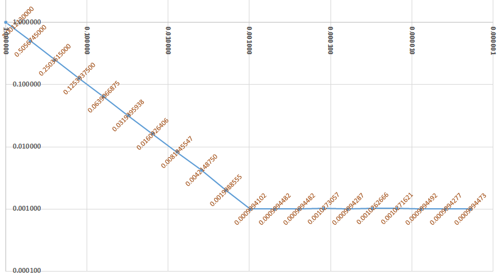

# A biggish C++17 linked lists tutorial

*This tutorial is in mid-writing, under construction. The large header at the top is added automatically by Github. Unfortunately, three suggested ways to get rid of it did not work.*

When you now learn about how to implement linked lists, remember that

* The C++ standard library has two linked list class templates, `std::list` and `std::forward_list` — there’s rarely any need to reinvent those wheels.
* And in most cases a `std::vector` is simpler, safer and more efficient than a linked list, even with a perfect list implementation, so the two mentioned classes are among the least used in the library.
* Do It Yourself™ linked list code is generally complex and error prone, a bug attractor, so a habit of implementing linked lists yourself would be a negative behaviour pattern like  procrastination, overspending, stereotyping, nail-biting and spending too much time watching television or (!) using a computer.

Wikipedia notes about the last point, that

> **”** The best time to correct a bad habit is immediately, before it becomes established. So, bad habits are best prevented from developing in childhood.

Unfortunately correcting the habit of implementing linked lists is difficult to do already in childhood, but one can try to not establish this habit in high school or college.

So why are your teachers insisting that you do this?

It’s mostly about *understanding* things, which is necessary for analysis and for choosing appropriate data structures, and gaining experience in actual *problem solving*, necessary for general software development. Since linked list code is complex, yet with effects that can be stated simply, it’s almost ideal for problem solving exercises. Then there's a little bit of *preparing* you for the possible but unlikely situation where a DIY linked list implementation is needed. As an example: inside an overload of `::operator new` (the global object allocation function in C++), if you should ever need to implement that, you would likely create an incorrect circular chain of calls if you used a list class from the standard library with defaulted template arguments. So, cases where DIY lists are required or convenient do exist, but are rare.

<!-- START doctoc generated TOC please keep comment here to allow auto update -->
<!-- DON'T EDIT THIS SECTION, INSTEAD RE-RUN doctoc TO UPDATE -->
**Table of Contents**  *generated with [DocToc](https://github.com/thlorenz/doctoc)*

- [1. What is a linked list?](#1-what-is-a-linked-list)
- [2. Use of a singly linked list type, `std::forward_list`.](#2-use-of-a-singly-linked-list-type-stdforward_list)
  - [2.1. Iterate with standard iterators.](#21-iterate-with-standard-iterators)
  - [2.2 Do something before the end in an iterator based traversal.](#22-do-something-before-the-end-in-an-iterator-based-traversal)
  - [2.3 Do something before the end in a range based `for` traversal.](#23-do-something-before-the-end-in-a-range-based-for-traversal)
  - [2.4 Insert and remove efficiently at the start of a list.](#24-insert-and-remove-efficiently-at-the-start-of-a-list)
  - [2.5 Reverse a list to get the desired order.](#25-reverse-a-list-to-get-the-desired-order)
  - [2.6 Keep a link to last node to append to a list in constant time.](#26-keep-a-link-to-last-node-to-append-to-a-list-in-constant-time)
  - [2.7. Keep a list sorted by inserting in sorted position.](#27-keep-a-list-sorted-by-inserting-in-sorted-position)
- [3 Basic linked lists with pointers.](#3-basic-linked-lists-with-pointers)
  - [3.1. Make pointers and referents `const` in a good way.](#31-make-pointers-and-referents-const-in-a-good-way)
  - [3.2 Use `new` and `delete` expressions to allocate and deallocate nodes.](#32-use-new-and-delete-expressions-to-allocate-and-deallocate-nodes)
  - [3.3 Define functions to link in and unlink nodes.](#33-define-functions-to-link-in-and-unlink-nodes)
  - [3.4 Keep a pointer to last node to append to a list in constant time.](#34-keep-a-pointer-to-last-node-to-append-to-a-list-in-constant-time)
  - [3.5 Do something before the end in a pointer based traversal (that’s easy).](#35-do-something-before-the-end-in-a-pointer-based-traversal-thats-easy)
  - [3.6 Insert in sorted position in a pointer based list.](#36-insert-in-sorted-position-in-a-pointer-based-list)
  - [3.7 Find and remove nodes in a pointer list.](#37-find-and-remove-nodes-in-a-pointer-list)
- [4. Sorting a singly linked list.](#4-sorting-a-singly-linked-list)
  - [4.1 Use the Corncob free list of >58 000 English words as data.](#41-use-the-corncob-free-list-of-58000-english-words-as-data)
  - [4.2. `Node` and `List` classes, and an `english_words_list()` function.](#42-node-and-list-classes-and-an-english_words_list-function)
  - [4.3. Randomize a list efficiently.](#43-randomize-a-list-efficiently)
  - [4.4. Merge-sort a list recursively.](#44-merge-sort-a-list-recursively)
  - [4.5. Merge-sort a list iteratively with “natural runs”.](#45-merge-sort-a-list-iteratively-with-natural-runs)
  - [4.6. A digression on measuring how long a code execution takes.](#46-a-digression-on-measuring-how-long-a-code-execution-takes)
    - [Best practically guaranteed resolution = 0.02 seconds.](#best-practically-guaranteed-resolution--002-seconds)
    - [Wait functions can also have very limited resolution.](#wait-functions-can-also-have-very-limited-resolution)
    - [Ensure reasonably short timings, not just reasonably long.](#ensure-reasonably-short-timings-not-just-reasonably-long)
    - [Adapt the measuring to the code being measured.](#adapt-the-measuring-to-the-code-being-measured)
    - [Separate setup and tear-down code from the code of interest.](#separate-setup-and-tear-down-code-from-the-code-of-interest)
    - [Add suppressable logging to see what’s going on.](#add-suppressable-logging-to-see-whats-going-on)
    - [Possible other approaches.](#possible-other-approaches)
  - 
- [asd](#asd)

<!-- END doctoc generated TOC please keep comment here to allow auto update -->

## 1. What is a linked list?

With a **linked list** a sequence of *n* values is represented as a collection of objects where each object carries one of the values + a (common speech, not C++) reference to the object with the next value:

A linked list is the simplest case of a collection of objects that refer to each other. The objects are called **nodes**, and the logical references are **links** between the nodes. In C++ code the links can be pointers or indices or hash values or names, or even pairs of names, whatever serves best to identify the link relation.

For a simplest possible linked list representation such as shown above, the links are stored in the nodes, and because of that there is a link out from the last node even though there is no next node!

This *next* link in the last node is a **null-link**: a special pointer or index or name, whatever, that says “this link doesn’t refer to anything, stop here”. With pointers as links there is a strong convention to use nullpointers, C++ `nullptr`, as null-links. For other link representations there is no established convention.

You can **visit** the nodes in a list like the above in order, also called **traversing** the list, by starting with a link to the first node and just following the *next* links until you encounter the null-link in the last node:

[*<small>linked_list_idea.cpp</small>*](source/linked_list_idea.cpp)
~~~cpp
#include <iostream>
#include <map>
#include <string>
using std::cout, std::endl, std::map, std::string;

struct Node
{
    string  name_of_next;
    double  value;
};

auto main()
    -> int
{
    const string    null_link       = "";
    const string    name_of_head    = "pi";

    const map<string, Node> nodes =
    {
        {"pi",          {"e", 3.14 }},      // A node named "pi" that links to node "e".
        {"e",           {"zero", 2.72}},    // ...
        {"zero",        {"the_answer", 0}}, // ...
        {"the_answer",  {"-1", 42}},        // ...
        {"-1",          {null_link, -1}}    // The last node, that just has a null-link.
    };
    
    // Traverse the list & output the values:
    for(    string link = name_of_head;
            link != null_link;
            link = nodes.at( link ).name_of_next ) {
        cout << nodes.at( link ).value << endl;
    }
}
~~~

Result:

~~~txt
3.14
2.72
0
42
-1
~~~

This example uses an unnatural inefficient list representation with name strings as links, and the nodes stored in a `std::map`, to keep things simple. One nice property of names as links is that one can add a node that links to some other node, before that other node exists! With pointers as links a node must exist before it can be linked to, which can complicate things.

---

The term **head** for the first node in a list is standard. A little less clear-cut, the rest of the list is usually called the **tail** of the list. However, one often also speaks about the last single node as the list’s **tail node**, which some people shorten to just “tail”, so there is a possible ambiguity, some room for some misunderstanding.

---

In mathematics one can define a very similar concept in terms of functions. The crucial point of similarity is that one only has direct access to the front of a list, the first node in the list. One can just define a name for the empty list, e.g. **nil**, and a function that constructs a new list from a value *v* and an existing list *rest* (which can be nil), e.g. **cons**(*v*, *rest*). Getting at the head of a list is then easy by defining **head**(**cons**(*v*, *rest*)) = *v*. Getting the tail is also easy, math-wise: **tail**(**cons**(*v*, *rest*)) = *rest*.

Another math view of a linked list is as a simplest possible *directed graph* of *vertices* connected by *edges*.

Programming languages that are based on math concepts like old Lisp (functional) and Prolog (logic programming), and like newer Haskell, Ocaml, Erlang etc., generally use the head/tail view of lists. And it can be worth also knowing about the terminology employed in Lisp. From the names of processor registers used in machine code level programming on the  IBM 704 computer, in the late 1950s, the **head** function is called **`CAR`**, short for “contents of the address register”, and the **tail** function is called **`CDR`**, short for “contents of the decrement register”. The **cons** function is just called **`CONS`**, short for “construct”.

## 2. Use of a singly linked list type, `std::forward_list`.

I imagine it can be a good idea to learn how to drive a car before sitting down to design a car. Assuming that that’s true, then in the same way it can be a good idea to learn how to use a linked list before sitting down and implementing one’s own linked list. And for that, the simplest linked list in the C++ standard library is `std::forward_list`.

`std::forward_list` is called a “forward” list because it can only be traversed efficiently in one direction, the *forward* direction. That’s because there is only a single, one-way chain of *next* links to follow. This is what’s meant by a **singly linked list**.

The older `std::list` is a two-way linked list, a **doubly linked list**.

### 2.1. Iterate with standard iterators.

The nodes in a `forward_list` are not accessible or even at all visible. C++17 introduced some access to the nodes of associative containers like `std::map`, but not for the lists. And anyway the level of internal links between nodes, that you’d use to iterate through a simple DIY linked list, is not available.

A `forward_list` is instead designed to appear as just an ordinary standard library collection of values. For such a container one uses ordinary **iterators**, essentially small identifier values, to refer to “positions” in the container. Each “position” holds a value, which is all that one has access to.

The iterators are usually obtained from the methods `.begin()` and `.end()`:

[*<small>std_forward_list/traversing_a_std_forward_list.with_iterators.cpp</small>*](source/std_forward_list/traversing_a_std_forward_list.with_iterators.cpp)
~~~cpp
#include <forward_list>         // std::forward_list
#include <iostream>
using std::cout, std::endl, std::forward_list;

auto main()
    -> int
{
    const forward_list<double> list = {3.14, 2.72, 0, 42, -1};

    for( auto it = list.begin(); it != list.end(); ++it ) {
        cout << *it << " ";
    }
    cout << endl;
}
~~~

Output:

~~~txt
3.14 2.72 0 42 -1
~~~

Here the call to **`begin`** obtains an iterator that refers to the node (if there is one) that contains the first value in the list, and the call to **`end`** obtains an iterator that works as if it referred to a node after the last one actually in the list. The increment operation `++it` moves the iterator to the next node by following the internal *next*-link in the node, and the **dereferencing** `*it` produces a C++ reference to the value in the node that `it` refers to; the `*` “follows” the iterator into the node it refers to, so to speak. These various parts of the `for` loop code correspond directly to the parts in the earlier named nodes example.

| *In the above iterators-based example:* | *In the earlier named nodes example:* |
|--------------------|------------------------------|
| `auto it = list.begin()` | `string link = name_of_head` |
| `it != list.end()` | `link != null_link` |
| `++it` | `link = nodes.at(link).name_of_next` |

For this particular usage, since the list offers standard `begin` and `end` methods one can alternatively just use a range based `for` loop, which gives shorter and cleaner code:

[*<small>std_forward_list/traversing_a_std_forward_list.with_range_based_for.cpp</small>*](source/std_forward_list/traversing_a_std_forward_list.with_range_based_for.cpp)
~~~cpp
#include <forward_list>         // std::forward_list
#include <iostream>
using std::cout, std::endl, std::forward_list;

auto main()
    -> int
{
    const forward_list<double> list = {3.14, 2.72, 0, 42, -1};

    for( const double v: list ) {
        cout << v << " ";
    }
    cout << endl;
}
~~~

And there are more ways to do this, e.g. using the `std::copy` algorithm to copy to a `std::ostream_iterator`, but to my mind that would be much less clear than the range based `for` loop.

### 2.2 Do something before the end in an iterator based traversal.

Say you want the values in an arbitrary length list presented like this:

~~~txt
3.14, 2.72, 0, 42 and -1.
~~~

In order to output the “and” one must know that one’s traversal is currently at the next to last or last node (or value). This is not a problem with e.g. a `vector`, but `forward_list` is a hardcore minimal implementation of a linked list. It does not waste time and space on keeping a direct link to the last node, or for that matter, on keeping a count of nodes.

So, the only way to know that one is at the end of the list is to check whether the *next* iterator value compares equal to `.end()`. In effect one must look forward in the list 👀, from the current traversal point. Happily the standard library offers the **`std::next`** function that produces the value that `++`-incrementing an iterator variable would have produced:

[*<small>std_forward_list/comma_separated_values_of_a_std_forward_list.with_iterators.cpp</small>*](source/std_forward_list/comma_separated_values_of_a_std_forward_list.with_iterators.cpp)
~~~cpp
#include <forward_list>         // std::forward_list
#include <iostream>
#include <iterator>             // std::next
#include <string>               // std::string
using std::cout, std::endl, std::forward_list, std::next;

auto main()
    -> int
{
    const forward_list<double> list = {3.14, 2.72, 0, 42, -1};

    for( auto it = list.begin(); it != list.end(); ++it ) {
        if( it != list.begin() ) {
            // Not at the first node, so add text to separate the previous value.
            const bool is_at_last_node = (next( it ) == list.end());
            cout << (is_at_last_node? " and " : ", ");
        }
        cout << *it;
    }
    cout << "." << endl;
}
~~~

### 2.3 Do something before the end in a range based `for` traversal.

With a range based `for` traversal one doesn’t have an iterator to compare to `.end()`; one only has a reference to a value. And the C++ range based `for` doesn’t offer any mechanism for determining whether the current loop iteration is the last one, which arguably could be useful. In order to do the above “and” example program with a range based `for` one therefore needs some way to know that one is at the end of the list, some other way than checking against `.end()`.

Possibilities include:

* Copy the values to a more convenient container such as a `vector`.
* Generate the output fully or partially in e.g. a `string`, and adjust it after the loop.  
  This is like copying the values, only worse.
* Use a special **sentinel value** (of your choosing) at the end of the list.  
  This is just a possibility for the *general* problem of detecting the list end, e.g. for appending a node. It’s a technique worth knowing about but I see no way that it can help with the problem at hand.
* Let each loop iteration output the *previous* value. Output the very last value after the loop.
* Count the nodes first, and then maintain a running count during the traversal.

The first and second possibilities, copying of values or text, are kludgy and involve inefficient dynamic memory allocation, even if those allocations happen automatically behind the scenes. The third possibility, a sentinel value, is just not helpful for producing the “and” at the right time. The fourth possibility of one-iteration-deferred output is a bit complex, e.g. in the loop one must take care to not output the first value in the first iteration, and more.

So it’s natural to just count the nodes, and the standard library’s `distance` function can do that — since for a pure *forward iterator* it just applies `++` repeatedly to its first iterator until it reaches the second:

[*<small>std_forward_list/comma_separated_values_of_a_std_forward_list.with_range_based_for.cpp</small>*](source/std_forward_list/comma_separated_values_of_a_std_forward_list.with_range_based_for.cpp)
~~~cpp
#include <stddef.h>             // ptrdiff_t
using Size = ptrdiff_t;

#include <forward_list>         // std::forward_list
#include <iostream>
#include <iterator>             // std::distance
#include <string>               // std::string
using std::cout, std::endl, std::forward_list, std::distance;

auto main()
    -> int
{
    const forward_list<double> list = {3.14, 2.72, 0, 42, -1};

    const Size n_nodes = distance( list.begin(), list.end() );
    Size node_number = 0;
    for( const double value: list ) {
        ++node_number;
        if( node_number > 1 ) {
            // Not at the first node, so add text to separate the previous value.
            const bool is_at_last_node = (node_number == n_nodes);
            cout << (is_at_last_node? " and " : ", ");
        }
        cout << value;
    }
    cout << "." << endl;
}
~~~

Output, as before:

~~~txt
3.14, 2.72, 0, 42 and -1.
~~~

This is an example where the range based `for` is less efficient (because one needs to count the number of nodes first) and less convenient, and more verbose!, than using iterators directly. And that’s because it abstracts away the information that one needs, namely the iterator value for the current node. In return for that limitation the loop construct is clean and simple.

### 2.4 Insert and remove efficiently at the start of a list.

With a `vector` one can append an item in (amortized) **constant time** via `push_back`. It’s efficient because there are no items after it that would need to be moved in the vector’s internal array. Conversely, straightforward insertion at the front of a `vector` takes time roughly proportional to the number of items in the vector, **linear time**, because they all need to be moved.

In **big Oh** notation constant time and linear time is denoted by respectively **O(1)** and **O(*n*)**, where for vector insertion *n* is the number of items.

A `forward_list` has the opposite big Oh behavior of `vector`, or of an array in general. Insertion at the front, e.g. via `push_front`, is O(1), because it just involves a couple of adjustments of internal links, “linking in” the new node. Straightforward insertion at the end is O(*n*), because it involves traversing the whole list in order to *find* the end…

For both `vector` and `forward_list` one can do things in less straightforward ways so as to get O(1) insertion also at the other end. For `vector` it involves a technique called “cursor gap”, and for `forward_list` it involves maintaining an iterator to the last node. In both cases this reduces other functionality and adds complexity that is best wrapped up in a class.

Anyway, corresponding to the efficient O(1) list insertion via `push_front` you can remove the first node in constant time via `pop_front`, and you can inspect the first value via just `front`:

[*<small>std_forward_list/insert_and_remove_numbers.cpp</small>*](source/std_forward_list/insert_and_remove_numbers.cpp)
~~~cpp
#include <forward_list>
#include <iostream>
using std::forward_list, std::cout, std::endl;

auto main()
    -> int
{
    forward_list<int> list;
    cout << "Inserting..." << endl;
    for( int i = 1; i <= 12; ++i ) {
        list.push_front( i );
        cout << i << " ";
    }
    cout << endl;

    cout << endl;
    cout << "Removing..." << endl;
    while( not list.empty() ) {
        cout << list.front() << " ";
        list.pop_front();
    }
    cout << endl;
}
~~~

Output:

~~~txt
Inserting...
1 2 3 4 5 6 7 8 9 10 11 12

Removing...
12 11 10 9 8 7 6 5 4 3 2 1
~~~

The values **pop** out of the list in the opposite order that they were **push**ed onto the list. In other words, the first value into the list, here `1`, is the last value out. This is called **LIFO** (last in first out) behavior, or **stack** behavior, because it’s similar to how the last dinner plate placed on a stack of dinner plates, the one on top, is the first one to be removed. The terms “push” and “pop” refer to how one deals with a spring-loaded such stack, a *pushdown stack*, in a restaurant kitchen.

However, this close correspondence & big Oh efficiency doesn’t mean that a `forward_list` should be your first choice for an implementation of a stack. Use a `std::stack` instead. Or maybe a `std::vector`, for ease of inspecting the values in the stack. With a `vector` you just use `push_back` and `pop_back` instead of the list’s `push_front` and `pop_front`. And since a `vector` plays well with modern machine’s caching strategies it’s generally more efficient than the list.

### 2.5 Reverse a list to get the desired order.

The LIFO behavior of the efficient insert and remove operations like `push_front` and `pop_front`, means that it’s easy to reverse a list. Just pop all its nodes and push them onto another list, and when all is done, `move`-assign the result list back in O(1) time. However you don’t have to implement that, because there’s the `.reverse()` convenience method that does it for you, and it does it without any copying of values.

To avoid copying of values in your own implementation you’d have to use `.splice_after()` to move nodes, instead of `pop_front` and `push_front`.

For an example where a reversal is practically needed, consider generating a Collatz sequence of integers in a `forward_list`. If a number *x* is even then the next Collatz sequence number is *x*/2, and if it’s odd then the next Collatz sequence number is 3*x* + 1. The **Collatz conjecture** is that no matter which positive integer you start with, if you follow this system then you’ll always eventually end up at 1, and that’s so well tested and likely true that it can just be assumed:

[*<small>std_forward_list/collatz.list.iterative.cpp</small>*](source/std_forward_list/collatz.list.iterative.cpp)
~~~cpp
#include <assert.h>         // assert
#include <stdlib.h>         // EXIT_...

#include <forward_list>     // std::forward_list
#include <iostream>
#include <string>           // std::stoi
using std::forward_list, std::cout, std::cerr, std::endl, std::stoi;

auto is_even( const int x )
    -> bool
{ return x % 2 == 0; }

auto reversed_collatz_sequence( int x )
    -> forward_list<int>
{
    forward_list<int> result;
    for( ;; ) {
        result.push_front( x );
        if( x == 1 ) {
            return result;
        }
        x = (is_even( x )? x/2 : 3*x + 1);
    }
}

auto collatz_sequence( const int x )
    -> forward_list<int>
{
    forward_list<int> result = reversed_collatz_sequence( x );
    result.reverse();                       // Ta da! Correction!
    return result;
}

auto main( int n_command_parts, char** command_parts )
    -> int
{
    if( n_command_parts != 2 ) {
        cerr << "!Usage: " << command_parts[0] << " STARTING_NUMBER" << endl;
        return EXIT_FAILURE;
    }
    const int starting_number = stoi( command_parts[1] );
    assert( starting_number >= 1 );

    for( const int v: collatz_sequence( starting_number ) ) {
        if( v != starting_number ) {        // We trust mr. Collatz.
            cout << " -> ";
        }
        cout << v;
    }
    cout << "." << endl;
}
~~~

Example building and output (this is in Cmd in Windows 10):

~~~txt
[X:\source\std_forward_list]
> g++64 collatz.list.iterative.cpp

[X:\source\std_forward_list]
> a
!Usage: a STARTING_NUMBER

[X:\source\std_forward_list]
> for /L %c in (1, 1, 11) do @a %c
1.
2 -> 1.
3 -> 10 -> 5 -> 16 -> 8 -> 4 -> 2 -> 1.
4 -> 2 -> 1.
5 -> 16 -> 8 -> 4 -> 2 -> 1.
6 -> 3 -> 10 -> 5 -> 16 -> 8 -> 4 -> 2 -> 1.
7 -> 22 -> 11 -> 34 -> 17 -> 52 -> 26 -> 13 -> 40 -> 20 -> 10 -> 5 -> 16 -> 8 -> 4 -> 2 -> 1.
8 -> 4 -> 2 -> 1.
9 -> 28 -> 14 -> 7 -> 22 -> 11 -> 34 -> 17 -> 52 -> 26 -> 13 -> 40 -> 20 -> 10 -> 5 -> 16 -> 8 -> 4 -> 2 -> 1.
10 -> 5 -> 16 -> 8 -> 4 -> 2 -> 1.
11 -> 34 -> 17 -> 52 -> 26 -> 13 -> 40 -> 20 -> 10 -> 5 -> 16 -> 8 -> 4 -> 2 -> 1.
~~~

Doing this with a `vector` is simpler because it doesn’t need to be reversed, and it’s also likely more efficient. I find it almost impossibly hard to come up with an example where a `forward_list` would be a good choice in practical programming. As a means to learn about use of linked lists before implementing them, it is however very nice indeed.

### 2.6 Keep a link to last node to append to a list in constant time.

An alternative to reversing is to just add the values in the right order in the first place. For the Collatz sequence that means *appending* values to the end of the list. In order to do that with reasonable efficiency, namely O(1), one needs to keep an iterator to the last node and use the `.insert_after()` method.

For an empty list there is no last node yet, so in general, e.g. for your own DIY linked list implementation, this must be handled as a special case. However, `forward_list` offers the method `.before_begin()` which produces an iterator that works *as if* it refers to a node before the first one, a pseudo-node that pseudo-exists also for an empty list. With that one can just initialize the iterator to last node, to the one from `.before_begin()`.

The code now approaches — though it doesn’t quite reach — the simplicity of expressing this with `vector`:

[*<small>std_forward_list/collatz.list.iterative_appending.cpp</small>*](source/std_forward_list/collatz.list.iterative_appending.cpp)
~~~cpp
#include <assert.h>         // assert
#include <stdlib.h>         // EXIT_...

#include <forward_list>     // std::forward_list
#include <iostream>
#include <string>           // std::stoi
using std::forward_list, std::cout, std::cerr, std::endl, std::stoi;

auto is_even( const int x )
    -> bool
{ return x % 2 == 0; }

auto collatz_sequence( int x )
    -> forward_list<int>
{
    using Iterator = forward_list<int>::iterator;

    forward_list<int> result;
    Iterator          it_lastnode = result.before_begin();
    for( ;; ) {
        it_lastnode = result.insert_after( it_lastnode, x );        // Append.
        if( x == 1 ) {
            return result;
        }
        x = (is_even( x )? x/2 : 3*x + 1);
    }
}

auto main( int n_command_parts, char** command_parts )
    -> int
{
    if( n_command_parts != 2 ) {
        cerr << "!Usage: " << command_parts[0] << " STARTING_NUMBER" << endl;
        return EXIT_FAILURE;
    }
    const int starting_number = stoi( command_parts[1] );
    assert( starting_number >= 1 );

    for( const int v: collatz_sequence( starting_number ) ) {
        if( v != starting_number ) {        // We trust mr. Collatz.
            cout << " -> ";
        }
        cout << v;
    }
    cout << "." << endl;
}
~~~

Output as before.

Note that the iterator to last node is updated for every append. Otherwise after the first append it would be an iterator to the next to last node, and after that things would go haywire. The pattern `it = some_func( it, ... )` is very common.

### 2.7. Keep a list sorted by inserting in sorted position.

Inserting a value in a sorted position in a list has the problem that with a simple-minded search one doesn’t know that one has found the sorted position until one is one node past it… 

~~~cpp
using Iterator = forward_list<double>::iterator;

auto sorted_insert_position_for( const double value, forward_list<double>& list )
    -> Iterator
{
    for(    Iterator it = list.begin();
            it != list.end();
            ++it ) {
        if( *it >= value ) {
            // Dang, already one node too far! And can't go back. So, bye bye...
            terminate();
        }
    }
    // Double dang, again the search has overshot the desired location. Well.
    terminate();
}
~~~

A common solution is to use a link that lags one step behind the link used for the traversal. With pointers as links this is known as a **trailing pointer**, and I guess with a `forward_list` one can talk about a trailing iterator, and generally about a trailing link. Then when the one-node-too-far is found, the trailing iterator at this point correctly refers to the node whose internal *next* link should be adjusted to now refer to the new node.

~~~cpp
auto sorted_insert_position_for( const double value, forward_list<double>& list )
    -> Iterator
{
    Iterator trailing = list.before_begin();
    for(    Iterator it = list.begin();
            it != list.end() and *it < value;
            ++it ) {
        trailing = it;
    }
    return trailing;
}
~~~

Without a trailing link, as with the example of detecting the end of the list one must then effectively look forward in the list 👀. But unlike with detection of the end one must now also look *into* the next node, to check the value there. And this adds a further complication, an extra check, because at the end of the list there just is no next node to look into: trying to look into that non-existing node would yield Undefined Behavior.

~~~cpp
auto sorted_insert_position_for( const double value, forward_list<double>& list )
    -> Iterator
{
    Iterator it_next_node;
    for(    Iterator it = list.before_begin();
            ;
            it = it_next_node ) {
        it_next_node = next( it );
        if( it_next_node == list.end() or *it_next_node >= value ) {
            return it;
        }
    }
    // Execution will never reach this point.
}
~~~

The above implementation depends on the short-circuit behavior of the built-in C++ `or`, that the second operand is not evaluated if the first operand is `true`. More generally for both built-in `or` and `and`, the second operand isn’t evaluated if the first operand already determines the value of the expression, assuming that both operands would have produced some `bool` value. I.e., the assumption is that there is no program exit or hang in the evaluation of the second operand.

A complete program using the trailing link technique:

[*<small>std_forward_list/insert_sorted.using_trailing_link.cpp</small>*](source/std_forward_list/insert_sorted.using_trailing_link.cpp)
~~~cpp
#include <forward_list>         // std::forward_list
#include <initializer_list>     // Required for deduced type of brace initializer.
#include <iostream>
using std::cout, std::endl, std::forward_list;

using Iterator = forward_list<double>::iterator;

auto sorted_insert_position_for( const double value, forward_list<double>& list )
    -> Iterator
{
    Iterator trailing = list.before_begin();
    for(    Iterator it = list.begin();
            it != list.end() and *it < value;
            ++it ) {
        trailing = it;
    }
    return trailing;
}

auto main()
    -> int
{
    const auto data = {3.14, 2.72, 0., 42., -1.};
    forward_list<double> list;

    for( const double v: data ) {
        const Iterator insert_position = sorted_insert_position_for( v, list );
        list.insert_after( insert_position, v );
    }

    for( const double v: list ) {
        cout << v << " ";
    }
    cout << endl;
}
~~~

Output:

-1 0 2.72 3.14 42

For large data sets this is not a good idea since the time to insert a new value/item is proportional to the number of values/items that you already have, O(*n*), linear time. And if you use repeated sorted insertions to sort an entire existing list then you have O(*n*²), **quadratic time**. I discovered in high school, for a Basic program I made to keep track of radio amateur QSL cards, that quadratic time sorting *really* slows down things as the number of items increases. I’d used much time on developing this program that now turned out to be practically unusable, and there was also some prestige in it (I’d made it to help the radio amateurs at the school), so it was a lesson that stuck. If you need to sort a `forward_list` then use its `.sort()` method, and for your own DIY linked list use a merge sort.

Well, of course, if you have a sorted list and a new item, then O(*n*) inserting is preferable to O(*n* log *n*) full sorting.

There are an almost unbounded number of further linked list topics that could be discussed with `forward_list` examples. We haven’t even explored a majority of the `forward_list` methods, much less what they can be used for, and how. But with this it’s now time to get down to the nitty gritty of implementing your own linked list, which after all is what teachers tend to require students to do, and which probably is why you’re reading this.

## 3 Basic linked lists with pointers.

A C++ **pointer** is a memory address with some nice operations:

|*Operation:* | *Name:* | *Result:* |
|----------|------|--------|
| `&thing` | Address operator. | The address of `thing`, i.e. a pointer that refers to `thing`. There are more ways to obtain pointers. This is the basic way. |
| `*p` | Dereferencing. | Denotes the `thing` that `p` refers to when `p` is the value `&thing`. |
| `p->m` | — | Equivalent to `(*p).m`, but is often a more clear notation. |
| `p + 1`  | Increment. | If `p` refers to an array item, then `p + 1` refers to the next array item.
| `not p` | Implicit conversion to `bool`. | `not p` is the same as `p == nullptr`. Using `not` is just one example of a context where a `bool` is expected, causing an implicit conversion to `bool` of the pointer. In particular one may write just `if(p){`… |

The type of a pointer that refers to an `int` object is `int*`. More generally the type of a pointer that refers to an object of a type `T` is **`T*`**. And, crucially for use of pointers as links in nodes, because the size of a pointer itself is known to the compiler you can use the type `T*` even before `T` has been fully defined, at a point where `sizeof(T)` is not yet known:

[*<small>pointer_list/concrete_pointer_list.cpp</small>*](source/pointer_list/concrete_pointer_list.cpp)
~~~cpp
#include <iostream>
using std::cout, std::endl;

struct Node
{
    Node*   pointer_to_next;
    double  value;
};

auto main()
    -> int
{
    Node    minus1      = { nullptr, -1 };
    Node    the_answer  = { &minus1, 42 };
    Node    zero        = { &the_answer, 0 };
    Node    e           = { &zero, 2.72 };
    Node    pi          = { &e, 3.14 };
    
    Node* pointer_to_head = &pi;

    // Traverse the list & output the values:
    for(    Node* p = pointer_to_head;
            p != nullptr;
            p = p->pointer_to_next ) {
        cout << p->value << endl;
    }
}
~~~
 
 Output, as with the first name string based linked list example:

~~~txt
3.14
2.72
0
42
-1
~~~

### 3.1. Make pointers and referents `const` in a good way.

`const` introduces a constraint, fewer ways that values can change, so that it becomes easier to understand the code.

There is a cost: verbosity. But generally the consensus is that sprinkling `const` as liberally as possible throughout the code, is a Good Thing&trade;. The time lost to having to type and read a little bit more source code is generally more than paid for by time saved on not tracking down weird bugs and generally on not having to try very hard to understand the code.

The language’s basic systematic `const` notation is that a `const` is placed *to the right* of what it refers to. Naturally this is called **east `const`** notation (heads-up: it’s not my preferred notation). Applied to the concrete linked list example it can go like this:

[*<small>pointer_list/concrete_pointer_list.east_const.cpp</small>*](source/pointer_list/concrete_pointer_list.east_const.cpp)
~~~cpp
#include <iostream>
using std::cout, std::endl;

struct Node
{
    Node const* pointer_to_next;
    double      value;
};

auto main()
    -> int
{
    Node const  minus1      = { nullptr, -1 };
    Node const  the_answer  = { &minus1, 42 };
    Node const  zero        = { &the_answer, 0 };
    Node const  e           = { &zero, 2.72 };
    Node const  pi          = { &e, 3.14 };
    
    Node const* const pointer_to_head = &pi;

    // Traverse the list & output the values:
    for(    Node const* p = pointer_to_head;
            p != nullptr;
            p = p->pointer_to_next ) {
        cout << p->value << endl;
    }
}
~~~

---

There is a problem here.

With a `const` node such as `minus1`, taking the address as is done in the initializer for the immediately following `the_answer` node yields a `Node const*` pointer value, a pointer to `Node const`. This pointer value cannot be assigned to (or used to initialize) a `Node*` data member, because that would give a way to modify the referent, which was declared `const` to express a guarantee that it would not be modified. And so to be compatible with the pointer values one gets from taking the addresses of `const` node objects, the `Node::pointer_to_next` data member had to be declared as type `Node const*`.

But this means that when one traverses a list of such nodes, even nodes that were not originally `const`, all that one will get will be pointers to `Node const`. And those pointers can’t be used to modify the `value` in a node (or for that matter, adjusting the `pointer_to_next`). So, with reasonable direct use of pointers, without jumping through a kilometersize tangle of hoops, a given `Node` definition supports originally `const` nodes, or originally mutable nodes, but not both.

In practice one therefore chooses to let the node type support mutable nodes, i.e. that *next* pointer will be of type `Node*`, and address `const`-ness at ***some higher level of abstraction***. For example, a `forward_list` can be `const` and still usable. Internally in that list the nodes that one doesn't see but can infer must exist, are probably like nodes with `Node*` *next*-pointers.

With a higher level abstraction like that it’s important to not let access to nodes and their *next* pointers escape out, otherwise one risks that some code will use that access to modify an originally `const` object, which is Undefined Behavior:

[*<small>pointer_list/concrete_pointer_list.east_const.ub_with_mutable_nodes.cpp</small>*](source/pointer_list/concrete_pointer_list.east_const.ub_with_mutable_nodes.cpp)
~~~cpp
#include <iostream>
using std::cout, std::endl;

struct Node
{
    Node*       pointer_to_next;
    double      value;
};

auto main()
    -> int
{
    struct List
    {
        Node minus1      = { nullptr, -1 };
        Node the_answer  = { &minus1, 42 };
        Node zero        = { &the_answer, 0 };
        Node e           = { &zero, 2.72 };
        Node pi          = { &e, 3.14 };
        
        auto pointer_to_head() const
            -> Node const*
        { return &pi; }
    };
    
    List const list = {};

    // Traverse the list & output the values:
    for(    Node const* p = list.pointer_to_head();
            p != nullptr;
            p = p->pointer_to_next ) {
        cout << p->value << endl;
    }
    
    Node* const pointer_to_e = list.pi.pointer_to_next;
    pointer_to_e->value = 6.28;     // Oops, UB for modifying originally `const` object.
    cout << endl;
    cout << "The value of e is " << list.e.value << ", possibly." << endl;
}
~~~

Both compilers I tried this with, Visual C++ 2019 and MinGW g++ 9.2, produced the following output:

~~~txt
3.14
2.72
0
42
-1

The value of e is 6.28, possibly.
~~~

But there’s just no guarantee. If the compiler is smart in the wrong way it may note that it “knows” that `list.e.value` is `2.72`, because after all `list` is an originally `const` object that can’t change, and then as an optimization it might use that value in the final output statement. Or, it might note that there is UB and optimize away all effects of the program, say.

Just to summarize the problem:

* At initialization time for the `list` a pointer to non-`const`, namely a `Node*` pointer, was initialized to point to an at that time mutable object, namely `list.e`.
* The pointer was allowed to be accessible from outside the abstraction `List`: it escaped out!
* It was then used to modify the now originally (after initialization) `const` object, causing Undefined Behavior.

Possible solutions, ways to completely hide the nodes and their *next* pointers while giving access to the values, include

* The abstraction can provide iterators, like `forward_list` does.
* The abstraction can provide an internal iteration state.
* The abstraction can provide a way to call a specified function for each value.

Iterators are not very complex but they involve much boilerplate code, and in order to conform to the requirements on standard iterators one must get a lot of details right. An internal iteration state can be simple but it precludes having a `const` object, which throws out the baby with the bath water. So, below is one way to have a specified function called for each value in the list:

[*<small>pointer_list/concrete_pointer_list.east_const.mutable_nodes_hidden_via_callback.cpp</small>*](source/pointer_list/concrete_pointer_list.east_const.mutable_nodes_hidden_via_callback.cpp)
~~~cpp
#include <iostream>
using std::cout, std::endl;

struct Node
{
    Node*       pointer_to_next;
    double      value;
};

class List
{
    Node minus1      = { nullptr, -1 };
    Node the_answer  = { &minus1, 42 };
    Node zero        = { &the_answer, 0 };
    Node e           = { &zero, 2.72 };
    Node pi          = { &e, 3.14 };
    
public:
    template< class Func >
    void for_each_value( Func const& f ) const
    {
        for( Node const* p = &pi; p != nullptr; p = p->pointer_to_next ) {
            f( p->value );
        }
    }
};

auto main()
    -> int
{
    List const list = {};

    // Traverse the list & output the values:
    list.for_each_value( [&](double v){ cout << v << endl; } );
}
~~~

Here the construct

    [&](double v){ cout << v << endl; }

… is a **lambda expression**, a way to define a function locally within an expression in the code. The `&` in the lambda designator `[&]` says that this lambda references things outside itself, namely `cout` and `endl`, and we say that it **captures** those things by reference. This is a **callback** function since it's “called back” by the `List::for_each_value` function. The list is like, “don’t call me, I’ll call you”. Instead of the lambda I could have defined an ordinary named function to use as callback.

There is no way here for the `List`-using code to modify the `const` object.

For example, if the lambda is changed to take a reference-to-non-`const` argument,

    [&](double& v){ v = 6.28; }

… then the `for_each_value` code simply doesn’t compile, so it’s a safe technique.

---

My preferred notation is **west `const`**, with the `const` always to the left of what it refers to.

This notation is possible because C++ supports it for the leftmost type in a declaration, *as a special case*. For example, the declaration `char const* p;` can be written as `const char* p;`. Similarly, `Node const* p` in the above code can be written as `const Node* p`.

You can’t rewrite something like `char const* const s = "Hi!";`  as a west `const` declaration like `const (const char*) s = "Hi!";`, because C++ doesn’t support parentheses in type expressions. The only built-in support for general substitution in type expressions is to name the parts with `typedef` or `using`. But to be able to use west `const` for any declaration without naming parts of the declaration, you can define a single line of support,

~~~cpp
template< class T > using Type_ = T;
~~~

… where then `Type_<`*some-type-expression*`>` is the same as, if C++ had allowed parentheses, `(`*some-type-expression*`)`.

For example, something like `char const* const s = "Hi!";` can then be written in west `const` style as `const Type_<const char*> s = "Hi!";`. And as an added bonus declarations where the language’s special case rule allows west `const` already, like the declaration `const Node* p`, can then be written like `Type_<const Node>* p` where it’s slightly more clear that `p` itself isn’t `const` (because the `*` more clearly applies to the whole `Type_<const Node>`). However, I generally don’t do that because to people who generally use west `const`, type expressions like `const Node*` are clear enough already — much like the meaning of `double` as a floating point number is clear to those who are *familiar* with it.

As far as I know the `Type_` support, modulo the name, was first proposed by Johannes “litb” Schaub.

The type substitution support is not technically required to express this section’s example program with west `const`, but applying it for clarity it can go like this:

[*<small>Type_.hpp</small>*](source/Type_.hpp)
~~~cpp
#pragma once
template< class T > using Type_ = T;
~~~

[*<small>pointer_list/concrete_pointer_list.west_const.mutable_nodes_hidden_via_callback.cpp</small>*](source/pointer_list/concrete_pointer_list.west_const.mutable_nodes_hidden_via_callback.cpp)
~~~cpp
#include "../Type_.hpp"

#include <iostream>
using std::cout, std::endl;

struct Node
{
    Node*       pointer_to_next;
    double      value;
};

class List
{
    Node minus1      = { nullptr, -1 };
    Node the_answer  = { &minus1, 42 };
    Node zero        = { &the_answer, 0 };
    Node e           = { &zero, 2.72 };
    Node pi          = { &e, 3.14 };
    
public:
    template< class Func >
    void for_each_value( const Func& f ) const
    {
        for( Type_<const Node>* p = &pi; p != nullptr; p = p->pointer_to_next ) {
            f( p->value );
        }
    }
};

auto main()
    -> int
{
    const List list = {};

    // Traverse the list & output the values:
    list.for_each_value( [&](double v){ cout << v << endl; } );
}
~~~

### 3.2 Use `new` and `delete` expressions to allocate and deallocate nodes.

With a successful **dynamic allocation** you get a pointer to a new object somewhere in memory. That object will persist even if the code manages to forget the pointer, and after function returns, which makes it ideal as a node in a linked list. To avoid such objects accumulating and using up all available memory they should be **deallocated** when they’re no longer needed, in a way that corresponds to the dynamic allocation.

---

In C++ dynamic allocation is strongly tied to initialization, via a **`new`-expression** that allocates memory and calls a specified constructor to create an object of your specified type *T*, in the allocated memory chunk. Conversely, deallocation is strongly tied to cleanup, via a **`delete`-expression** that calls the object’s *T* destructor and deallocates the memory. In the possible case where the object’s constructor signals failure by throwing an exception the `new`-expression temporarily catches the exception, calls destructors on all successfully initialized sub-objects (since the top level object is not successfully initialized its *T* destructor, which tends to assume that, is not called), deallocates the memory, and re-throws the exception — so that you get an **all-or-nothing** effect where either you get a new successfully initialized object, or else you just get an exception.

Example showing that an object dynamically allocated by one function can be deallocated in another function:

[*<small>pointer_list/new_and_delete.cpp</small>*](source/pointer_list/new_and_delete.cpp)
~~~cpp
#include "../Type_.hpp"

#include <iostream>
using std::clog, std::endl;

void trace( const Type_<const char*> s ) { clog << s << endl; }

struct Noisy_object
{
    Noisy_object()
    {
        trace( "--> Object created." );
    }
    
    ~Noisy_object()
    {
        trace( "--> Object destroyed." );
    }
};

auto foo()
    -> Noisy_object*
{
    trace( "In function `foo`, executing a `new`-expression." );
    return new Noisy_object;
}

void bar( const Type_<Noisy_object*> p )
{
    trace( "In function `bar`, executing a `delete`-expression." );
    delete p;
}

auto main()
    -> int
{
    trace( "In `main`." );

    const Type_<Noisy_object*> p = foo();
    trace( "Back in `main` again." );

    bar( p );
    trace( "Back in `main` again." );
    trace( "Finished! :)" );
}
~~~

Output:

~~~txt
In `main`.
In function `foo`, executing a `new`-expression.
--> Object created.
Back in `main` again.
In function `bar`, executing a `delete`-expression.
--> Object destroyed.
Back in `main` again.
Finished! :)
~~~

---

Direct use of `new` and `delete` expressions like above, is necessary for implementing linked data structures like linked lists. But it’s extraordinarily easy to get this wrong. For example, it’s easy to inadvertently `delete` the same object twice, which is UB, or to forget to `delete` it, which then causes a **memory leak**.

Therefore, for purposes other than linked data structures, first and foremost consider safe standard library containers like `std::vector`.

And if the containers don’t cut it, consider pointer wrapper classes such as the standard library’s `std::unique_ptr` and `std::smart_ptr`, which *automate* the deallocations. These are called **smart pointers**. They’re not very smart at all, but because of the automation they are generally much safer than the core language’s **raw pointers** used above.

| *Rank*: | *Kind of solution:* |
|---------|---------------------|
| Best and safest. | Standard library containers like `std::vector` and `std::string`. |
| So so. | Smart pointers like `std::unique_ptr` and `std::shared_ptr`. |
| Risky, dubious code. | Raw pointers and `new` and `delete` expressions. |

Except, importantly: *don't* use smart pointers as links in linked data structures.

Because if you do then you risk automated recursive destructor calls all the way through the data structure, which can easily cause UB via a **stack overflow**, which you absolutely don’t want.

### 3.3 Define functions to link in and unlink nodes.

A nice thing about dynamic allocation is that the individual objects don’t need corresponding top level named pointer variables. For example, with a linked list one only needs a pointer variable that designates the head node. The other nodes are found by following the *next* pointers in the nodes.

Adding a new node at the start of the list then consists of just

1. Allocate & initialize the node.  

2. Set its *next* pointer to point to the current head node.  

3. Set the head node pointer to point to the new node.  

Removing the head node is just opposite, so:

[*<small>pointer_list/insert_and_remove_numbers.in_pointer_list.cpp</small>*](source/pointer_list/insert_and_remove_numbers.in_pointer_list.cpp)
~~~cpp
#include "../Type_.hpp"

#include <iostream>
using std::cout, std::endl;

struct Node
{
    Node*   next;
    int     value;
};

auto main()
    -> int
{
    Node* head = nullptr;
    cout << "Inserting..." << endl;
    for( int i = 1; i <= 12; ++i ) {
        const Type_<Node*> new_node = new Node{ nullptr, i };
        new_node->next = head;
        head = new_node;
        cout << i << " ";
    }
    cout << endl;

    cout << endl;
    cout << "Removing..." << endl;
    while( head != nullptr ) {
        cout << head->value << " ";
        const Type_<Node*> doomed_node = head;
        head = head->next;
        delete doomed_node;
    }
    cout << endl;
}
~~~

Output:

~~~txt
Inserting...
1 2 3 4 5 6 7 8 9 10 11 12

Removing...
12 11 10 9 8 7 6 5 4 3 2 1
~~~

---

As a matter of C++ coding, the two first statements in

~~~cpp
    const Type_<Node*> new_node = new Node{ nullptr, i };
    new_node->next = head;
    head = new_node;
~~~

… can be reduced to a single statement, as in

~~~cpp
    const Type_<Node*> new_node = new Node{ head, i };
    head = new_node;
~~~

… and here the `new_node` variable serves no purpose, so this can in turn be reduced to just

~~~cpp
    head = new Node{ head, i };
~~~

So, that’s the basic insert-a-new-node-at-the-start-of-the-list code. It’s short enough that one may tend to just write it directly wherever it’s needed. Hopefully the experienced C++ programmers that read this won’t have experienced a heart attack or something before getting to this point of more natural short code instead of pedagogical 1, 2, 3 code.

---

Even though the insertion code snippet is very short, as far as I know the corresponding code for node removal can’t be reduced that way.

So, for the teaching examples I prefer (and also if I had occasion to *actually* implement a linked list I would prefer) to define functions for insertion and removal. These functions operate on the *next* fields, and they’re only concerned with **linking** and **unlinking**, the links manipulation. Where a node to link in comes from, e.g. from a `new`-expression or another list, and what will happen to an unlinked node, e.g. destroyed or moved to another list, is of no concern to these functions.

Ideally, to prevent these functions from being inadvertently applied to pointer variables other than *next* fields and *head* pointers, the *next* fields and *head* pointer should be a distinct type, some kind of trivial pointer wrapper. Counting against that idea is the fact that I’ve never inadvertently misapplied the functions, so at least for me there would be no significant advantage; a case of [YAGNI](https://en.wikipedia.org/wiki/You_aren%27t_gonna_need_it). Plus the distinct type would be more code and abstraction, i.e. less simple and clear, so:

[*<small>pointer_list/link_and_unlink_functions.cpp</small>*](source/pointer_list/link_and_unlink_functions.cpp)
~~~cpp
#include <iostream>
using std::cout, std::endl;

struct Node
{
    Node*   next;
    int     value;

    void link_in_before( Node*& a_next_field )
    {
        next = a_next_field;
        a_next_field = this;
    }
    
    friend auto unlinked( Node*& a_next_field )
        -> Node*
    {
        const auto result = a_next_field;
        a_next_field = result->next;
        return result;
    }
};

auto main()
    -> int
{
    Node* head = nullptr;
    cout << "Inserting..." << endl;
    for( int i = 1; i <= 12; ++i ) {
        (new Node{ nullptr, i })->link_in_before( head );
        cout << i << " ";
    }
    cout << endl;

    cout << endl;
    cout << "Removing..." << endl;
    while( head != nullptr ) {
        cout << head->value << " ";
        delete unlinked( head );
    }
    cout << endl;
}
~~~

Output, as before:

~~~txt
Inserting...
1 2 3 4 5 6 7 8 9 10 11 12

Removing...
12 11 10 9 8 7 6 5 4 3 2 1
~~~

The naming here may at first seem odd, `link_in_before` versus (which does just about the same) `forward_list::insert_after`. That's because `insert_after` reads as inserting *after* a specified node, while `link_in_before` reads as linking a new node in *before* the node that a specified *next* field points to. The naming is all about how the calling code reads, and e.g. the call in this program, `link_in_before(head)`, is self-explanatory.

### 3.4 Keep a pointer to last node to append to a list in constant time.

As with the `forward_list`, to append in a reasonably efficient way, namely O(1) time, you can keep a link to the last node.

With a pointer based list that link is naturally a pointer.

For a list abstraction one may choose to maintain a last node pointer along with the node list. `forward_list` doesn’t, because it’s easy to add on top but impossible to remove, and also because it would constrain the operation set. Without any abstraction one will typically just temporarily maintain a last node pointer during a sequence of append operations.

[*<small>pointer_list/Node.hpp</small>*](source/pointer_list/Node.hpp)
~~~cpp
#pragma once
#include "../Type_.hpp"

struct Node
{
    Node*   next;
    double  value;

    void link_in_before( Node*& a_next_field ) noexcept
    {
        next = a_next_field;
        a_next_field = this;
    }
    
    friend auto unlinked( Node*& a_next_field ) noexcept
        -> Node*
    {
        const Type_<Node*> result = a_next_field;
        a_next_field = result->next;
        return result;
    }
    
    friend void delete_list_and_zero( Node*& head ) noexcept
    {
        while( head ) { delete unlinked( head ); }
    }

    friend void delete_list( Node*&& temp ) noexcept
    {
        delete_list_and_zero( temp );
    }
};
~~~

[*<small>pointer_list/list_copy_of_the_five_important_numbers.hpp</small>*](source/pointer_list/list_copy_of_the_five_important_numbers.hpp)
~~~cpp
#pragma once
#include "Node.hpp"
#include "../Type_.hpp"
#include <initializer_list>         // Required for deduced type of brace initializer.

inline auto list_copy_of_the_five_important_numbers()
    -> Node*
{
    Node*   head    = nullptr;
    Node*   last    = nullptr;
    for( const double v: {3.14, 2.72, 0., 42., -1.} ) {
        const Type_<Node*> new_node = new Node{ nullptr, v };
        if( head == nullptr ) {
            head = new_node;
        } else {
            new_node->link_in_before( last->next );
        }
        last = new_node;
    }
    return head;
}
~~~

[*<small>pointer_list/five_numbers_as_pointer_list.cpp</small>*](source/pointer_list/five_numbers_as_pointer_list.cpp)
~~~cpp
#include "list_copy_of_the_five_important_numbers.hpp"

#include <iostream>
using std::cout, std::endl;

auto main()
    -> int
{
    const Type_<Node*> head = list_copy_of_the_five_important_numbers();

    for( Node* p = head; p != nullptr; p = p->next ) {
        cout << p->value << endl;
    }

    delete_list( +head );
}
~~~

Output:

~~~txt
3.14
2.72
0
42
-1
~~~

Here the construct `+head` forms a *pointer value*. Another way to do this is to write `head + 0`. It’s done because `delete_list` takes an rvalue reference as formal argument, so that one can pass it e.g. a pointer value returned from a function.

Originally I let `delete_list` take its argument by value, which had the same desirable property of allowing values as arguments. However, this then clashed with my own later expectation that it should zero out a variable passed as argument. So, the two cases are now separated on the principle that generally explicit = good, implicit = bad.

In this program for an ordinary desktop system or better it’s not technically necessary to `delete` all the nodes at the end. The operating system, e.g. Mac OS, Linux or Windows, will reclaim the memory automatically when the process terminates. It will also close any open file handles and will in general do a fair general clean-up, and as long as that automatic clean-up covers what the program needs clean-up for (e.g. it doesn't cover removing temporary files) one can technically just rely on it.

However, when you debug a program or run some other diagnostic tool such as Valgrind, the tool may complain about memory leaks if the program doesn’t itself clean up everything.

And then you might waste time chasing a non-existing bug, so, better clean up; hence the `delete_list` function here.

### 3.5 Do something before the end in a pointer based traversal (that’s easy).

From the `forward_list` discussion recall the “do something before the end” problem of presenting output like

~~~txt
3.14, 2.72, 0, 42 and -1.
~~~

With iterators that give access only to the values, detecting the end of the list to output that “and” was difficult. To make that logic reasonably simple we had to use the iterator-to-pseudo-node `.before_begin()`. This supported no-special-case code that looked forward in the list 👀.

But with pointers to nodes the last node’s *next* pointer can be seen and is a `nullptr`, so it’s easy to detect the last node *without looking forward*:

[*<small>pointer_list/comma_separated_values_of_a_pointer_list.cpp</small>*](source/pointer_list/comma_separated_values_of_a_pointer_list.cpp)
~~~cpp
#include "list_copy_of_the_five_important_numbers.hpp"

#include <iostream>
using std::cout, std::endl;

auto main()
    -> int
{
    const Type_<Node*> head = list_copy_of_the_five_important_numbers();

    for( Node* p = head; p != nullptr; p = p->next ) {
        if( p != head ) {
            // Not at the first node, so add text to separate the previous value.
            const bool is_at_last_node = (p->next == nullptr);
            cout << (is_at_last_node? " and " : ", ");
        }
        cout << p->value;
    }
    cout << "." << endl;

    delete_list( +head );
}
~~~

### 3.6 Insert in sorted position in a pointer based list.

For `std::forward_list` it was easy to choose a return type for the function to find a sorted insertion position. It’s a design with only one choice for position id’s, namely iterators. One might therefore think that a corresponding function for a pointer based list should return a pointer to a node.

After all, pointers are what corresponds to the iterators?

But with a list with *n* nodes there are *n* + 1 possible insert positions, and only *n* possible pointer to node values.

The function *could* return a `nullptr` to signal insertion at the front, but that would complicate the calling code.

One neat alternative is to instead return a reference to the *next* field that the calling code needs to modify, where the *head* pointer is regarded as a *next* field (this brings the number of *next* fields up to *n* + 1, just sufficient!):

[*<small>pointer_list/comma_separated_values_of_a_pointer_list.cpp</small>*](source/pointer_list/comma_separated_values_of_a_pointer_list.cpp)
~~~cpp
#include "Node.hpp"

#include <initializer_list>     // Required for deduced type of brace initializer.
#include <iostream>
using std::cout, std::endl;

auto find_position const double new_value, Node*& list_head )
    -> Node*&
{
    Node* trailing = nullptr;
    for(    Node* p = list_head; 
            p != nullptr and p->value < new_value;
            p = p->next ) {
        trailing = p;
    }
    return (trailing == nullptr? list_head : trailing->next);
}

auto main()
    -> int
{
    const auto data = {3.14, 2.72, 0., 42., -1.};
    Node* head = nullptr;

    // Insert the data sorted.
    for( const double v: data ) {
        Node*& next = find_position v, head );
        (new Node{ nullptr, v})->link_in_before( next );
    }

    // Display the list.
    for( Node*p = head; p != nullptr; p = p->next ) {
        cout << p->value << " ";
    }
    cout << endl;

    // Clean up, just to be nice.
    delete_list( +head );
}
~~~

Output:

~~~txt
-1 0 2.72 3.14 42
~~~

It is perhaps worth noting that in C, which doesn’t have references, this technique would be expressed with a pointer to pointer instead of reference to pointer.

And this is one case where such a pointer to pointer is a pointer that refers to a single pointer object, and not to an item in an array of pointers such as the `argv` argument of `main`.

### 3.7 Find and remove nodes in a pointer list.

  

  

  

  

  

  

[*<small>pointer_list/remove_specified_nodes.cpp</small>*](source/pointer_list/remove_specified_nodes.cpp)
~~~cpp
#include "list_copy_of_the_five_important_numbers.hpp"

#include <iostream>
using std::cout, std::endl;

void display( const Type_<const char*> explanation, const Type_<Node*> head )
{
    cout << explanation;
    for( Node* p = head; p != nullptr; p = p->next ) {
        cout << " " << p->value;
    }
    cout << "." << endl;
}

auto main()
    -> int
{
    Node* head = list_copy_of_the_five_important_numbers();
    display( "Original values:", head );

    // Delete all nodes that are not 42, in a way that's O(n) efficient for a large list.
    cout << "O(n)-deleting the too math-ish numbers..." << endl;

    Node*   p           = head;
    Node*   trailing    = nullptr;
    while( p != nullptr ) {
        if( p->value != 42 ) {
            Node*& next_field = (trailing == nullptr? head : trailing->next);
            delete unlinked( next_field );
            p = next_field;
        } else {
            trailing = p;  p = p->next;
        }
    }

    display( "The list is now", head );
    delete_list( +head );
}
~~~

Output:

~~~txt
Original values: 3.14 2.72 0 42 -1.
O(n)-deleting the too math-ish numbers...
The list is now 42.
~~~

Worth mentioning in passing, *if there guaranteed is a next node*, plus no other node pointers that need to be kept valid, then if you have a pointer directly to a node in a singly linked list you can effectively delete that node’s value from the sequence of values, in O(1) time, by copying the next node’s value here and deleting the next node. As I recall I learned this trick from an exercise in Donald Knuth’s classic “The Art of Computer Programming”.

---

The above code can’t easily be used for other purposes, in other programs, without wholescale modification. Deleting a node is so drastic a thing to do that it affects the code around this operation. For example, in the above code it invalidates the `p` pointer, which then points to a deleted node, a **dangling pointer**, so that to avoid UB it has to be reassigned, `p = next_field;`.

However, instead of a having a search loop that traverses the list node by node, where the loop body deletes a node, one can have a loop where each iteration advances “directly” to the next node to delete, by calling a search function to find that next node. Well, the search function will chase pointers through the list just like the above code does. But with this refactoring the searching part will be **reusable**, code that you can lift right out and use for some different purpose.

For a simple `nullptr`-terminated list the search function can support idiomatic `while(`*side-effect-based-advance*`)` usage code by returning a reference to the last *next* field in the list when it fails. Note that this relies on the C++ support for references. You can’t do the same in C, which is probably why I didn’t see it — I was *thinking in C* for the pointer stuff, learnings from the 1980’s — in my first sketch of this section.

[*<small>pointer_list/remove_specified_nodes.using_a_search_function.cpp</small>*](source/pointer_list/remove_specified_nodes.using_a_search_function.cpp)
~~~cpp
#include "list_copy_of_the_five_important_numbers.hpp"

#include <iostream>
using std::cout, std::endl;

void display( const Type_<const char*> explanation, const Type_<Node*> head )
{
    cout << explanation;
    for( Node* p = head; p != nullptr; p = p->next ) {
        cout << " " << p->value;
    }
    cout << "." << endl;
}

template< class Func >
auto find( const Func& is_target, Node*& head )
    -> Node*&           // Reference to the next-field of the previous node.
{
    Node*   trailing    = nullptr;
    Node*   p           = head;
    for( ;; ) {
        if( p == nullptr or is_target( p->value ) ) {
            return (trailing == nullptr? head : trailing->next);
        }
        trailing = p;  p = p->next;
    }
    // The execution will never get here.
}

auto find_not_42( Node*& head )
    -> Node*&
{ return find( { return x != 42; }, head ); }

auto main()
    -> int
{
    Node* head = list_copy_of_the_five_important_numbers();
    display( "Original values:", head );

    // Delete all nodes that are not 42, in a way that's O(n) efficient for a large list.
    cout << "O(n)-deleting the too math-ish numbers..." << endl;

    Node** p_sublist_head = &head;
    while( Node*& next_field = find_not_42( *p_sublist_head ) ) {
        delete unlinked( next_field );
        p_sublist_head = &next_field;
    }

    display( "The list is now", head );
    delete_list( +head );
}
~~~

Output, as before,

~~~txt
Original values: 3.14 2.72 0 42 -1.
O(n)-deleting the too math-ish numbers...
The list is now 42.
~~~

---

Further possible refactoring: the unlinking of a set of nodes to delete can be factored out as a separate function. Namely, one can define a function that returns a list of unlinked nodes. From an engineering perspektive this is at the point of (too) diminishing returns, but from a learning perspective it can be useful to have seen an example of just efficiently *moving nodes* from one list to another.

The concept of efficiently moving nodes is what `std::forward_list::splice_after` is all about. And with the C++ standard library it’s just about the only reason to use a linked list. The other things you can do with a `forward_list` are generally both easier and more efficient with `vector`.

The following implementation uses the operations `link_in_before`, `unlinked` and `delete_list` defined earlier in [the `Node` class](source/pointer_list/Node.hpp):

[*<small>pointer_list/remove_specified_nodes.using_a_transfer_function.cpp</small>*](source/pointer_list/remove_specified_nodes.using_a_transfer_function.cpp)
~~~cpp
#include "list_copy_of_the_five_important_numbers.hpp"

#include <iostream>
using std::cout, std::endl;

void display( const Type_<const char*> explanation, const Type_<Node*> head )
{
    cout << explanation;
    for( Node* p = head; p != nullptr; p = p->next ) {
        cout << " " << p->value;
    }
    cout << "." << endl;
}

template< class Func >
auto find( const Func& is_target, Node*& head )
    -> Node*&           // Reference to the next-field of the previous node.
{
    Node*   trailing    = nullptr;
    Node*   p           = head;
    for( ;; ) {
        if( p == nullptr or is_target( p->value ) ) {
            return (trailing == nullptr? head : trailing->next);
        }
        trailing = p;  p = p->next;
    }
    // The execution will never get here.
}

template< class Func >
auto list_of_all( const Func& is_target, Node*& head )
    -> Node*
{
    // Transfer all nodes that fit, in a way that's O(n) efficient for a large list.
    Node*   transferred_head    = nullptr;
    Node**  p_sublist_head      = &head;
    while( Node*& next_field = find( is_target, *p_sublist_head ) ) {
        unlinked( next_field )->link_in_before( transferred_head );
        p_sublist_head = &next_field;
    }
    return transferred_head;
}

auto list_of_all_not_42_in( Node*& head )
    -> Node*
{ return list_of_all( { return x != 42; }, head ); }

auto main()
    -> int
{
    Node* head = list_copy_of_the_five_important_numbers();
    display( "Original values:", head );

    cout << "O(n)-deleting the too math-ish numbers..." << endl;
    delete_list( list_of_all_not_42_in( head ) );

    display( "The list is now", head );
    delete_list( +head );
}
~~~

Perhaps for clarity in reuse the function should be called `reversed_list_of_all`, but hey.

Output as before,

~~~txt
Original values: 3.14 2.72 0 42 -1.
O(n)-deleting the too math-ish numbers...
The list is now 42.
~~~

## 4. Sorting a singly linked list.

We’ve [already sorted a pointer based linked list](#36-insert-in-sorted-position-in-a-pointer-based-list), namely by repeated insertions in sorted position. But since that approach uses O(*n*²) quadratic time it’s horribly inefficient for longer lists. It can be fast for a short list, even faster than more generally faster sorts, but as the list size increases prepare to waaaaaaaaaaaaaaaaiiiiiiiiiiiit…

That **insertion sort** can be described more systematically as:

1. Form two lists *u* and *s*, where *u* holds the unsorted items and *s* is empty.
2. While *u* is not empty:  
2.1. Extract the front of *u*, call that value *x*.  
2.2. The searching part: insert *x* in sorted position in *s*.

There is a corresponding **selection sort** that’s equally horribly O(*n*²) quadratic time inefficient for large lists:

1. Form two lists *u* and *s*, where *u* holds the unsorted items and *s* is empty.
2. While *u* is not empty:  
2.1. The searching part: select and extract the largest value of *u*, call that value *x*.  
2.2. Add *x* at the front of *s*.

More efficients sorts are generally based on the idea of **divide and conquer**, or “divide et impera” as Caesar may have said:

1. one first divides the data into *n* roughly equal size parts, where *n* is typically 2; then
2. one sorts each part in the same way as the whole (this is a recursive step); and finally
3. one combines the now sorted parts into a sorted whole.

For the **Quicksort** algorithm used by `std::sort` for random access containers, the comparison of values, the real sorting action, happens in the partitioning step. Quick sort does that by moving all values less than an opportunistically chosen **pivot value** to a first part, and the rest to a second part. In contrast, for the **merge sort** algorithm used by `std::forward_list::sort` the comparison of values happens in the re-combination of the parts, the merging, which (with this description/view) just consumes values in sorted order from the fronts of the now sorted part lists.

As exemplified by `std::sort` and `std::forward_list::sort`, Quicksort is the common default choice of sorting algorithm for an array, and merge sort is the common default choice of sorting algorithm for linked lists. However, I show both approaches for linked lists (and we’ll time them). But first of all, in order to have something substantial to sort we’ll employ a divide and conquer approach similar to merge sort, just with random choice of which parts values come from in the merging, to randomize a long list of English words. It’s a kind of inverse sorting. An unsorting.

### 4.1 Use the Corncob free list of >58 000 English words as data.

For the examples we’ll use [the Corncob free list of English words](http://www.mieliestronk.com/wordlist.html) as data to sort.

It has more than 58 000 word in a simple text file, one per line. One perhaps interesting C++ problem is how to `#include` that file as data for a string literal. Instead of anything clever I just copied and pasted the text into a literal in a header, and that worked nicely with the MinGW g++ compiler, but for Visual C++ 2019 I had to re-express it a bit:

[*<small>data/english_words.hpp</small>*](source/data/english_words.hpp)
~~~cpp
#pragma once
#include <string_view>

namespace data {
    using std::string_view;

    // From the "Corncob" online dictionary,
    // <url: http://www.mieliestronk.com/wordlist.html>.
    
    // Originally expressed as a single long string literal for the MinGW g++ compiler.
    // But now using an array of `char` to work around Visual C++ 2019 error
    // C2026 “string too big, trailing characters truncated”. It can only handle
    // literal pieces each of < 16380 bytes. And then for the resulting string literal
    // there is Visual C++ 2019 fatal error C2019 “string exceeds 65535 bytes in length”.
    // These übersilly limits are out of the 1980’s. Argh.

    inline extern const char english_words_literal[] =
    {
        '\n',
        'a', 'a', 'r', 'd', 'v', 'a', 'r', 'k', '\n',
        'a', 'a', 'r', 'd', 'w', 'o', 'l', 'f', '\n',

            ⋮

        'z', 'u', 'l', 'u', 's', '\n',
        '\0'
    };

    // Two characters to ignore: '\n' at start and '\0' at end of the literal.
    constexpr auto english_words = string_view(
        english_words_literal + 1, sizeof( english_words_literal ) - 2
        );

}  // namespace data
~~~

The `string_view` of the whole big literal, `english_words`, may be just what one wants, just the data, thank you (e.g. for efficient searching), but at least for this tutorial the individual words are needed.  Since all the data is in a string literal it’s not necessary to inefficiently-for-C++ copy the words, as would happen with `std::string` values. All that’s needed for a value is a little separate `string_view` that *refers* to a chunk of above literal:

[*<small>data/english_words_iteration.hpp</small>*](source/data/english_words_iteration.hpp)
~~~cpp
#include "english_words.hpp"

#include <string_view>      // std::string_view

namespace data {
    using std::string_view;
    
    template< class Func >
    inline void for_each_english_word( const Func& f )
    {
        const string_view&  s           = english_words;
        const int           s_length    = int( s.length() );

        int i_wordstart = 0;
        while( i_wordstart < s_length ) {
            int i_wordend = i_wordstart + 1;
            while( i_wordend < s_length and s[i_wordend] != '\n' ) {
                ++i_wordend;
            }
            const int   word_length = i_wordend - i_wordstart;
            const auto  word        = string_view( &s[i_wordstart], word_length );

            f( word );

            i_wordstart = i_wordend + 1;
        }
    }

}  // namespace data
~~~

As an example usage, the following program displays the five first and last words.

Because several more example programs need to display an abbreviated list, I factored that logic out in a separate header:

[*<small>data/Abbreviated_list_displayer.hpp</small>*](source/data/Abbreviated_list_displayer.hpp)
~~~cpp
#pragma once
#include <ostream>          // std::ostream
#include <string_view>      // std::string_view

namespace oneway_sorting_examples {
    using std::ostream, std::string_view;

    class Abbreviated_list_displayer    // Non-copyable
    {
        ostream&        m_stream;
        int             m_n_items;
        int             m_index;

    public:
        void display( const string_view& item )
        {
            if( m_index < 5 or m_n_items - 5 <= m_index ) {
                if( m_index > 0 ) {
                    m_stream << ", ";
                }
                if( m_index == m_n_items - 5 ) {
                    m_stream << "..., ";
                }
                m_stream << item;
            }
            ++m_index;
        }
        
        Abbreviated_list_displayer( ostream& stream, const int n_items ):
            m_stream( stream ),
            m_n_items( n_items ),
            m_index( 0 )
        {}
    };
}  // namespace oneway_sorting_examples
~~~

[*<small>data/first_and_last_5_words.cpp</small>*](source/data/first_and_last_5_words.cpp)
~~~cpp
#include "english_words_iteration.hpp"
#include "Abbreviated_list_displayer.hpp"
using data::Abbreviated_list_displayer, data::for_each_english_word;

#include <iostream>         // std::(cout, endl)
#include <functional>       // std::invoke
using std::cout, std::endl, std::invoke;

auto main()
    -> int
{
    const int n = invoke(  -> int
    {
        int count = 0;
        for_each_english_word( [&](auto) { ++count; } );
        return count;
    } );
    
    cout << n << " words:" << endl;
    Abbreviated_list_displayer displayer( cout, n );
    for_each_english_word( [&](auto word){ displayer.display( word ); } );
    cout << "." << endl;
}
~~~

Output:

~~~txt
58112 words:
aardvark, aardwolf, aaron, aback, abacus, ..., zooms, zooplankton, zoos, zulu, zulus.
~~~

### 4.2. `Node` and `List` classes, and an `english_words_list()` function.

The `double` values of section 3’s `Node` won’t do to handle these words, so a new `Node` type is needed.

[*<small>sorting_singly_linked/Node.hpp</small>*](source/sorting_singly_linked/Node.hpp)
~~~cpp
#pragma once
#include "../Type_.hpp"
#include <string_view>

namespace oneway_sorting_examples {
    using std::string_view;

    struct Node
    {
        Node*           next;
        string_view     value;

        void link_in_before( Node*& a_next_field ) noexcept;
        friend auto unlinked( Node*& a_next_field ) noexcept;
        friend void delete_list_and_zero( Node*& head ) noexcept;
        friend void delete_list( Node*&& temp ) noexcept;
    };
}  // namespace oneway_sorting_examples
~~~

We’ll now be passing lists around, including returning them from functions, so it’s a good idea to also define a `List` type that ensures proper copying, moving and destruction. This type doesn’t need to encapsulate the inner workings of a list. We’re still learning and therefore dealing directly with raw, exposed list machinery, the inner nuts ’n bolts ’n gears, but now that machinery is at least safely fastened to a chassis, so to speak:

[*<small>signed_size_types.hpp</small>*](source/signed_size_types.hpp)
~~~cpp
#pragma once
#include <stddef.h>         // ptrdiff_t

namespace signed_size_types {
    using Size = ptrdiff_t;
    using Index = Size;
}  // namespace signed_size_types
~~~

[*<small>sorting_singly_linked/List.hpp</small>*](source/sorting_singly_linked/List.hpp)
~~~cpp
#pragma once
#include "../signed_size_types.hpp"
#include "../Type_.hpp"
#include "Node.hpp"

#include <algorithm>        // std::(exchange, swap)
#include <utility>          // std::move

namespace oneway_sorting_examples {
    using std::exchange, std::move, std::swap;
    using signed_size_types::Size, signed_size_types::Index;

    // Just taking charge of copying, moving and destruction, not encapsulating internals.
    // For convenience & DRYness also provides
    // a nested class `Appender`, a method `count`, and a method `is_sorted`.
    struct List
    {
        Node* head;

        class Appender;                                         // Convenience & DRYness.
        inline auto count() const noexcept -> Size;             // Convenience & DRYness.
        inline auto is_sorted() const noexcept -> bool;         // Convenience & DRYness.

        inline friend void swap( List& a, List& b ) noexcept;   // Declared for exposition.
        inline auto operator=( const List& other ) -> List&;    // Copy assignment.
        inline auto operator=( List&& other ) noexcept -> List&;// Move assignment.
        inline List() noexcept;                                 // Default constructor.
        inline List( const List& other );                       // Copy constructor.
        inline List( List&& other ) noexcept;                   // Move constructor.    
        inline ~List() noexcept;                                // Destructor.
    };

    class List::Appender
    {
        Node*&  m_head;
        Node*   m_last;

        Appender( const Appender& ) = delete;

    public:
        Appender( Node*& a_head_pointer ) noexcept:
            m_head( a_head_pointer ),
            m_last( nullptr )
        {
            for( Node* p = m_head; p; p = p->next ) { m_last = p; }
        }

        void append( const Type_<Node*> new_node ) noexcept
        {
            Node*& beyond = (m_last? m_last->next : m_head);
            new_node->link_in_before( beyond );
            m_last = new_node;
        }
    };

    inline auto List::count() const noexcept
        -> Size
    {
        Size n = 0;
        for( const Node* p = head; p; p = p->next ) { ++n; }
        return n;
    }

    inline auto List::is_sorted() const noexcept
        -> bool
    {
        string_view previous = "";
        for( const Node* p = head; p; p = p->next ) {
            if( p->value < previous ) {
                return false;
            }
            previous = p->value;
        }
        return true;
    }

    inline void swap( List& a, List& b ) noexcept
    {
        swap( a.head, b.head );
    }

    inline auto List::operator=( const List& other )
        -> List&
    {
        List temp = other;
        swap( temp, *this );
        return *this;
    }
        
    inline auto List::operator=( List&& other ) noexcept
        -> List&
    {
        // Can be optimized, but delegation to constructor + swap is nicely DRY.
        List temp = move( other );
        swap( temp, *this );
        return *this;
    }

    inline List::List() noexcept:
        head( nullptr )
    {}

    inline List::List( const List& other ):
        List()
    {
        Appender appender( head );
        try {
            for( Node* p = other.head; p; p = p->next ) {
                appender.append( new Node{ nullptr, p->value } );
            }
        } catch( ... ) {
            delete_list( +head );
            throw;
        }
    }
    
    inline List::List( List&& other ) noexcept:
        head( exchange( other.head, nullptr ) )
    {}

    inline List::~List() noexcept
    {
        delete_list( +head );
    }

}  // namespace oneway_sorting_examples
~~~

The `Appender` class takes care of efficiently appending a sequence of nodes. It assumes and requires that the list structure is not changed by other means while this goes on. By moving the search for the last node from the constructor to the `append` function one could support insertion of new nodes between calls of that function, while keeping the instance, but then with marginal advantage and a serious cost of more complex usage conditions and less robust usage code.

With that in the toolbox a function `english_words_list` for producing the 58 000+ words as individual nodes in a list, is straightforward:

[*<small>sorting_singly_linked/english_words_list.hpp</small>*](source/sorting_singly_linked/english_words_list.hpp)
~~~cpp
#pragma once
#include "../data/english_words_iteration.hpp"
#include "List.hpp"

namespace oneway_sorting_examples {
    
    inline auto english_words_list()
        -> List
    {
        List list;
        List::Appender appender( list.head );
        data::for_each_english_word( [&]( const string_view& word )
        {
            appender.append( new Node{ nullptr, word } );
        } );
        return list;
    }

}  // namespace oneway_sorting_examples
~~~

Finally, we should better test (not rigorously, but just, test) that this code works as intended, producing the data that we intend to randomize and then sort.

[*<small>sorting_singly_linked/english_words_list_result.cpp</small>*](source/sorting_singly_linked/english_words_list_result.cpp.cpp)
~~~cpp
#include "../data/Abbreviated_list_displayer.hpp"
using data::Abbreviated_list_displayer;

#include "english_words_list.hpp"
namespace x = oneway_sorting_examples;
using x::Node, x::List, x::english_words_list;

#include <iostream>
using std::cout, std::endl;

auto main()
    -> int
{
    List words = english_words_list();
    const int n = int( words.count() );
    
    cout << "`english_words_list()` produced " << n << " words:" << endl;
    Abbreviated_list_displayer displayer( cout, n );
    for( Node* p = words.head; p != nullptr; p = p->next ) {
        displayer.display( p->value );
    }
    cout << "." << endl;
}
~~~

Output, as before (but now with the data coming from a linked list):

~~~cpp
`english_words_list()` produced 58112 words:
aardvark, aardwolf, aaron, aback, abacus, ..., zooms, zooplankton, zoos, zulu, zulus.
~~~

That worked, yay!

### 4.3. Randomize a list efficiently.

Modern C++ code should use the facilities of the C++11 `<random>` header, and not the old C `rand` and `srand` functions. The old functions are likely to generate value sequences that are far from ideally random, and if I used them here I would be teaching you Bad Habits™. Unfortunately direct use of the modern and more solid computer science based `<random>` header facilities is very much less convenient, and more verbose, than using the old functions.

I therefore placed a set of more convenient wrappers in [a header `"my_random.hpp"`](source/my_random.hpp). For the shuffling we’ll use the class `my_random::Choices` whose `.next()` method produces a pseudo-random `bool` value. The header also provides `my_random::Integers` and `my_random::Numbers`, where the latter produces floating point numbers in range 0 to (but not including) 1.

Particularly relevant definitions from [`"my_random.hpp"`](source/my_random.hpp) (these depend on some parts not shown):

~~~cpp
namespace my_random {
        ⋮

    // A more well-defined, more reliable alternative to std::default_random_engine.
    using Generator     = conditional_t< system_is_64_bit_or_more,
        std::mt19937_64,            // Efficient for 64-bit systems.
        std::mt19937                // Efficient for 32-bit systems.
        >;
    using Bits_value    = Generator::result_type;

        ⋮

    class Choices
    {
        Bits            m_bits;
        Bits_value      m_value;
        int             m_n_bits_consumed;
    
    public:
        auto generator()
            -> Generator&
        { return m_bits.generator(); }

        auto next()
            -> bool
        {
            if( m_n_bits_consumed == bits_per_<Bits_value> ) {
                m_value = m_bits.next();
                m_n_bits_consumed = 0;
            }
            ++m_n_bits_consumed;
            return !!(exchange( m_value, m_value/2 ) % 2);
        }
        
        explicit Choices( const Seed seed = random_seed() ):
            m_bits( seed ),
            m_value( 0 ),
            m_n_bits_consumed( bits_per_<Bits_value> )
        {}
    };

    template< class Integer = int >
    struct Integer_
    {
        static auto from( Generator& g, const Integer n_unique_values )
            -> Integer
        { return uniform_int_distribution<Integer>( 0, n_unique_values - 1 )( g ); }
    };
~~~

The logic in class `Choices` is a possibly premature optimization I added because things seemed slow in a Windows console window. It turned out that what was slow was not invocations of the random generator but Windows’ creation of a new process of a little program. From a human perspective that should be instantaneous; it wasn’t.

But while that possibly needlessly added code complicates things it does no technical harm, so I left it in.

---

When the data to be shuffled is all in main memory, as our 58 000+ words are, then for simplicity shuffling of a list can be expressed as a recursive function, one that after distributing the words about equally to 2 parts lists calls itself to randomize those lists, and after that randomly merges the now randomly ordered part lists. With *n* words and 2 part lists the recursion depth is roughly log₂(*n*) = log(*n*)/log(2), which for *n* = 58112 is ‭≈15.8, which rounded up is 16. This means that the call chain is far too short to cause stack overflow UB, so that a simple recursive implementation is OK.

[*<small>sorting_singly_linked/merge_shuffle.hpp</small>*](source/sorting_singly_linked/merge_shuffle.hpp)
~~~cpp
#pragma once
#include "List.hpp"
#include "../my_random.hpp"

#include <array>        // std::array

namespace oneway_sorting_examples {
    using std::array;
    using my_random::Choices, my_random::Seed, my_random::random_seed;
    
    inline void merge_shuffle( List& list, Choices& choices )
    {
        // Recursion base case: a list with n <= 1 nodes is necessarily randomly ordered.
        if( list.head == nullptr or list.head->next == nullptr ) {
            return;
        }
        array<List, 2> parts;
        
        // Divide the nodes about equally to part lists (a partitioning of nodes):
        for( int i = 0; list.head != nullptr; ) {
            unlinked( list.head )->link_in_before( parts[i%2].head );
            ++i;
        }
        
        // Recurse:
        for( int i = 0; i < 2; ++i ) {
            merge_shuffle( parts[i], choices );
        }
        
        // Merge the now random 2 parts randomly:
        List::Appender appender( list.head );
        for( ;; ) {
            const int n_empty = (parts[0].head == nullptr) + (parts[1].head == nullptr);
            if( n_empty == 2 ) {
                break;      // Hurray, we're finished at this recursion level.
            } else if( n_empty == 1 ) {
                const int i_rest = (parts[0].head != nullptr? 0 : 1);
                do {
                    appender.append( unlinked( parts[i_rest].head ) );
                } while( parts[i_rest].head != nullptr );
            } else { // n_empty == 0
                const int i_random = choices.next();
                appender.append( unlinked( parts[i_random].head ) );
            }
        }
    }

    inline void merge_shuffle( List& list, const Seed seq_nr = random_seed() )
    {
        Choices choices( seq_nr );
        merge_shuffle( list, choices );
    }

}  // namespace oneway_sorting_examples
~~~

Possibly this list shuffle and the corresponding list shuffle that’s like Quicksort instead of like merge sort, have special names. However, I’m not familiar with such names. Happily, since linked lists are rarely used, for the practicing programmer — as opposed to the computer scientist — there’s no big practical need for names.

----

For *n*  nodes, at each of the log₂(*n*) recursion levels each node is considered once, so the total time is O(*n*⋅log(*n*)). This is acceptable. But still, since in our case log₂(*n*) ≈ 16 one can reasonably expect that an O(*n*) algorithm will be 16 times as fast for this data set, and a constant factor of 16 is far from insignificant.

But can a linked list be shuffled in O(*n*) time without using O(*n*) extra memory? I don’t know of any way, and I doubt that it can be done. In contrast, as you’ll see O(*n*) time shuffling of an array is easy.

To measure elapsed time modern C++ code should use the C++11 `<chrono>` header, instead of the old C `clock` function. However, as with the `<random>` header direct use of those facilities is inconvenient and verbose. For this tutorial I therefore provide a [header `"my_chrono.hpp"`](source/my_chrono.hpp) that provides an alias `my_chrono::Timer_clock`, a function `my_chrono::as_seconds` that produces an ordinary `double` value, and ditto functions for milliseconds, microseconds and nanoseconds.

[*<small>sorting_singly_linked/merge_shuffle_result.cpp</small>*](source/sorting_singly_linked/merge_shuffle_result.cpp)
~~~cpp
#include "../my_chrono.hpp"
#include "../my_random.hpp"
using my_chrono::Timer_clock, my_chrono::Time_point, my_chrono::as_seconds;
using my_random::Seed;

#include "../data/Abbreviated_list_displayer.hpp"
using data::Abbreviated_list_displayer;

#include "english_words_list.hpp"
#include "merge_shuffle.hpp"
namespace x = oneway_sorting_examples;
using x::Node, x::List, x::english_words_list, x::merge_shuffle;

#include <iostream>
using std::fixed, std::cout, std::clog, std::endl;

auto main()
    -> int
{
    List words = english_words_list();
    const int n = int( words.count() );
    
    const Time_point start_time = Timer_clock::now();
    const int seq_nr = 42;
    merge_shuffle( words, Seed( seq_nr ) ); // seq_nr => get the same result every time.
    const Time_point end_time = Timer_clock::now();
    const double n_seconds = as_seconds( end_time - start_time );

    clog << fixed << n_seconds << " seconds." << endl;
    cout << "Merge-shuffled " << n << " words:" << endl;
    Abbreviated_list_displayer displayer( cout, n );
    for( Node* p = words.head; p != nullptr; p = p->next ) {
        displayer.display( p->value );
    }
    cout << "." << endl;
}
~~~

One result with MinGW g++ 9.2 in Windows 10, using optimization option `-O3`:

~~~txt
0.012996 seconds.
Merge-shuffled 58112 words:
usurer, undisguised, hosepipe, reasonless, fouled, ..., hawaii, droving, cathartic, accesses, stuffiness.
~~~

The measured time of some code can vary from one run of the program to the next, and it can be so short that it’s difficult to measure accurately using the old `clock` function (especially in Windows, where it has very low resolution), or even as here with modern `<chrono>` timing. So usually one should put the code to measure in a simple loop that executes it thousands of times, measure the total elapsed time and divide by the number of executions. But happily the above result shows that that’s not necessary for this particular code and dataset on my old laptop.

Still it doesn’t hurt to check if e.g. 11 consecutive runs produce similar times:

~~~txt
[X:\source\sorting_singly_linked]
> for /L %x in (1,1,11) do @(a>nul)
0.015972 seconds.
0.015990 seconds.
0.011994 seconds.
0.011993 seconds.
0.012992 seconds.
0.011995 seconds.
0.011994 seconds.
0.011993 seconds.
0.012993 seconds.
0.011993 seconds.
0.011971 seconds.
~~~

They do, OK.

---

Since a reasonable array shuffle is O(*n*) linear time, plus does less for each value — just a copy or two, as opposed to the linked list adjustment of several pointers — I expected an array shuffle to be *at least* 16 times faster for this data set. However, it turned out to be just slightly more than 7 times faster. This serves to show that intuition can easily go wrong, at least in the details, about performance issues. One possible way to find out about why it’s not way faster is to **profile** the code, using a tool that measures how much time is spent in each relevant part. I don’t do that here; I just note that 7+ times faster shuffling, for array instead of linked list, is not insignificant. 

The simple idea of O(*n*) array shuffling, known as the [Fisher-Yates shuffle](https://en.wikipedia.org/wiki/Fisher%E2%80%93Yates_shuffle), is to swap the first item of the array with a random other item or itself. Then do the same with the rest of the array regarded as a full array. The “or itself” ensures that each item has an equal chance of ending up in any particular place.

Instead of implementing array shuffling oneself, as in the code below, for professional work one would just use the standard library’s implementation `std::shuffle`. There is no corresponding `std::forward_list::shuffle`. The standard library is pretty array-oriented, supportive of arrays rather than linked lists.

[*<small>sorting_singly_linked/array_shuffle_result.cpp</small>*](source/sorting_singly_linked/array_shuffle_result.cpp)
~~~cpp
#include "../data/english_words_iteration.hpp"
#include "../data/Abbreviated_list_displayer.hpp"
using data::for_each_english_word, data::Abbreviated_list_displayer;

#include "../my_chrono.hpp"
#include "../my_random.hpp"
using my_chrono::Timer_clock, my_chrono::Time_point, my_chrono::as_seconds;
using my_random::Seed, my_random::random_seed;

#include <stddef.h>         // ptrdiff_t
using Size = ptrdiff_t;
using Index = Size;

#include <iostream>         // std::(cout, endl)
#include <vector>           // std::vector
#include <string_view>      // std::string_view
#include <utility>          // std::swap
using
    std::vector, std::string_view, std::swap,
    std::fixed, std::cout, std::clog, std::endl;

auto english_words_vector()
    -> vector<string_view>
{
    vector<string_view> words;
    for_each_english_word( [&]( const string_view& w ){ words.push_back( w ); } );
    return words;
}

void array_shuffle( vector<string_view>& words, const Seed a_seed = random_seed() )
{
    my_random::Generator g( a_seed.value() );
    const Size max_index = words.size() - 1;
    for( Index i = 0; i < max_index - 1; ++i ) {
        const Size      n_left          = words.size() - i;
        const Index     offset_other    = my_random::Integer_<Index>::from( g, n_left );
        if( offset_other != 0 ) {
            swap( words[i], words[i + offset_other] );
        }
    }
}

auto main()
    -> int
{
    vector<string_view> words = english_words_vector();
    const int n = int( words.size() );
    
    #ifdef USE_AVERAGE
        const int n_iterations = 1'000;
    #else
        // Note: a single array shuffle can be too fast to measure (can look like 0 time).
        const int n_iterations = 1;
    #endif
    const Time_point start_time = Timer_clock::now();
    for( int i = 0; i < n_iterations; ++i ) {
        const int seq_nr = 42;
        array_shuffle( words, Seed( seq_nr ) ); // seq_nr => get the same result always.
    }
    const Time_point end_time = Timer_clock::now();
    const double n_seconds = as_seconds( end_time - start_time )/n_iterations;

    clog << fixed << n_seconds << " seconds per shuffle." << endl;
    cout << "Array-shuffled " << n << " words:" << endl;
    Abbreviated_list_displayer displayer( cout, n );
    for( const string_view& word: words ) { displayer.display( word ); }
    cout << "." << endl;
}
~~~

The first few times I compiled this code with MinGW g++ 9.2 with optimization option `-O3`, without asking for averaging, I got timings where most were exactly 0, and the rest, just a few ones, were very close to 1/64ᵗʰ of a second, 0.015625 seconds. That indicated that the best steady timer that this compiler’s `<chrono>` offers, has just 6 bits resolution of the fractional part of seconds (though it *reports* the time in much more fine grained units). However, when I now sat down to write this up I compiled again, and lo and behold, the results are now instead all very close to multiples of 0.001:

~~~txt
[X:\source\sorting_singly_linked]
> a
0.000981 seconds per shuffle.
Array-shuffled 58112 words:
ruction, phosphate, roosts, charles, towelling, ..., toys, chase, pincered, stepwise, recognised.

[X:\source\sorting_singly_linked]
> for /L %x in (1,1,11) do @(a>nul)
0.001998 seconds per shuffle.
0.001997 seconds per shuffle.
0.001999 seconds per shuffle.
0.000999 seconds per shuffle.
0.002025 seconds per shuffle.
0.001999 seconds per shuffle.
0.003017 seconds per shuffle.
0.002000 seconds per shuffle.
0.002203 seconds per shuffle.
0.001999 seconds per shuffle.
0.002996 seconds per shuffle.
~~~

Evidently the timer it now used had resolution of 1 millisecond, but somehow the reported result is adjusted to deviate just a little, randomly, from an exact multiple of 0.001. It’s all very perplexing and mysterious. Timer resolutions just shouldn’t change, but one must accept reality. I can think of possible explanations like maybe my Sony wireless headphones driver interfered, or maybe there was a silent background update of Windows. Or, who knows, really.

Anyway this is an example where the code to be timed is too fast to be measured with the available low resolution timer, namely `Timer_clock` which is defined as

~~~cpp
using Timer_clock = std::conditional_t<std::chrono::high_resolution_clock::is_steady,
    std::chrono::high_resolution_clock,
    std::chrono::steady_clock
    >;
~~~

After asking for averaging of 1000 shuffles via option `-D USE_AVERAGE`, more believable numbers emerge:

~~~txt
[X:\source\sorting_singly_linked]
> a
0.001593 seconds per shuffle.
Array-shuffled 58112 words:
reagents, wing, consists, bountiful, mordant, ..., hatefully, quarrying, apis, waterways, cantatas.

[X:\source\sorting_singly_linked]
> for /L %i in (1,1,11) do @a>nul
0.001576 seconds per shuffle.
0.001590 seconds per shuffle.
0.001588 seconds per shuffle.
0.001575 seconds per shuffle.
0.001583 seconds per shuffle.
0.001595 seconds per shuffle.
0.001592 seconds per shuffle.
0.001573 seconds per shuffle.
0.001597 seconds per shuffle.
0.001570 seconds per shuffle.
0.001573 seconds per shuffle.
~~~

In contrast, the timer used by Visual C++ 2019 (here invoked with optimization option `/O2`) appears to have high enough resolution to measure single shuffles:

~~~txt
[X:\source\sorting_singly_linked]
> b
0.001984 seconds per shuffle.
Array-shuffled 58112 words:
curiosity, others, nightmarish, detachments, accept, ..., hitchhiked, jots, parsec, arbiters, plumbago.

[X:\source\sorting_singly_linked]
> for /L %i in (1,1,11) do @b>nul
0.001968 seconds per shuffle.
0.001982 seconds per shuffle.
0.002046 seconds per shuffle.
0.001976 seconds per shuffle.
0.001987 seconds per shuffle.
0.002860 seconds per shuffle.
0.002003 seconds per shuffle.
0.001989 seconds per shuffle.
0.002055 seconds per shuffle.
0.001998 seconds per shuffle.
0.001994 seconds per shuffle.
~~~

Asking for averaging produced very similar numbers.

So, it looks like MinGW g++ optimizes this slightly better than Visual C++, with roughly 0.0016 seconds per shuffle versus roughly 0.0020 seconds.

Compared to the roughly 0.012 seconds for the linked list merge shuffle with g++, the 0.0016 seconds array shuffle is roughly 7.5 times faster. But keep in mind that these numbers are just one arbitrary real example. The main point is that not only in theoretical big Oh behavior but also in practice for a not minimal data set, arrays win handily over linked lists, with shorter and faster code for arrays plus, arrays have standard library support for this task via `std::shuffle`.

---

The sorting examples will use a common function that produces a shuffled list:

[*<small>sorting_singly_linked/shuffled_english_words_list.hpp</small>*](source/sorting_singly_linked/shuffled_english_words_list.hpp)
~~~cpp
#pragma once
#include "../my_random.hpp"

#include "english_words_list.hpp"
#include "merge_shuffle.hpp"

namespace oneway_sorting_examples {
    using my_random::Seed;
    
    inline auto shuffled_english_words_list( const Seed seq_nr = Seed( 42 ) )
        -> List
    {
        List result = english_words_list();
        merge_shuffle( result, seq_nr );
        return result;
    }

}  // namespace oneway_sorting_examples
~~~

As already shown this function produces a list, based on pseudo-random sequence #42, beginning and ending with

~~~txt
usurer, undisguised, hosepipe, reasonless, fouled, ..., hawaii, droving, cathartic, accesses, stuffiness.
~~~

### 4.4. Merge-sort a list recursively.

Recursive merge-sort is so well suited to linked lists that the most straightword code works, and is clean and clear:

[*<small>sorting_singly_linked/merge_sort_recursively.hpp</small>*](source/sorting_singly_linked/merge_sort_recursively.hpp)
~~~cpp
#pragma once
#include "List.hpp"

#include <array>        // std::array

namespace oneway_sorting_examples {
    using std::array;
    
    inline void merge_sort_recursively( List& list )
    {
        // Recursion base case: a list with n <= 1 nodes is necessarily sorted.
        if( not list.head or not list.head->next ) {
            return;
        }
        array<List, 2> parts;
        
        // Divide the nodes about equally to part lists (a partitioning of nodes):
        for( int i = 0; list.head; ) {
            unlinked( list.head )->link_in_before( parts[i%2].head );
            ++i;
        }
        
        // Recurse:
        for( int i = 0; i < 2; ++i ) {
            merge_sort_recursively( parts[i] );
        }
        
        // Merge the now sorted 2 parts in sorted order:
        List::Appender appender( list.head );
        for( ;; ) {
            const int n_empty = (not parts[0].head) + (not parts[1].head);
            if( n_empty == 2 ) {
                break;      // Hurray, we're finished at this recursion level.
            } else if( n_empty == 1 ) {
                const int i_rest = (parts[0].head? 0 : 1);
                do {
                    appender.append( unlinked( parts[i_rest].head ) );
                } while( parts[i_rest].head );
            } else { // n_empty == 0
                const int i = (parts[0].head->value < parts[1].head->value? 0 : 1);
                appender.append( unlinked( parts[i].head ) );
            }
        }
    }

}  // namespace oneway_sorting_examples
~~~

The O(1) recursion base case checking here, that the list does not have more than 1 node, illustrates that even standard library classes can lack crucial functionality. To wit, `std::forward_list` does not provide a method to O(1)-check that condition directly. It can be expressed as `list.empty() or next(list.begin()) == list.end()`, directly analogous to the pointer based code above, but one would not expect a novice to come up with that or, in particular, to understand that one is *supposed* to implement such things, that the `forward_list` design is RISC-like minimal.

Recall that with MinGW g++ 9.2 in Windows 10, using optimization option -O3, a merge-*shuffle* of the 58 000+ words took about 0.012 seconds.

So, with the same compiler, options and system, how does a merge-*sort* fare?

[*<small>sorting_singly_linked/merge_sort_recursively_result.cpp</small>*](source/sorting_singly_linked/merge_sort_recursively_result.cpp)
~~~cpp
#include "../my_chrono.hpp"
#include "../my_random.hpp"
using my_chrono::Timer_clock, my_chrono::Time_point, my_chrono::as_seconds;

#include "shuffled_english_words_list.hpp"
#include "merge_sort_recursively.hpp"
namespace x = oneway_sorting_examples;
using
    x::english_words_list, x::shuffled_english_words_list,
    x::Node, x::List, x::merge_sort_recursively;
using Words_list_func = auto()->List;

#include <iomanip>          // std::setw
#include <iostream>         // std::(fixed, cout, clog, endl)    
#include <limits>           // std::numeric_limits
#include <optional>         // std::optional
using
    std::setw, std::numeric_limits,
    std::fixed, std::cout, std::clog, std::endl,
    std::optional;

auto seconds_for( Words_list_func& words_list )
    -> optional<double>
{
    List                words       = words_list();
    const Time_point    start_time  = Timer_clock::now();
    merge_sort_recursively( words );
    const Time_point    end_time    = Timer_clock::now();

    if( not words.is_sorted() ) {
        return {};
    }
    return as_seconds( end_time - start_time );
}

auto main()
    -> int
{
    cout << fixed;

    cout    << "Recursive merge-sort results in seconds, for "
            << english_words_list().count() << " words:"
            << endl;
    cout << endl;
    const auto w = setw( 16 );
    cout << w << "Sorted data:" << w << "Shuffled data:" << w << "Diff:" << endl;
    for( int i = 1; i <= 12; ++i ) {
        constexpr double nan = numeric_limits<double>::quiet_NaN();
        const auto& sorted_words    = *english_words_list;
        const auto& shuffled_words  = *[]{ return shuffled_english_words_list(); };

        const double sorted_time    = seconds_for( sorted_words ).value_or( nan );
        const double shuffled_time  = seconds_for( shuffled_words ).value_or( nan );
        cout
            << w << sorted_time
            << w << shuffled_time
            << w << shuffled_time - sorted_time
            << endl;
    }
}
~~~

A typical result — with the aforementioned compiler, options and system, and the 58 000+ words:

~~~txt
Recursive merge-sort results in seconds, for 58112 words:

    Sorted data:  Shuffled data:           Diff:
        0.035842        0.035539       -0.000303
        0.029644        0.030225        0.000581
        0.041317        0.039680       -0.001637
        0.033998        0.029781       -0.004217
        0.037587        0.043382        0.005795
        0.030052        0.036938        0.006886
        0.030077        0.039889        0.009812
        0.030913        0.026196       -0.004717
        0.031621        0.030113       -0.001508
        0.038929        0.030195       -0.008734
        0.039260        0.031010       -0.008250
        0.030034        0.039993        0.009959
~~~

Compared to 0.012 seconds for a shuffle, 0.036 or so for the sort is 3 times slower. In theory a shuffle is just a sort, namely reorganizing the data into a chosen random permutation. But in practice the shuffle differs both in being simpler and in being faster.

From several runs it looks as if sorting the shuffled data is slightly faster (or less slow) than sorting the already sorted original data, but this may be just my perception.

One way to capitalize on the presence of already sorted stretches in the data, is to use an iterative merge sort instead of a recursive one.

### 4.5. Merge-sort a list iteratively with “natural runs”.

If one considers only how sequences are merged, then with the sequence of 8 𝜋 digits

&nbsp;&nbsp;&nbsp;&nbsp;&nbsp;&nbsp;&nbsp;&nbsp;*3&nbsp;1&nbsp;4&nbsp;1&nbsp;5&nbsp;9&nbsp;2&nbsp;7*

… the final, bottom recursion level in a recursive merge sort deals with 8 1-digit sequences, which those calls merge pairwise into 4 2-digit sequences:

~~~txt
  13 14    59 27
  ↗   ↑    ↑   ↖
3 1  4 1  5 9  2 7
~~~

The next to last recursion level merges these 4 2-digit sequences into 2 4-digit sequences:

~~~txt
     1134 2579
     ↗       ↖
  13  14    59  27
~~~

And the top level call produces the final sorted sequence:

~~~txt
     11234579
         ↑
     1134 2579
~~~

This does not however reflect the detailed *order* that things happen in. In the executing code the 3\|1 merger is done first, then the 4\|1 merge, but then the 13\|14 merge is done. The function call returns one level up and delves recursively down all the way again, to the 5\|9 merge, then the 2\|7 merge, then doing the 59\|27 merge, and finally the 1134\|2579 merge.

The nice thing about disregarding that execution order and considering only recursion *levels*, is that each level’s data can be regarded as a single sequence of **runs** of sorted values. At the bottom level each run is 1 item long, at the next to bottom level each run is 2 items long, and so on, and *n* items for the whole sorted sequence at the top level. Or, to be precise, that's the lengths that one knows about without inspecting the data. Assuming that the runs are of these lengths, powers of 2, yields relatively simple iterative merge sort code that effectively does the same as the recursive version.

In the time of magnetic tape drives, which one typically had a very limited number of, this was desirable because each level’s data could be stored on a single tape. Or, to facilitate the merging, rather two tapes, half of it on each tape. An iterative merge sort would then merge the runs on these tapes onto two other tapes, and just switch the tape pairs for the next iteration. With this scheme one could make do with just 4 tape drives regardless of the sequence size, instead of the 16 tape drives that the recursive scheme would require for our 58 000+ English words, or in general, ⌈log₂(*n*)⌉ tape drives.

Since the time of tape drives is long past, except possibly for backup in big data centers, and  since the recursive version’s code is so straightforward, one needs some other reason for doing an iterative merge sort. One such reason is that one can leverage already in sort order runs of items, the **natural runs**, and merge them. The natural runs can never be smaller than the power of 2 runs, and they will likely be longer, and this means fewer merges. In the ideal case there will be only one merge for an already sorted sequence, i.e. a single pass. So if the data is already near sorted an iterative merge sort with natural runs may outperform the recursive one.

Dealing with natural runs is however a little bit tricky and involves more checking in the code, so there is a cost  —  *There Ain’t No Such Thing As A Free Lunch*:

[*<small>sorting_singly_linked/merge_sort_iteratively.hpp</small>*](source/sorting_singly_linked/merge_sort_iteratively.hpp)
~~~cpp
#pragma once
#include "List.hpp"

#include <assert.h>     // assert

#include <array>        // std::array
#include <functional>   // std::invoke
#include <utility>      // std::move

namespace oneway_sorting_examples {
    using std::array, std::invoke, std::move, std::string_view;

    struct Merge_sort_input
    {
        string_view         previous_value = "";
        array<List, 2>      in;
        
        auto next()
            -> Node*
        {
            const int n_empty = (not in[0].head + not in[1].head);
            if( n_empty == 2 ) {
                return nullptr;
            } else if( n_empty == 1 ) {
                return unlinked( in[0].head? in[0].head : in[1].head );
            } else { // n_empty == 0
                const array<string_view, 2> v =
                {
                    in[0].head->value, in[1].head->value
                };

                if( (v[0] >= previous_value) == (v[1] >= previous_value) ) {
                    return unlinked( v[0] < v[1]? in[0].head : in[1].head );
                } else if( v[0] >= previous_value ) {
                    return unlinked( in[0].head );
                } else {
                    return unlinked( in[1].head );
                }
            }
        }
    };

    inline auto merge_sort_iteratively( List& list )
        -> int      // Number of passes used.
    {
        if( not list.head or not list.head->next ) {
            return 0;
        }

        Merge_sort_input    input;
        array<List, 2>      out;

        out[0] = move( list );
        for( int n_passes = 1; true; ++n_passes ) {
            input.previous_value = "";
            input.in[0] = move( out[0] );
            input.in[1] = move( out[1] );
            array<List::Appender, 2> out_appenders = {out[0].head, out[1].head};

            int i_out = 0;
            for( ;; ) {
                const Type_<Node*> p = input.next();
                if( not p ) {
                    break;          // Merge finished.
                } else if( p->value < input.previous_value ) {
                    i_out = 1 - i_out;      // Start a new run in the other out-list.
                }
                input.previous_value = p->value;
                out_appenders[i_out].append( p );
            }

            if( not out[0].head or not out[1].head ) {
                list = move( out[0].head? out[0] : out[1] );
                return n_passes;
            }
        }
    }

}  // namespace oneway_sorting_examples
~~~

Almost the same code used to test the recursive merge, can now illuminate just how much (if anything) the added complexity adds to the sorting time when the data does *not* have long natural runs already.

[*<small>sorting_singly_linked/merge_sort_iteratively_result.cpp</small>*](source/sorting_singly_linked/merge_sort_iteratively_result.cpp)
~~~cpp
#include "../my_chrono.hpp"
#include "../my_random.hpp"
using my_chrono::Timer_clock, my_chrono::Time_point, my_chrono::as_seconds;

#include "shuffled_english_words_list.hpp"
#include "merge_sort_iteratively.hpp"
namespace x = oneway_sorting_examples;
using
    x::english_words_list, x::shuffled_english_words_list,
    x::Node, x::List, x::merge_sort_iteratively;
using Words_list_func = auto()->List;

#include <iomanip>          // std::setw
#include <iostream>         // std::(fixed, cout, clog, endl)    
#include <limits>           // std::numeric_limits
#include <optional>         // std::optional
using
    std::setw, std::numeric_limits,
    std::fixed, std::cout, std::clog, std::endl,
    std::optional;

auto seconds_for( Words_list_func& words_list )
    -> optional<double>
{
    List                words       = words_list();
    const Time_point    start_time  = Timer_clock::now();
    merge_sort_iteratively( words );
    const Time_point    end_time    = Timer_clock::now();

    if( not words.is_sorted() ) {
        return {};
    }
    return as_seconds( end_time - start_time );
}

auto main()
    -> int
{
    cout << fixed;

    cout    << "Iterative \"natural runs\" merge-sort results in seconds, for "
            << english_words_list().count() << " words:"
            << endl;
    cout << endl;
    const auto w = setw( 16 );
    cout << w << "Sorted data:" << w << "Shuffled data:" << w << "Diff:" << endl;
    for( int i = 1; i <= 12; ++i ) {
        constexpr double nan = numeric_limits<double>::quiet_NaN();
        const auto& sorted_words    = *english_words_list;
        const auto& shuffled_words  = *[]{ return shuffled_english_words_list(); };

        const double sorted_time    = seconds_for( sorted_words ).value_or( nan );
        const double shuffled_time  = seconds_for( shuffled_words ).value_or( nan );
        cout
            << w << sorted_time
            << w << shuffled_time
            << w << shuffled_time - sorted_time
            << endl;
    }
}
~~~

One typical result with MinGW g++ 9.2 in Windows 10, using option `-O3`:

~~~txt
Iterative "natural runs" merge-sort results in seconds, for 58112 words:

    Sorted data:  Shuffled data:           Diff:
        0.003018        0.074938        0.071920
        0.000999        0.059964        0.058965
        0.002001        0.059965        0.057964
        0.000985        0.067960        0.066975
        0.000999        0.060098        0.059099
        0.000000        0.059402        0.059402
        0.000000        0.053381        0.053381
        0.000000        0.069031        0.069031
        0.015624        0.053416        0.037792
        0.000000        0.069046        0.069046
        0.000000        0.069011        0.069011
        0.015629        0.068993        0.053364
~~~

For shuffled data it’s clearly slower than the recursive version, up to twice as slow, but for already sorted data it’s way faster. Except — we’re evidently up against the resolution limit of this compiler’s `<chrono>` implementation. The first eight results are very close to multiples of 1 msec, indicating a 1 msec timer, but then comes four results (OK, two of which are zero) that instead are very close to multiples of 1/64ᵗʰ second, or 0.015625 seconds. It’s as if the timer downgrades its resolution midway through these runs. That, and the small deviations from perfect multiples, is just a big mystery to me; I have no explanation.

### 4.6. A digression on measuring how long a code execution takes.

As mentioned in passing in section [4.3 “Randomize a list efficiently”](#43-randomize-a-list-efficiently): the usual way to measure a code execution that may be too fast for the timer’s resolution, as we encountered in the iterative merge sort of already sorted order data with MinGW g++ 9.2, is to execute that code a great number of times *n*, and divide the total time by *n*.

---
#### Best practically guaranteed resolution = 0.02 seconds.

Any practically useful timer must give at least two to three significant digits for a time measurement in the seconds or tens of seconds range. And any timer provided by a successful general C++ implementation must be practically useful. Thus, with any of the successful general C++ implementations — those for desktop systems and higher, like g++, g++-compatible clang, MSVC, and MSVC-compatible Intel — one is practically guaranteed a resolution of 1/50ᵗʰ of a second.

However, as exemplified earlier one may encounter resolutions of just 1/64ᵗʰ of a second.

Arguably a 1/64ᵗʰ second resolution in Windows is extremely low quality, considering that e.g. Windows’ `QueryPerformanceCounter` function returns a time stamp typically with microsecond resolution (millionth of a second) or better. For example, on my old Windows 10 laptop the code below using the `QueryPerformanceFrequency` function reports 0.1 microseconds per `QueryPerformanceCounter` tick. This extreme discrepancy between system capability and the functionality offered by one major C++ compiler, namely g++, means that as of early 2020 one will still create DIY semi-portable timers instead of relying exclusively on the standard library’s `<chrono>` facilities, which is a shame.

[*<small>explore/winapi-timer-resolution.cpp</small>*](source/explore/winapi-timer-resolution.cpp)
~~~cpp
#define NOMINMAX
#include <windows.h>    // LARGE_INTEGER, QueryPerformanceFrequency

#include <stdlib.h>     // EXIT_...
#include <iostream>     // std::(cout, endl)
using std::cout, std::endl;

auto main()
    -> int
{
    LARGE_INTEGER timer_frequency;
    const bool ok = !!QueryPerformanceFrequency( &timer_frequency );
    if( not ok ) {
        return EXIT_FAILURE;
    }
    const double tick_duration = 1.0/timer_frequency.QuadPart;
    cout << "For this process each tick is " << tick_duration << " seconds." << endl;
}
~~~

Output on my old laptop (this is compiler-independent but is Windows version, machine and possibly even process specific):

~~~txt
For this process each tick is 1e-07 seconds.
~~~

---

#### Wait functions can also have very limited resolution.

The low practically guaranteed resolution of C++ timers, of 0.02 second, also applies to *wait* functions such as `std::this_thread::sleep_for`:

[*<small>explore/wait-resolution.cpp</small>*](source/explore/wait-resolution.cpp)
~~~cpp
#include "../my_chrono.hpp"
using my_chrono::Timer_clock, my_chrono::Duration, my_chrono::as_seconds;
namespace chrono = std::chrono;

#include <algorithm>        // std::max
#include <type_traits>      // std::is_same_v
#include <iomanip>          // std::setw
#include <iostream>         // std::(cout, endl)
#include <thread>           // std::this_thread::*
using 
    std::min, std::max, std::is_same_v,
    std::fixed, std::left, std::right, std::setw, std::setprecision,
    std::cout, std::endl;
namespace this_thread = std::this_thread;

auto main()
    -> int
{
    const bool using_steady_clock = is_same_v<Timer_clock, chrono::steady_clock>;
    const auto clock_name = (using_steady_clock? "steady_clock" : "high_resolution_clock");
    cout << "Using std::" << clock_name << "." << endl;
    
    cout << fixed << setprecision( 12 );
    for(    Duration resolution = chrono::seconds( 1 );
            resolution >= chrono::microseconds( 1 );
            resolution /= 2 ) {
        const auto direct_start_time = Timer_clock::now();
        this_thread::sleep_for( resolution );
        const auto direct_end_time = Timer_clock::now();
        
        const int n = min( 1000, max( 1,
            static_cast<int>( chrono::milliseconds( 100 )/resolution )
            ) );
        const auto loop_start_time = Timer_clock::now();
        for( int i = 1; i <= n; ++i ) {
            this_thread::sleep_for( resolution );
        }
        const auto loop_end_time = Timer_clock::now();
        
        cout
            << "Interval " << as_seconds( resolution ) << "s"
            << " measured directly = " << as_seconds( direct_end_time - direct_start_time )
            << ", average of " << setw( 5 ) << right << n << " = "
            << as_seconds( loop_end_time - loop_start_time )/n
            << "." << endl;
    }
}
~~~

Output with MinGW g++ 9.2 in Windows 10, using optimization option `-O3`:

~~~txt
Using std::steady_clock.
Interval 1.000000000000s measured directly = 1.001407000000, average of     1 = 1.000168000000.
Interval 0.500000000000s measured directly = 0.500724000000, average of     1 = 0.500469000000.
Interval 0.250000000000s measured directly = 0.251394000000, average of     1 = 0.251021000000.
Interval 0.125000000000s measured directly = 0.125976000000, average of     1 = 0.125191000000.
Interval 0.062500000000s measured directly = 0.062842000000, average of     1 = 0.063444000000.
Interval 0.031250000000s measured directly = 0.032167000000, average of     3 = 0.031820333333.
Interval 0.015625000000s measured directly = 0.016173000000, average of     6 = 0.016115333333.
Interval 0.007812500000s measured directly = 0.008019000000, average of    12 = 0.008058166667.
Interval 0.003906250000s measured directly = 0.004009000000, average of    25 = 0.004006200000.
Interval 0.001953125000s measured directly = 0.001993000000, average of    51 = 0.002057607843.
Interval 0.000976562000s measured directly = 0.000984000000, average of   102 = 0.000999598039.
Interval 0.000488281000s measured directly = 0.001001000000, average of   204 = 0.000999519608.
Interval 0.000244140000s measured directly = 0.001010000000, average of   409 = 0.000999449878.
Interval 0.000122070000s measured directly = 0.000996000000, average of   819 = 0.000999429792.
Interval 0.000061035000s measured directly = 0.001000000000, average of  1000 = 0.000999429000.
Interval 0.000030517000s measured directly = 0.000997000000, average of  1000 = 0.000999429000.
Interval 0.000015258000s measured directly = 0.000999000000, average of  1000 = 0.000999426000.
Interval 0.000007629000s measured directly = 0.000998000000, average of  1000 = 0.000999430000.
Interval 0.000003814000s measured directly = 0.000999000000, average of  1000 = 0.000999450000.
Interval 0.000001907000s measured directly = 0.000998000000, average of  1000 = 0.001006444000.
~~~

Here any wait interval shorter than 1 msec is reported as roughly 1 msec, so evidently that’s the minimum period that `std::this_thread::sleep_for` can wait with MinGW g++ 9.2.

With Visual C++ 2019 using option `/O2` it’s even worse, roughly 2 msec as minimum wait period.

---
#### Ensure reasonably short timings, not just reasonably long.

In the above code the declaration

~~~cpp
const int n = min( 1000, max( 1,
    static_cast<int>( chrono::milliseconds( 100 )/resolution )
    ) );
~~~

… exemplifies that it may be necessary to place a cap on the number of iterations *n*, in order to get a reasonably short measurement.

To wit, with a `std::this_thread::sleep_for` resolution of 1 msec, with this cap of maximum 1000 each measurement won’t take longer than 1000⋅0.001 = 1 second. But without the cap the last measurements in this program could take minutes. In other programs one could risk days or years or worse.

This is one good reason to build such programs as console programs. If it takes too long, then in the console just hit *`Ctrl`*+*`C`* to kill the process. Then fix the code to reduce the number of iterations, rebuild and try again.

---
#### Adapt the measuring to the code being measured.

Since one doesn’t know *a priori* how long or short time the code *f* to be measured takes, a reasonable  —  or at least not unreasonable  —  approach is

1. Try to measure a single execution of *f*. Call that time *t_A*. Let *n* ← 1.  
2. While the total measured time *t_A* is 0,  
2.1. Double the number of iterations *n* of *f* and measure as *t_A* again.  
3. Let *t_B* ← *t_A*.
4. While *t_B* < min(1 sec, 1000⋅*t_A*):  
4.1. Double the number of iterations *n* of *f* and measure as *t_B*.
5. Now hopefully *t_B*/*n* is a 3 significant digits measure of the time of *f*.

This is the logic used by the `time_for` function at the end in the `"my_chrono.hpp"` wrapper header for this tutorial:

[*<small>my_chrono.hpp</small>*](source/my_chrono.hpp)
~~~cpp
#pragma once
// Based on
// <url: https://github.com/alf-p-steinbach/cppx-core/blob/master/source/cppx-core/
// stdlib-wrappers/chrono-util.hpp>

#include <stdint.h>         // int64_t

#include <chrono>           // std::chrono::*
#include <ratio>            // std::(milli, micro, nano)
#include <type_traits>      // std::conditional

namespace my_chrono {
    namespace chrono = std::chrono;
    using std::conditional_t, std::milli, std::micro, std::nano;

    using Timer_clock = conditional_t<chrono::high_resolution_clock::is_steady,
        chrono::high_resolution_clock,
        chrono::steady_clock
        >;
    using Time_point    = Timer_clock::time_point;  // Result of static member `now()`.
    using Duration      = Timer_clock::duration;    // Difference type of time points.

    template< class Rep, class Period >
    inline auto as_seconds( const chrono::duration<Rep, Period> duration_value )
        -> double
    { return chrono::duration<double>( duration_value ).count(); }

    template< class Rep, class Period >
    inline auto as_milliseconds( const chrono::duration<Rep, Period> duration_value )
        -> double
    { return chrono::duration<double, milli>( duration_value ).count(); }

    template< class Rep, class Period >
    inline auto as_microseconds( const chrono::duration<Rep, Period> duration_value )
        -> double
    { return chrono::duration<double, micro>( duration_value ).count(); }

    template< class Rep, class Period >
    inline auto as_nanoseconds( const chrono::duration<Rep, Period> duration_value )
        -> double
    { return chrono::duration<double, nano>( duration_value ).count(); }

    inline auto min_of( const Duration& a, const Duration& b )
        -> Duration
    { return (a < b? a : b); }

    inline auto max_of( const Duration& a, const Duration& b )
        -> Duration
    { return (a > b? a : b); }

    struct Measurement
    {
        const Duration      duration;
        const int64_t       n_iterations;
        
        auto average_seconds() const
            -> double
        { return as_seconds( duration )/n_iterations; }
    };

    template< class Func >
    inline auto time_per( const Func& f )
        -> Measurement
    {
        Duration time_a;
        int64_t n = 1;
        for( ;; ) {
            const Time_point a_start = Timer_clock::now();
            for( int64_t i = 1; i <= n; ++i ) {
                f();
            }
            time_a = Timer_clock::now() - a_start;
            if( time_a > Duration::zero() ) {
                break;
            }
            n *= 2;
        }

        Duration time_b = time_a;
        while( time_b < min_of( chrono::seconds( 1 ), 1000*time_a ) ) {
            n *= 2;
            Time_point b_start = Timer_clock::now();
            for( int64_t i = 1; i <= n; ++i ) {
                f();
            }
            time_b = Timer_clock::now() - b_start;
        }
        return Measurement{ time_b, n };
    }

}  // namespace my_chrono
~~~

Re-expressed with `my_chrono::time_for` the wait resolution checking program can look like this:

[*<small>explore/adaptive-wait-resolution.cpp</small>*](source/explore/adaptive-wait-resolution.cpp)
~~~cpp
#include "../my_chrono.hpp"
using
    my_chrono::Timer_clock, my_chrono::Duration, my_chrono::as_seconds,
    my_chrono::Measurement, my_chrono::time_per;
namespace chrono = std::chrono;

#include <algorithm>        // std::max
#include <type_traits>      // std::is_same_v
#include <iomanip>          // std::setw
#include <iostream>         // std::(cout, endl)
#include <thread>           // std::this_thread::*
using 
    std::is_same_v,
    std::fixed, std::left, std::right, std::setw, std::setprecision,
    std::cout, std::endl;
namespace this_thread = std::this_thread;

auto main()
    -> int
{
    const bool using_steady_clock = is_same_v<Timer_clock, chrono::steady_clock>;
    const auto clock_name = (using_steady_clock? "steady_clock" : "high_resolution_clock");
    cout << "Using std::" << clock_name << "." << endl;
    
    cout << fixed << setprecision( 12 );
    for(    Duration resolution = chrono::seconds( 1 );
            resolution >= chrono::microseconds( 1 );
            resolution /= 2 ) {
        const Measurement m = time_per( [&]{ this_thread::sleep_for( resolution ); } );
        cout
            << "Interval " << as_seconds( resolution ) << " secs"
            << " measured as " << m.average_seconds()
            << " using " << setw( 5 ) << m.n_iterations << " iterations."
            << endl;
    }
}
~~~

Output with MinGW g++ 9.2 in Windows 10, optimization option `-O3`:

~~~txt
Using std::steady_clock.
Interval 1.000000000000 secs measured as 1.001213000000 using     1 iterations.
Interval 0.500000000000 secs measured as 0.505674500000 using     2 iterations.
Interval 0.250000000000 secs measured as 0.250361500000 using     4 iterations.
Interval 0.125000000000 secs measured as 0.125393750000 using     8 iterations.
Interval 0.062500000000 secs measured as 0.063906687500 using    16 iterations.
Interval 0.031250000000 secs measured as 0.031939593750 using    32 iterations.
Interval 0.015625000000 secs measured as 0.016092640625 using    64 iterations.
Interval 0.007812500000 secs measured as 0.008194554687 using   128 iterations.
Interval 0.003906250000 secs measured as 0.004214875000 using   256 iterations.
Interval 0.001953125000 secs measured as 0.001998855469 using   512 iterations.
Interval 0.000976562000 secs measured as 0.000999410156 using  1024 iterations.
Interval 0.000488281000 secs measured as 0.000999448242 using  1024 iterations.
Interval 0.000244140000 secs measured as 0.000999448242 using  1024 iterations.
Interval 0.000122070000 secs measured as 0.001027305664 using  1024 iterations.
Interval 0.000061035000 secs measured as 0.000999428711 using  1024 iterations.
Interval 0.000030517000 secs measured as 0.001026266602 using  1024 iterations.
Interval 0.000015258000 secs measured as 0.001027162109 using  1024 iterations.
Interval 0.000007629000 secs measured as 0.000999449219 using  1024 iterations.
Interval 0.000003814000 secs measured as 0.000999427734 using  1024 iterations.
Interval 0.000001907000 secs measured as 0.000999447266 using  1024 iterations.
~~~

Graph of these numbers produced by Excel:

The code is simpler and probably more reliable, and the results show clearly that for this compiler the `sleep_for` resolution, its minimum waiting time, is roughly 1 millisecond.

---
#### Separate setup and tear-down code from the code of interest.

The original problem of measuring iterative merge-sort of an already sorted sequence, can’t be solved by *directly* applying `my_chrono::time_per`. That’s because `time_per` depends on possibly executing the given code a great number of times, and that time would include preparation of a sorted linked list, **setup**, and destruction and deallocation of the list, **tear-down** (a.k.a. cleanup), for each of the *n* executions of the **code of interest**, the actual iterative merge sorting. The time for the sorting is likely to drown completely in the times for creation and destruction of a linked list of words.

This was not a problem for a single execution, because then one could just note the time right before executing the code of interest, like

~~~cpp
    setup_code();
    const auto start_time = Timer::now();
    code_of_interest();
    const auto end_time = Timer::now();
    // OK, measured only the code of interest.
    tear_down_code();
~~~

… but with a loop, especially a loop executing a single functor, all these code parts may need to be within the loop body:

~~~cpp
    const auto start_time = Timer::now();
    for( int i = 1; i <= 1000; ++i ) {
        setup_code();
        code_of_interest();
        tear_down_code();
    }
    const auto end_time = Timer::now();
    // Gah, the total time includes the total (multiple) setup & tear-down code times!
~~~

If the computer has enough resources then the tear-down can be postponed to after the measurement. That doesn’t directly address the issue of setup code execution in the loop, but it means that one retains all the created objects until after the final measurement. And since that has to involve e.g. a `vector` of lists outside the functor to be executed, one can pre-prepare (so to speak) a sufficient number of lists in that `vector`.

More generally, the outlined approach is to

* prepare a sufficient number of data sets in e.g. a `vector` external to the code-of-interest functor, and retain these sets till until after the measurement.

For this scheme there is a possibility that one has not prepared enough lists, or whatever data is needed, and if that happens then one can use a similar scheme as within `time_for`, namely to

* double the number of data sets *n* and try again.

However, if one gets the near the limit of how much memory can be allocated then the OS might engage in frenetic needless swapping to disk, called [**trashing**](https://en.wikipedia.org/wiki/Thrashing_(computer_science)), whence the system gets slower and slower and eventually effectively hangs, and where anyway measurements are worthless. And so there should be a reasonable-for-the-system cap on the number of resources. And if that resource limit is exceeded then the measurement attempt has failed.

In our case 58 000+ nodes is measured in kilobytes; a thousand (say) such lists is measured in megabytes; and a common PC has gigabytes of main memory. So, there is little chance of resource contention even with e.g. 2049 lists. So, let’s just try that:

[*<small>sorting_singly_linked/merge_sort_iteratively_result.adaptive_timing.cpp</small>*](source/sorting_singly_linked/merge_sort_iteratively_result.adaptive_timing.cpp)
~~~cpp
#include "../my_chrono.hpp"
#include "../my_random.hpp"
using my_chrono::Measurement, my_chrono::time_per;

#include "shuffled_english_words_list.hpp"
#include "merge_sort_iteratively.hpp"
namespace x = oneway_sorting_examples;
using
    x::english_words_list, x::shuffled_english_words_list,
    x::Node, x::List, x::merge_sort_iteratively;
using Words_list_func = auto()->List;

#include <iomanip>          // std::setw
#include <iostream>         // std::(fixed, cout, clog, endl)    
#include <limits>           // std::numeric_limits
#include <optional>         // std::optional
#include <stdexcept>        // std::(exception, runtime_error)
#include <string>
#include <vector>           // std::vector;
using
    std::exception, std::runtime_error, std::string, std::to_string, std::vector,
    std::numeric_limits, std::optional,
    std::setw, std::fixed, std::cout, std::clog, std::endl;

void log( const string& s )
{
    // Turn off logging output by redirecting the error stream, e.g. in Windows `a 2>nul`.
    clog << "- " << s << endl;
}
    
auto seconds_for( Words_list_func& words_list )
    -> optional<double>
{
    log( "Preparing data." );
    vector<List> words( 2049, words_list() );
    const int n_lists = words.size();
    int n_sorted = 0;

    log( "Measuring" );
    const Measurement   m           = time_per( [&]
    {
        if( n_sorted == n_lists ) { throw runtime_error( "Too few prepared lists." ); }
        merge_sort_iteratively( words[n_sorted] );
        ++n_sorted;
    } );
    log( "Used " + to_string( m.n_iterations ) + " iterations for the measuring." );

    log( "Cleanup." );
    for( int i = 0; i < n_sorted; ++i ) {
        if( not words[i].is_sorted() ) {
            return {};
        }
    }
    return m.average_seconds();
}

void cpp_main()
{
    cout << fixed;
    cout    << "Iterative \"natural runs\" merge-sort results in seconds, for "
            << english_words_list().count() << " words:"
            << endl;
    cout << endl;
    const auto w = setw( 16 );
    cout << w << "Sorted data:" << w << "Shuffled data:" << w << "Diff:" << endl;
    for( int i = 1; i <= 12; ++i ) {
        constexpr double nan = numeric_limits<double>::quiet_NaN();
        const auto& sorted_words    = *english_words_list;
        const auto& shuffled_words  = *[]{ return shuffled_english_words_list(); };

        const double sorted_time    = seconds_for( sorted_words ).value_or( nan );
        const double shuffled_time  = seconds_for( shuffled_words ).value_or( nan );
        cout    << w << sorted_time
                << w << shuffled_time
                << w << shuffled_time - sorted_time
                << endl;
    }
}

auto main()
    -> int
{
    try {
        cpp_main();
        return EXIT_SUCCESS;
    } catch( const exception& x ) {
        clog << "!" << x.what() << endl;
    }
    return EXIT_FAILURE;
}
~~~

This code does not include the possible outer loop of doubling the number of prepared data sets, because that turned out to not be necessary.

Results with MinGW g++ 9.2 in Windows 10, optimization option `-O3`:

~~~txt
Iterative "natural runs" merge-sort results in seconds, for 58112 words:

    Sorted data:  Shuffled data:           Diff:
        0.001836        0.071252        0.069415
        0.002079        0.063384        0.061305
        0.001840        0.068578        0.066738
        0.002442        0.067994        0.065552
        0.001782        0.064982        0.063200
        0.001831        0.064366        0.062534
        0.001822        0.087337        0.085515
        0.002210        0.076595        0.074385
        0.002148        0.092640        0.090492
        0.002363        0.072504        0.070141
        0.002254        0.082263        0.080009
        0.002002        0.069818        0.067816
~~~

Note: this results presentation does not give any idea how long the program took to complete.

#### Add suppressable logging to see what’s going on.

Provided the code of interest takes less than 1 second, it’s roughly guaranteed that each call to `my_chrono::time_per` will not take much more than 1 second, because that’s the cap it places on total time — it just assumes that any measured interval in that range has at least 3 significant digits.

However, setup and tear-down, here preparing and finally destroying about 2000 linked lists each of 85 000+ words, can take so much time that one starts to wonder whether any real progress is made inside that process (let it run to completion), or is it perhaps **hanging** (kill it and try to figure out why)?

Sometimes, and in this case, one can address that information void issue simply by adding logging calls. I used `std::clog` here, because that's easy to suppress by redirecting the standard error stream in the command to run the program, and I wrapped the logging in a function that adds a special prefix to each log line so that the log lines also can be easily removed afterwards. There are a zillion + 1 ways of doing this, but `clog` is easy and often enough.

#### Possible other approaches.

Possible other approaches include:

* Use a separate thread to inspect, at regular short intervals, which code part the code execution is in — setup, code of interest or tear-down. This gives a statistical measure of relative times. The assumption (perhaps worth checking!) is that updating an atomic variable representing the current code part, takes insignificant time relative to the code of interest.
* Measure the time of setup and possibly also tear-down, separately, in addition to measuring the combined time with the code of interest.
* Use a system specific timer with much higher in-practice guaranteed resolution than the C++ standard library’s 0.02 secs, e.g. in Windows use Windows’ `QueryPerformanceCounter` function with usually better than 0.000001 secs.

The asynchronous sampling first approach is probably best done by employing a tool for code execution **profiling**, because that’s what it’s all about — no need to implement it yourself when you probably already have a tool, e.g. your IDE, that can do it for you.

Disclaimer: I haven’t tried using a profiling tool for the sampling approach, and I haven’t read anything about it that I recall, so it is perhaps not common, but I see no particular problem with it.

###
asd
------

With the older double-linked `std::list` the decision about which of moving and size should be constant time, and which should be linear time, was left up to the compiler in C++03. But in C++11 it was decided in favor of constant time size. So with `std::list` moving nodes between lists is a linear time operation, because they must be counted.
