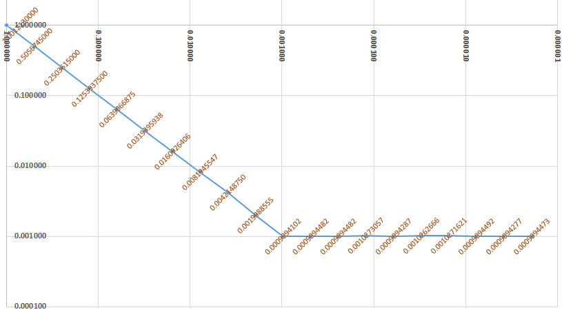

## 4. Sorting a singly linked list.

We’ve [already sorted a pointer based linked list](#36-insert-in-sorted-position-in-a-pointer-based-list), namely by repeated insertions in sorted position. But since that approach uses O(*n*²) quadratic time it’s horribly inefficient for longer lists. It can be fast for a short list, even faster than more generally faster sorts, but as the list size increases prepare to waaaaaaaaaaaaaaaaiiiiiiiiiiiit…

That **insertion sort** can be described more systematically as:

1. Form two lists *u* and *s*, where *u* holds the unsorted items and *s* is empty.
2. While *u* is not empty:  
2.1. Extract the front of *u*, call that value *x*.  
2.2. The searching part: insert *x* in sorted position in *s*.

There is a corresponding **selection sort** that’s equally horribly O(*n*²) quadratic time inefficient for large lists:

1. Form two lists *u* and *s*, where *u* holds the unsorted items and *s* is empty.
2. While *u* is not empty:  
2.1. The searching part: select and extract the largest value of *u*, call that value *x*.  
2.2. Add *x* at the front of *s*.

More efficients sorts are generally based on the idea of **divide and conquer**, or “divide et impera” as Caesar may have said:

1. one first divides the data into *n* roughly equal size parts, where *n* is typically 2; then
2. one sorts each part in the same way as the whole (this is a recursive step); and finally
3. one combines the now sorted parts into a sorted whole.

For the **Quicksort** algorithm used by `std::sort` for random access containers, the comparison of values, the real sorting action, happens in the partitioning step. Quick sort does that by moving all values less than an opportunistically chosen **pivot value** to a first part, and the rest to a second part. In contrast, for the **merge sort** algorithm used by `std::forward_list::sort` the comparison of values happens in the re-combination of the parts, the merging, which (with this description/view) just consumes values in sorted order from the fronts of the now sorted part lists.

As exemplified by `std::sort` and `std::forward_list::sort`, Quicksort is the common default choice of sorting algorithm for an array, and merge sort is the common default choice of sorting algorithm for linked lists. However, I show both approaches for linked lists (and we’ll time them). But first of all, in order to have something substantial to sort we’ll employ a divide and conquer approach similar to merge sort, just with random choice of which parts values come from in the merging, to randomize a long list of English words. It’s a kind of inverse sorting. An unsorting.

### 4.1 Use the Corncob free list of >58 000 English words as data.

For the examples we’ll use [the Corncob free list of English words](http://www.mieliestronk.com/wordlist.html) as data to sort.

It has more than 58 000 word in a simple text file, one per line. One perhaps interesting C++ problem is how to `#include` that file as data for a string literal. Instead of anything clever I just copied and pasted the text into a literal in a header, and that worked nicely with the MinGW g++ compiler, but for Visual C++ 2019 I had to re-express it as an array of single `char` values.

The data here was generated from the original string literal by regular expression find & replace in the Notepad++ editor:

[*<small>data/english_words.hpp</small>*](source/data/english_words.hpp)
~~~cpp
#pragma once
#include <string_view>

namespace data {
    using std::string_view;

    // From the "Corncob" online dictionary,
    // <url: http://www.mieliestronk.com/wordlist.html>.
    
    // Originally expressed as a single long string literal for the MinGW g++ compiler.
    // But now using an array of `char` to work around Visual C++ 2019 error
    // C2026 “string too big, trailing characters truncated”. It can only handle
    // literal pieces each of < 16380 bytes. And then for the resulting string literal
    // there is Visual C++ 2019 fatal error C2019 “string exceeds 65535 bytes in length”.
    // These übersilly limits are out of the 1980’s. Argh.

    inline extern const char english_words_literal[] =
    {
        '\n',
        'a', 'a', 'r', 'd', 'v', 'a', 'r', 'k', '\n',
        'a', 'a', 'r', 'd', 'w', 'o', 'l', 'f', '\n',

            ⋮

        'z', 'u', 'l', 'u', 's', '\n',
        '\0'
    };

    // Two characters to ignore: '\n' at start and '\0' at end of the literal.
    constexpr auto english_words = string_view(
        english_words_literal + 1, sizeof( english_words_literal ) - 2
        );

}  // namespace data
~~~

The `string_view` of the whole big literal, `english_words`, may be just what one wants, just the data, thank you (e.g. for efficient searching), but at least for this tutorial the individual words are needed.  Since all the data is in a string literal it’s not necessary to inefficiently-for-C++ copy the words, as would happen with representing the words as `std::string` values. All that’s needed for a value is a little separate `string_view` that *refers* to a chunk of above literal:

[*<small>data/english_words_iteration.hpp</small>*](source/data/english_words_iteration.hpp)
~~~cpp
#include "english_words.hpp"

#include <string_view>      // std::string_view

namespace data {
    using std::string_view;
    
    template< class Func >
    inline void for_each_english_word( const Func& f )
    {
        const string_view&  s           = english_words;
        const int           s_length    = int( s.length() );

        int i_wordstart = 0;
        while( i_wordstart < s_length ) {
            int i_wordend = i_wordstart + 1;
            while( i_wordend < s_length and s[i_wordend] != '\n' ) {
                ++i_wordend;
            }
            const int   word_length = i_wordend - i_wordstart;
            const auto  word        = string_view( &s[i_wordstart], word_length );

            f( word );

            i_wordstart = i_wordend + 1;
        }
    }

}  // namespace data
~~~

As an example usage, the following program displays the five first and last words.

Because several more example programs need to display an abbreviated list, I factored that logic out in a separate header:

[*<small>data/Abbreviated_list_displayer.hpp</small>*](source/data/Abbreviated_list_displayer.hpp)
~~~cpp
#pragma once
#include <ostream>          // std::ostream
#include <string_view>      // std::string_view

namespace data {
    using std::ostream, std::string_view;

    class Abbreviated_list_displayer    // Non-copyable
    {
        ostream&        m_stream;
        int             m_n_items;
        int             m_index;

    public:
        void display( const string_view& item )
        {
            const int sub_size = 5;
            if( m_index < sub_size or m_n_items - sub_size <= m_index ) {
                if( m_index > 0 ) {
                    m_stream << ", ";
                }
                if( m_n_items > 2*sub_size and m_index == m_n_items - sub_size ) {
                    m_stream << "..., ";
                }
                m_stream << item;
            }
            ++m_index;
        }
        
        Abbreviated_list_displayer( ostream& stream, const int n_items ):
            m_stream( stream ),
            m_n_items( n_items ),
            m_index( 0 )
        {}
    };
}  // namespace data
~~~

[*<small>data/first_and_last_5_words.cpp</small>*](source/data/first_and_last_5_words.cpp)
~~~cpp
#include "english_words_iteration.hpp"
#include "Abbreviated_list_displayer.hpp"
using data::Abbreviated_list_displayer, data::for_each_english_word;

#include <iostream>         // std::(cout, endl)
#include <functional>       // std::invoke
using std::cout, std::endl, std::invoke;

auto main()
    -> int
{
    const int n = invoke(  -> int
    {
        int count = 0;
        for_each_english_word( [&](auto) { ++count; } );
        return count;
    } );
    
    cout << n << " words:" << endl;
    Abbreviated_list_displayer displayer( cout, n );
    for_each_english_word( [&](auto word){ displayer.display( word ); } );
    cout << "." << endl;
}
~~~

Output:

~~~txt
58112 words:
aardvark, aardwolf, aaron, aback, abacus, ..., zooms, zooplankton, zoos, zulu, zulus.
~~~

### 4.2. `Node` and `List` classes, and an `english_words_list()` function.

The `double` values of section 3’s `Node` won’t do to handle the English words, so a new `Node` type is needed.

In addition to using a `string_view` as value this `Node` class conditionally supports custom memory allocation and deallocation. That will be needed when we later measure the performance of list sorting, because in one case the measuring allocates so many nodes that for 32-bit code in Windows (which by default has a 2 GB limit on the program’s own usage) the default memory management is unable to handle it; it runs out of memory. The solution of custom memory management is quite brittle, because it’s just a coincidence that the number of nodes isn’t a few percents larger, where no amount of fiddling would rescue the code. Also, doing this is an unfortunate complication that I believe reduces clarity, slightly.

Still I’m proud that in this turial compiler bugs, standard library shortcomings and the necessity to deal with real systems with limited resources, are not unmentioned and swept under the rug issues, but are instead tackled head-on.

[*<small>03_sorting_singly_linked/Node.hpp</small>*](source/03_sorting_singly_linked/Node.hpp)
~~~cpp
#pragma once
#include "../util/signed_size_types.hpp"
#include "../util/Type_.hpp"

#include <string_view>

namespace oneway_sorting_examples {
    using std::string_view;
    using util::Size, util::Type_;

    struct Node final
    {
        Node*           next;
        string_view     value;

        #ifdef USE_CUSTOM_NODE_ALLOCATION
            static inline auto operator new( const size_t size ) -> void*;
            static inline void operator delete( const Type_<void*> p );
        #endif
        
        inline void link_in_before( Node*& a_next_field ) noexcept;

        friend inline auto unlinked( Node*& a_next_field ) noexcept -> Node*;
        friend inline void delete_list_and_zero( Node*& head ) noexcept;
        friend inline void delete_list( Node*&& temp ) noexcept;
    };
    
    // Support for the custom node allocation machinery.
    struct Node_allocator
    {
        virtual auto allocate( Size ) -> void* = 0;
        virtual void deallocate( void* ) = 0;

        static auto instance() -> Node_allocator&;      // Defined by client code.
    };

    #ifdef USE_CUSTOM_NODE_ALLOCATION
        inline auto Node::operator new( const size_t size )
            -> void*
        { return Node_allocator::instance().allocate( size ); }

        inline void Node::operator delete( const Type_<void*> p )
        {
            Node_allocator::instance().deallocate( p );
        }
    #endif

    inline void Node::link_in_before( Node*& a_next_field ) noexcept
    {
        next = a_next_field;
        a_next_field = this;
    }

    inline auto unlinked( Node*& a_next_field ) noexcept
        -> Node*
    {
        const Type_<Node*> result = a_next_field;
        a_next_field = result->next;
        return result;
    }
    
    inline void delete_list_and_zero( Node*& head ) noexcept
    {
        while( head ) { delete unlinked( head ); }
    }

    inline void delete_list( Node*&& temp ) noexcept
    {
        delete_list_and_zero( temp );
    }
}  // namespace oneway_sorting_examples
~~~

… where the signed size types are defined as

[*<small>util/signed_size_types.hpp</small>*](source/util/signed_size_types.hpp)
~~~cpp
#pragma once
#include <stddef.h>         // ptrdiff_t

namespace util {
    using Size = ptrdiff_t;
    using Index = Size;
}  // namespace util
~~~

We’ll now be passing lists around, including intentionally copying them, so the following `List` type ensures proper automatic copying, moving and destruction — the operations that otherwise can trip you up because it’s so easy to invoke them inadvertently. An alternative could be to `=delete` the implicitly invokable operations and provide corresponding named ordinary functions. That could avoid unintended copying but would be far less convenient.

Anyway the *purpose* is still to learn about linked list handling, and for most other list operations such abstraction would be premature.

And so this `List` is designed for dealing directly with raw, exposed list machinery, the inner nuts ’n bolts ’n gears, just with some convenience and bottom safety added.

[*<small>03_sorting_singly_linked/List.hpp</small>*](source/03_sorting_singly_linked/List.hpp)
~~~cpp
#pragma once
#include "Node.hpp"

#include <algorithm>        // std::(exchange, swap)
#include <utility>          // std::move

namespace oneway_sorting_examples {
    using std::exchange, std::move, std::swap, std::string_view;
    using util::Index;

    struct List
    {
        Node* head;

        class Appender;                                         // Convenience & DRYness.
        inline auto count() const noexcept -> Size;             // Convenience & DRYness.
        inline auto is_sorted() const noexcept -> bool;         // Convenience & DRYness.

        // Taking charge of construction, copying, moving and destruction:
        inline friend void swap( List& a, List& b ) noexcept;   // Declared for exposition.
        inline auto operator=( const List& other ) -> List&;    // Copy assignment.
        inline auto operator=( List&& other ) noexcept -> List&;// Move assignment.
        inline List() noexcept;                                 // Default constructor.
        inline List( const List& other );                       // Copy constructor.
        inline List( List&& other ) noexcept;                   // Move constructor.    
        inline ~List() noexcept;                                // Destructor.
    };

    class List::Appender
    {
        Node*&  m_head;
        Node*   m_last;

        Appender( const Appender& ) = delete;

    public:
        auto last() const -> Node* { return m_last; }

        Appender( Node*& a_head_pointer ) noexcept:
            m_head( a_head_pointer ),
            m_last( nullptr )
        {
            for( Node* p = m_head; p; p = p->next ) { m_last = p; }
        }

        void append( const Type_<Node*> new_node ) noexcept
        {
            Node*& beyond = (m_last? m_last->next : m_head);
            new_node->link_in_before( beyond );
            m_last = new_node;
        }
    };

    inline auto List::count() const noexcept
        -> Size
    {
        Size n = 0;
        for( const Node* p = head; p; p = p->next ) { ++n; }
        return n;
    }

    inline auto List::is_sorted() const noexcept
        -> bool
    {
        string_view previous = "";
        for( const Node* p = head; p; p = p->next ) {
            if( p->value < previous ) {
                return false;
            }
            previous = p->value;
        }
        return true;
    }

    inline void swap( List& a, List& b ) noexcept
    {
        swap( a.head, b.head );
    }

    inline auto List::operator=( const List& other )
        -> List&
    {
        List temp = other;
        swap( temp, *this );
        return *this;
    }

    inline auto List::operator=( List&& other ) noexcept
        -> List&
    {
        swap( other, *this );
        return *this;
    }

    inline List::List() noexcept:
        head( nullptr )
    {}

    inline List::List( const List& other ):
        List()
    {
        Appender appender( head );
        try {
            for( Node* p = other.head; p; p = p->next ) {
                appender.append( new Node{ nullptr, p->value } );
            }
        } catch( ... ) {
            delete_list_and_zero( head );
            throw;
        }
    }
    
    inline List::List( List&& other ) noexcept:
        head( exchange( other.head, nullptr ) )
    {}

    inline List::~List() noexcept
    {
        delete_list_and_zero( head );
    }

}  // namespace oneway_sorting_examples
~~~

The `Appender` class takes care of efficiently appending a sequence of nodes. It assumes and requires that the list structure is not changed by other means while this goes on. By moving the search for the last node from the constructor to the `append` function one could support insertion of new nodes between calls of that function, while keeping the instance, but then with marginal advantage and a serious cost of more complex usage conditions and less robust usage code.

With that in the toolbox a function `english_words_list` for producing the 58 000+ words as individual nodes in a list, is straightforward:

[*<small>03_sorting_singly_linked/english_words_list.hpp</small>*](source/03_sorting_singly_linked/english_words_list.hpp)
~~~cpp
#pragma once
#include "../data/english_words_iteration.hpp"
#include "List.hpp"

namespace oneway_sorting_examples {
    
    inline auto english_words_list()
        -> List
    {
        List list;
        List::Appender appender( list.head );
        data::for_each_english_word( [&]( const string_view& word )
        {
            appender.append( new Node{ nullptr, word } );
        } );
        return list;
    }

}  // namespace oneway_sorting_examples
~~~

Finally, we should better test — not rigorously, but just, test — that this code works as intended, producing the data that we intend to randomize and then sort.

[*<small>03_sorting_singly_linked/english_words_list_result.cpp</small>*](source/03_sorting_singly_linked/english_words_list_result.cpp.cpp)
~~~cpp
#include "../data/Abbreviated_list_displayer.hpp"
using data::Abbreviated_list_displayer;

#include "english_words_list.hpp"
namespace x = oneway_sorting_examples;
using x::Node, x::List, x::english_words_list;

#include <iostream>
using std::cout, std::endl;

auto main()
    -> int
{
    List words = english_words_list();
    const int n = int( words.count() );
    
    cout << "`english_words_list()` produced " << n << " words:" << endl;
    Abbreviated_list_displayer displayer( cout, n );
    for( Node* p = words.head; p != nullptr; p = p->next ) {
        displayer.display( p->value );
    }
    cout << "." << endl;
}
~~~

Output as before, but now with the data coming from a linked list:

~~~cpp
`english_words_list()` produced 58112 words:
aardvark, aardwolf, aaron, aback, abacus, ..., zooms, zooplankton, zoos, zulu, zulus.
~~~

That worked, yay!

### 4.3. Randomize a list efficiently.

Modern C++ code should use the facilities of the C++11 `<random>` header, and not the old C `rand` and `srand` functions. The old functions are likely to generate value sequences that are far from ideally random, and if I used them here I would be teaching you Bad Habits™. Unfortunately direct use of the modern and more solidly computer science based `<random>` header facilities is very much less convenient, and more verbose, than using the old functions.

I therefore placed more convenient wrappers in namespace `util::std_random` in [a convenience header `"util/std_random.hpp"`](source/util/std__random.hpp).

For the shuffling we’ll use the `std_random::Choices` class whose `.next()` method produces a pseudo-random `bool` value. Other main functionality of that header includes `std_random::Integers`, which produces integers in a specified zero-based range, and `std_random::Numbers`, which produces floating point numbers in range 0 to but not including 1. Particularly relevant parts of the header (these depend on some parts not shown):

~~~cpp
namespace util::std_random {
    namespace _alias { namespace std_random = util::std_random; }
        ⋮

    // A more well-defined, more reliable alternative to std::default_random_engine.
    using Generator     = conditional_t< system_is_64_bit_or_more,
        std::mt19937_64,            // Efficient for 64-bit systems.
        std::mt19937                // Efficient for 32-bit systems.
        >;
    using Bits_value    = Generator::result_type;

        ⋮

    class Choices
    {
        Bits            m_bits;
        Bits_value      m_value;
        int             m_n_bits_consumed;
    
    public:
        auto generator()
            -> Generator&
        { return m_bits.generator(); }

        auto next()
            -> bool
        {
            if( m_n_bits_consumed == bits_per_<Bits_value> ) {
                m_value = m_bits.next();
                m_n_bits_consumed = 0;
            }
            ++m_n_bits_consumed;
            return !!(exchange( m_value, m_value/2 ) % 2);
        }
        
        explicit Choices( const Seed seed = random_seed() ):
            m_bits( seed ),
            m_value( 0 ),
            m_n_bits_consumed( bits_per_<Bits_value> )
        {}
    };

    template< class Integer = int >
    struct Integer_
    {
        static auto from( Generator& g, const Integer n_unique_values )
            -> Integer
        { return uniform_int_distribution<Integer>( 0, n_unique_values - 1 )( g ); }
    };

    using Integer   = Integer_<int>;
}  // namespace util::std_random
~~~

The logic in class `Choices` is a possibly premature optimization I added because things seemed slow in a Windows console window. It turned out that what was slow was not invocations of the random generator but Windows’ creation of a new process of a little program. From a human perspective that should be instantaneous; it wasn’t.

But while that possibly needlessly added code complicates things it does no technical harm, increases the sequence length relative to discarding bits, and can possibly improve efficiency (the original intent), so I left it in.

---

When the data to be shuffled is all in main memory, as our 58 000+ words are, then for simplicity shuffling of a list can be expressed as a recursive function that after distributing the words about equally to 2 parts lists calls itself to randomize those lists, and then randomly merges the now randomly ordered part lists.

With *n* words and 2 part lists the recursion depth is roughly log₂*n*, which for *n* = 58 112 is ‭≈15.8, which rounded up is 16.

A typical function call uses a handful or at most some tens of bytes of stack space, and the typical default stack size on a desktop system is a few MB. A maximum call chain of 16 nested calls is therefore far too short to cause undefined behavior via stack overflow. And so a simple recursive implementation is OK.

[*<small>03_sorting_singly_linked/merge_shuffle.hpp</small>*](source/03_sorting_singly_linked/merge_shuffle.hpp)
~~~cpp
#pragma once
#include "List.hpp"
#include "../util/std_random.hpp"

#include <array>        // std::array

namespace oneway_sorting_examples {
    using std::array;
    using namespace util::std_random::_alias;
    
    inline void merge_shuffle( List& list, std_random::Choices& choices )
    {
        // Recursion base case: a list with n <= 1 nodes is necessarily randomly ordered.
        if( list.head == nullptr or list.head->next == nullptr ) {
            return;
        }
        array<List, 2> parts;
        
        // Divide the nodes about equally to part lists (a partitioning of nodes):
        for( int i = 0; list.head != nullptr; ) {
            unlinked( list.head )->link_in_before( parts[i%2].head );
            ++i;
        }
        
        // Recurse:
        for( int i = 0; i < 2; ++i ) {
            merge_shuffle( parts[i], choices );
        }
        
        // Merge the now random 2 parts randomly:
        List::Appender appender( list.head );
        for( ;; ) {
            const int n_empty = (parts[0].head == nullptr) + (parts[1].head == nullptr);
            if( n_empty == 2 ) {
                break;      // Hurray, we're finished at this recursion level.
            } else if( n_empty == 1 ) {
                const int i_rest = (parts[0].head != nullptr? 0 : 1);
                do {
                    appender.append( unlinked( parts[i_rest].head ) );
                } while( parts[i_rest].head != nullptr );
            } else { // n_empty == 0
                const int i_random = choices.next();
                appender.append( unlinked( parts[i_random].head ) );
            }
        }
    }

    inline void merge_shuffle(
        List&                       list,
        const std_random::Seed      seq_nr = std_random::random_seed()
        )
    {
        std_random::Choices choices( seq_nr );
        merge_shuffle( list, choices );
    }

}  // namespace oneway_sorting_examples
~~~

Possibly this list shuffle and the corresponding list shuffle that’s like Quicksort instead of like merge sort, have special names. However, I’m not familiar with such names. Happily, since linked lists are rarely used, for the practicing programmer — as opposed to the computer scientist — there’s no big practical need for names.

----

At each of the log₂*n* recursion levels each of the *n* nodes is considered once, so the total time is O(*n*⋅log *n*). This is acceptable. But still, since in our case log₂*n* ≈ 16 one can reasonably expect that an O(*n*) algorithm will be 16 times as fast for this data set, and a constant factor of 16 is far from insignificant.

But can a linked list be shuffled in O(*n*) time without using O(*n*) extra memory? I don’t know of any way, and I doubt that it can be done. In contrast, as you’ll see O(*n*) time shuffling of an array is easy.

To measure elapsed time modern C++ code should use the C++11 `<chrono>` header, instead of the old C `clock` function. One main reason is that the `<chrono>` facilities are less easy to use incorrectly. However, as with the `<random>` header direct use can be inconvenient and verbose.

For this tutorial I therefore provide [a convenience header `"util/chrono.hpp"`](source/util/chrono.hpp).

The convenience header provides an alias `my_chrono::Timer_clock` chosen as the monotonically increasing clock with best resolution, a function `my_chrono::as_seconds` that produces an ordinary `double` value, and ditto functions for milliseconds, microseconds and nanoseconds.

[*<small>03_sorting_singly_linked/merge_shuffle_result.cpp</small>*](source/03_sorting_singly_linked/merge_shuffle_result.cpp)
~~~cpp
#include "../util/std_chrono.hpp"
#include "../util/std_random.hpp"
using namespace util::std_chrono::_alias;
using namespace util::std_random::_alias;
using std_chrono::Timer_clock, std_chrono::Time_point, std_chrono::as_seconds;

#include "../data/Abbreviated_list_displayer.hpp"
using data::Abbreviated_list_displayer;

#include "english_words_list.hpp"
#include "merge_shuffle.hpp"
namespace x = oneway_sorting_examples;
using x::Node, x::List, x::english_words_list, x::merge_shuffle;

#include <iostream>
using std::fixed, std::cout, std::clog, std::endl;

auto main()
    -> int
{
    List words = english_words_list();
    const int n = int( words.count() );
    
    const Time_point start_time = Timer_clock::now();
    const int seq_nr = 42;
    merge_shuffle( words, std_random::Seed( seq_nr ) ); // seq_nr => always same result.
    const Time_point end_time = Timer_clock::now();
    const double n_seconds = as_seconds( end_time - start_time );

    clog << fixed << n_seconds << " seconds." << endl;
    cout << "Merge-shuffled " << n << " words:" << endl;
    Abbreviated_list_displayer displayer( cout, n );
    for( Node* p = words.head; p != nullptr; p = p->next ) {
        displayer.display( p->value );
    }
    cout << "." << endl;
}
~~~

Note: even though this program uses a fixed seed value, 42, and therefore will produce the same result each time it’s run, a 32-bit executable can generate a different result than a 64-bit executable because the logic in the header chooses the `std_random::Generator` type according to the bitness of the executable.

One result with 64-bit MinGW g++ 9.2 in Windows 10, using optimization option `-O3`:

~~~txt
0.012996 seconds.
Merge-shuffled 58112 words:
usurer, undisguised, hosepipe, reasonless, fouled, ..., hawaii, droving, cathartic, accesses, stuffiness.
~~~

The measured time of some code can vary from one run of the program to the next, and it can be so short that it’s difficult to measure accurately using the old `clock` function. This is especially so in Windows, where `clock` has very low resolution.  And it’s so even for some of the following examples here with modern `<chrono>` timing, when using the MinGW g++ 9.2 compiler.

 So usually one should ***put the code to be measured in a simple loop that executes it thousands of times***, measure the total elapsed time and divide by the number of executions. Unless the code takes a long time to complete. Happily the above result shows that looping is not necessary for this particular code and dataset on my old laptop.

Still it doesn’t hurt to check if e.g. 11 consecutive runs produce similar times, here in Windows Cmd:

~~~txt
[X:\source\sorting_singly_linked]
> for /L %x in (1,1,11) do @(a>nul)
0.015972 seconds.
0.015990 seconds.
0.011994 seconds.
0.011993 seconds.
0.012992 seconds.
0.011995 seconds.
0.011994 seconds.
0.011993 seconds.
0.012993 seconds.
0.011993 seconds.
0.011971 seconds.
~~~

They do, OK. And the times obtained with Visual C++ 2019 with option `/O2` are very similar, but up around 0.015 seconds as bottom line instead of 0.012. I.e. the g++ code is a little faster.

---

Since a reasonable array shuffle is O(*n*) linear time, as opposed to O(*n* log *n*), and since an array shuffle does less for each value — just a copy or two, as opposed to the linked list adjustment of several pointers — I expected an array shuffle to be *at least* 16 times faster for this data set. I’d say that’s reasonable. However, the array shuffle turned out to be just slightly more than 7 times faster.

This serves to show that intuition can easily go wrong, at least in the details, about performance issues. One possible way to find out about why it’s not way faster is to **profile** the code, using a tool that measures how much time is spent in each relevant part. I don’t do that here; I just note that 7+ times faster shuffling, for array instead of linked list, is not insignificant. 

And in general arrays are faster than linked lists at just about anything.

The simple idea of O(*n*) array shuffling, known as the [Fisher-Yates shuffle](https://en.wikipedia.org/wiki/Fisher%E2%80%93Yates_shuffle), is to swap the first item of the array with a random other item or itself. Then do the same with the rest of the array regarded as a full array. The “or itself” ensures that every item has an equal chance of ending up in any particular place.

Instead of implementing array shuffling oneself, as in the code below, for professional work one would just use the standard library’s implementation `std::shuffle`. There is no corresponding `std::forward_list::shuffle`. The standard library is mostly array-oriented, supportive of arrays rather than linked lists.

[*<small>03_sorting_singly_linked/array_shuffle_result.cpp</small>*](source/03_sorting_singly_linked/array_shuffle_result.cpp)
~~~cpp
#include "../data/english_words_iteration.hpp"
#include "../data/Abbreviated_list_displayer.hpp"
using data::for_each_english_word, data::Abbreviated_list_displayer;

#include "../util/std_chrono.hpp"
#include "../util/std_random.hpp"
using namespace util::std_chrono::_alias;
using namespace util::std_random::_alias;
using std_chrono::Timer_clock, std_chrono::Time_point, std_chrono::as_seconds;

#include <stddef.h>         // ptrdiff_t
using Size = ptrdiff_t;
using Index = Size;

#include <iostream>         // std::(cout, endl)
#include <vector>           // std::vector
#include <string_view>      // std::string_view
#include <utility>          // std::swap
using
    std::vector, std::string_view, std::swap,
    std::fixed, std::cout, std::clog, std::endl;

auto english_words_vector()
    -> vector<string_view>
{
    vector<string_view> words;
    for_each_english_word( [&]( const string_view& w ){ words.push_back( w ); } );
    return words;
}

void array_shuffle(
    vector<string_view>&        words,
    const std_random::Seed      a_seed = std_random::random_seed()
    )
{
    std_random::Generator g( a_seed.value() );
    const Size max_index = words.size() - 1;
    for( Index i = 0; i < max_index; ++i ) {
        const Size  n_available     = words.size() - i;
        const Index offset_other    = std_random::Integer_<Index>::from( g, n_available );
        if( offset_other != 0 ) {
            swap( words[i], words[i + offset_other] );
        }
    }
}

auto main()
    -> int
{
    vector<string_view> words = english_words_vector();
    const int n = int( words.size() );
    
    #ifdef USE_AVERAGE
        const int n_iterations = 1'000;
    #else
        // Note: a single array shuffle can be too fast to measure (can look like 0 time).
        const int n_iterations = 1;
    #endif

    const Time_point start_time = Timer_clock::now();
    for( int i = 0; i < n_iterations; ++i ) {
        const auto seed_42 =  std_random::Seed( 42 );
        array_shuffle( words, seed_42 );    // seed_42 => always the same result.
    }
    const Time_point end_time = Timer_clock::now();
    const double n_seconds = as_seconds( end_time - start_time )/n_iterations;

    clog << fixed << n_seconds << " seconds per shuffle." << endl;
    cout << "Array-shuffled " << n << " words:" << endl;
    Abbreviated_list_displayer displayer( cout, n );
    for( const string_view& word: words ) { displayer.display( word ); }
    cout << "." << endl;
}
~~~

With 64-bit MinGW g++ 9.2 with optimization option `-O3`, without asking for averaging, I got timings where most were exactly 0, and the rest, just a few ones, were very close to 1/64ᵗʰ of a second, 0.015625 seconds:

~~~txt
[X:\source\03_sorting_singly_linked]
> a
0.000000 seconds per shuffle.
Array-shuffled 58112 words:
ruction, phosphate, roosts, charles, towelling, ..., toys, chase, pincered, recognised, stepwise.

[X:\source\03_sorting_singly_linked]
> for /L %x in (1,1,11) do @(a>nul)
0.000000 seconds per shuffle.
0.000000 seconds per shuffle.
0.000000 seconds per shuffle.
0.000000 seconds per shuffle.
0.000000 seconds per shuffle.
0.000000 seconds per shuffle.
0.000000 seconds per shuffle.
0.015653 seconds per shuffle.
0.015624 seconds per shuffle.
0.000000 seconds per shuffle.
0.015555 seconds per shuffle.
~~~

This indicates that the best steady timer that this compiler’s `<chrono>` offers, has just 6 bits resolution of the fractional part of seconds, though it *reports* the time in much more fine grained units. However, while also some other runs have shown this, some other runs with other builds have instead indicated a resolution of 1 msec. It’s all quite perplexing, as if the underlying machinery that the standard library relies on is somehow chosen dynamically, of varying quality.

With 32-bit Visual C++ 2019, using option `/O2` for full speed optimization, the results are much more consistent about timer resolution:

~~~txt
[X:\source\03_sorting_singly_linked]
> b
0.000985 seconds per shuffle.
Array-shuffled 58112 words:
program, dopes, depredation, bestowing, disreputable, ..., blushes, idiocies, movingly, offers, construing.

[X:\source\03_sorting_singly_linked]
> for /L %x in (1,1,11) do @(b>nul)
0.000954 seconds per shuffle.
0.001785 seconds per shuffle.
0.001815 seconds per shuffle.
0.001843 seconds per shuffle.
0.003566 seconds per shuffle.
0.002691 seconds per shuffle.
0.001067 seconds per shuffle.
0.000977 seconds per shuffle.
0.001144 seconds per shuffle.
0.002299 seconds per shuffle.
0.001243 seconds per shuffle.
~~~

Here the 3 lowest measurements are each roughly 1 millisecond, and trying this several more times, including with new builds after some days, the lowest measurement were always roughly 1 millisecond. Which consistently indicates a timer with 1 millisecond resolution. But the other (higher) results vary so also this is somewhat perplexing and mysterious.

Anyway this is an example where for at least one main compiler the code to be timed is too fast to be measured with the available low resolution timer, namely `Timer_clock` which is defined as

~~~cpp
using Timer_clock = std::conditional_t<std::chrono::high_resolution_clock::is_steady,
    std::chrono::high_resolution_clock,
    std::chrono::steady_clock
    >;
~~~

After asking for averaging of 1000 shuffles via g++ option `-D USE_AVERAGE`, more believable non-zero numbers emerged:

~~~txt
[X:\source\03_sorting_singly_linked]
> a
0.001554 seconds per shuffle.
Array-shuffled 58112 words:
reagents, wing, consists, bountiful, mordant, ..., hatefully, quarrying, apis, cantatas, waterways.

[X:\source\03_sorting_singly_linked]
> for /L %x in (1,1,11) do @(a>nul)
0.001547 seconds per shuffle.
0.001562 seconds per shuffle.
0.001547 seconds per shuffle.
0.001531 seconds per shuffle.
0.001562 seconds per shuffle.
0.001547 seconds per shuffle.
0.001547 seconds per shuffle.
0.001547 seconds per shuffle.
0.001578 seconds per shuffle.
0.001562 seconds per shuffle.
0.001578 seconds per shuffle.
~~~

Corresponding average numbers for 32-bit Visual C++ 2019 are roughly 0.001 second per shuffle. So, while g++ produced slightly faster code for linked list shuffling, 32-bit Visual C++ produced slightly faster code for array shuffling. But the results are very close.

However, compared to the roughly 0.012 seconds for the linked list merge shuffle with g++, the 0.0016 seconds array shuffle is roughly 7.5 times faster, and that result *is* significant.

Keep in mind that these numbers are just one arbitrary real example. The main point is that not only in theoretical big Oh behavior but also in practice for a not minimal data set, arrays win handily over linked lists. Arrays yield shorter and faster code plus, arrays have standard library support for this task and for much else.

---

The sorting examples will use a common function `shuffled_english_words_list` that produces a shuffled list:

[*<small>03_sorting_singly_linked/shuffled_english_words_list.hpp</small>*](source/03_sorting_singly_linked/shuffled_english_words_list.hpp)
~~~cpp
#pragma once
#include "../util/std_random.hpp"

#include "english_words_list.hpp"
#include "merge_shuffle.hpp"

namespace oneway_sorting_examples {
    using namespace util::std_random::_alias;
    
    inline auto shuffled_english_words_list(
        const std_random::Seed seed = std_random::Seed( 42 )
        ) -> List
    {
        List result = english_words_list();
        merge_shuffle( result, seed );
        return result;
    }

}  // namespace oneway_sorting_examples
~~~

As already shown the shuffled list based on pseudo-random sequence #42, that one obtains with the 64-bit MinGW g++ 9.2 compiler, begins and ends with

~~~txt
usurer, undisguised, hosepipe, reasonless, fouled, ..., hawaii, droving, cathartic, accesses, stuffiness.
~~~

### 4.4. Merge-sort a list recursively.

Recursive merge-sort is so well suited to linked lists that the most straightword code works, and is clean and clear:

[*<small>03_sorting_singly_linked/merge_sort_recursively.hpp</small>*](source/03_sorting_singly_linked/merge_sort_recursively.hpp)
~~~cpp
#pragma once
#include "List.hpp"

#include <array>        // std::array

namespace oneway_sorting_examples {
    using std::array;
    
    inline void merge_sort_recursively( List& list )
    {
        // Recursion base case: a list with n <= 1 nodes is necessarily sorted.
        if( not list.head or not list.head->next ) {
            return;
        }
        array<List, 2> parts;
        
        // Divide the nodes about equally to part lists (a partitioning of nodes):
        for( int i = 0; list.head; ) {
            unlinked( list.head )->link_in_before( parts[i%2].head );
            ++i;
        }
        
        // Recurse:
        for( int i = 0; i < 2; ++i ) {
            merge_sort_recursively( parts[i] );
        }
        
        // Merge the now sorted 2 parts in sorted order:
        List::Appender appender( list.head );
        for( ;; ) {
            const int n_empty = (not parts[0].head) + (not parts[1].head);
            if( n_empty == 2 ) {
                break;      // Hurray, we're finished at this recursion level.
            } else if( n_empty == 1 ) {
                const int i_rest = (parts[0].head? 0 : 1);
                do {
                    appender.append( unlinked( parts[i_rest].head ) );
                } while( parts[i_rest].head );
            } else { // n_empty == 0
                const int i = (parts[0].head->value < parts[1].head->value? 0 : 1);
                appender.append( unlinked( parts[i].head ) );
            }
        }
    }

}  // namespace oneway_sorting_examples
~~~

The O(1) recursion base case checking here, that the list does not have more than 1 node, illustrates indirectly that even standard library classes can lack crucial functionality. To wit, `std::forward_list` does not provide a method to O(1)-check that condition directly. It can be expressed as `list.empty() or next(list.begin()) == list.end()`, directly analogous to the pointer based code above, but one would not expect a novice to come up with that or, in particular, to understand that one is *supposed* to implement such things, that the `forward_list` design is RISC-like minimal.

Recall that with MinGW g++ 9.2 in Windows 10, using optimization option -O3 a merge-*shuffle* of the 58 000+ words took about 0.012 seconds.

So, with the same compiler, options and system, how does a merge-*sort* fare?

[*<small>03_sorting_singly_linked/merge_sort_recursively_result.cpp</small>*](source/03_sorting_singly_linked/merge_sort_recursively_result.cpp)
~~~cpp
#include "../util/std_chrono.hpp"
using namespace util::std_chrono::_alias;
using std_chrono::Timer_clock, std_chrono::Time_point, std_chrono::as_seconds;

#include "shuffled_english_words_list.hpp"
#include "merge_sort_recursively.hpp"
namespace x = oneway_sorting_examples;
using
    x::english_words_list, x::shuffled_english_words_list,
    x::Node, x::List, x::merge_sort_recursively;

#include <iomanip>          // std::setw
#include <iostream>         // std::(fixed, cout, clog, endl)    
#include <limits>           // std::numeric_limits
using
    std::setw, std::numeric_limits,
    std::fixed, std::cout, std::clog, std::endl,
    std::make_optional, std::nullopt, std::optional;

constexpr double nan_value = numeric_limits<double>::quiet_NaN();

auto seconds_for( List words )
    -> double
{
    const Time_point    start_time  = Timer_clock::now();
    merge_sort_recursively( words );
    const Time_point    end_time    = Timer_clock::now();
    const double        seconds     = as_seconds( end_time - start_time );
    return (words.is_sorted()? seconds : nan_value);
}

auto main()
    -> int
{
    cout    << fixed;
    cout    << "Recursive merge-sort results in seconds, for "
            << english_words_list().count() << " words:"
            << endl;
    cout    << endl;
    const auto w = setw( 16 );
    cout << w << "Sorted data:" << w << "Shuffled data:" << w << "Diff:" << endl;
    for( int i = 1; i <= 12; ++i ) {
        const double time_for_sorted    = seconds_for( english_words_list() );
        const double time_for_shuffled  = seconds_for( shuffled_english_words_list() );
        const double diff               = time_for_shuffled - time_for_sorted;
        cout << w << time_for_sorted << w << time_for_shuffled << w << diff << endl;
    }
}
~~~

A typical result — with the aforementioned compiler, options and system, and the 58 000+ words:

~~~txt
Recursive merge-sort results in seconds, for 58112 words:

    Sorted data:  Shuffled data:           Diff:
        0.046872        0.031250       -0.015622
        0.031268        0.031247       -0.000021
        0.031238        0.031247        0.000009
        0.031247        0.031248        0.000001
        0.046872        0.031245       -0.015627
        0.031249        0.031248       -0.000001
        0.031240        0.031248        0.000008
        0.031248        0.031247       -0.000001
        0.031247        0.031268        0.000021
        0.031268        0.031247       -0.000021
        0.031235        0.031229       -0.000006
        0.031248        0.031227       -0.000021
~~~

The two differences here that are not roughly 0, namely 0.015622 and 0.015627, yet again indicate a MinGW g++ 9.2 timer resolution of 1/64 = 0.015625 seconds.

Compared to 0.012 seconds for a shuffle, 0.031 or so for the sort is roughly 2.6 times slower. In theory a shuffle is just a sort, namely reorganizing the data into a chosen random permutation. But in practice the shuffle differs both in being simpler and in being faster.

From several runs it looks as if sorting the shuffled data is slightly faster (or less slow) than sorting the already sorted original data, but this may be just my perception.

One way to capitalize on the presence of already sorted stretches in the data, is to use an iterative merge sort instead of a recursive one.

### 4.5. Merge-sort a list iteratively with “natural runs”.

If one considers only how sequences are merged, then with the sequence of 8 𝜋 digits

&nbsp;&nbsp;&nbsp;&nbsp;&nbsp;&nbsp;&nbsp;&nbsp;**3&nbsp;1&nbsp;4&nbsp;1&nbsp;5&nbsp;9&nbsp;2&nbsp;7**

… the final, bottom recursion level in a recursive merge sort deals with 8 1-digit sequences, which those calls merge pairwise into 4 2-digit sequences:

~~~txt
  13 14    59 27
  ↗   ↑    ↑   ↖
3 1  4 1  5 9  2 7
~~~

The next to last recursion level merges these 4 2-digit sequences into 2 4-digit sequences:

~~~txt
     1134 2579
     ↗       ↖
  13  14    59  27
~~~

And the top level call produces the final sorted sequence:

~~~txt
     11234579
         ↑
     1134 2579
~~~

This does not however reflect the detailed *order* that things happen in. In the executing code the 3\|1 merge is done first, then the 4\|1 merge, but then the 13\|14 merge is done. The function call returns one more level up and delves recursively down all the way again, to the 5\|9 merge, then the 2\|7 merge, then doing the 59\|27 merge, and finally the 1134\|2579 merge.

The nice thing about disregarding that execution order and considering only recursion *levels*, is that each level’s data can be regarded as a single sequence of **runs** of sorted values. At the bottom level each run is 1 item long, at the next to bottom level each run is 2 items long, and so on, and *n* items for the whole sorted sequence at the top level. Or, to be precise, that's the lengths that one knows about without inspecting the data. Assuming that the runs are of these lengths, powers of 2, yields relatively simple iterative merge sort code that effectively does the same as the recursive version.

In the time of magnetic tape drives, which one typically had a very limited number of, this was desirable because each level’s data could be stored on a single tape. Or, to facilitate the merging, rather two tapes, half of it on each tape. An iterative merge sort would then merge the runs on these tapes onto two other tapes, and just switch the tape pairs for the next iteration. With this scheme one could make do with just 4 tape drives regardless of the sequence size, instead of the 16+ tape drives that the recursive scheme would require for our 58 000+ English words, or in general, ⌈log₂(*n*)⌉+ tape drives.

Since the time of tape drives is long past, except possibly for backup in big data centers, and  since the recursive version’s code is so straightforward, one needs some other reason for doing an iterative merge sort. One such reason is that one can leverage already in-sort-order runs of items, the **natural runs**, and merge them. The natural runs can never be smaller than the power of 2 runs, and they will likely be longer, and this means fewer merges. In the ideal case for an already sorted sequence there will be only one merge, a do-nothing merge, i.e. a single pass. So if the data is already near sorted an iterative merge sort with natural runs may outperform the recursive one.

Dealing with natural runs is however a little bit tricky and involves more checking in the code, so there is a cost  —  *There Ain’t No Such Thing As A Free Lunch*:

[*<small>03_sorting_singly_linked/merge_sort_iteratively.hpp</small>*](source/03_sorting_singly_linked/merge_sort_iteratively.hpp)
~~~cpp
#pragma once
#include "List.hpp"

#include <assert.h>     // assert

#include <array>        // std::array
#include <functional>   // std::invoke
#include <utility>      // std::move

namespace oneway_sorting_examples {
    using std::array, std::invoke, std::move, std::string_view;

    struct Merge_sort_input
    {
        string_view         previous_value = "";
        array<List, 2>      in;
        
        auto next()
            -> Node*
        {
            const int n_empty = (not in[0].head + not in[1].head);
            if( n_empty == 2 ) {
                return nullptr;
            } else if( n_empty == 1 ) {
                return unlinked( in[0].head? in[0].head : in[1].head );
            } else { // n_empty == 0
                const array<string_view, 2> v =
                {
                    in[0].head->value, in[1].head->value
                };

                if( (v[0] >= previous_value) == (v[1] >= previous_value) ) {
                    return unlinked( v[0] < v[1]? in[0].head : in[1].head );
                } else if( v[0] >= previous_value ) {
                    return unlinked( in[0].head );
                } else {
                    return unlinked( in[1].head );
                }
            }
        }
    };

    inline auto merge_sort_iteratively( List& list )
        -> int      // Number of passes used.
    {
        if( not list.head or not list.head->next ) {
            return 0;
        }

        Merge_sort_input    input;
        array<List, 2>      out;

        out[0] = move( list );
        for( int n_passes = 1; true; ++n_passes ) {
            input.previous_value = "";
            input.in[0] = move( out[0] );
            input.in[1] = move( out[1] );
            array<List::Appender, 2> out_appenders = {out[0].head, out[1].head};

            int i_out = 0;
            for( ;; ) {
                const Type_<Node*> p = input.next();
                if( not p ) {
                    break;          // Merge finished.
                } else if( p->value < input.previous_value ) {
                    i_out = 1 - i_out;      // Start a new run in the other out-list.
                }
                input.previous_value = p->value;
                out_appenders[i_out].append( p );
            }

            if( not out[0].head or not out[1].head ) {
                list = move( out[0].head? out[0] : out[1] );
                return n_passes;
            }
        }
    }

}  // namespace oneway_sorting_examples
~~~

Almost the same code used to test the recursive merge, can now illuminate just how much (if anything) the added complexity adds to the sorting time when the data does *not* have long natural runs already.

[*<small>03_sorting_singly_linked/merge_sort_iteratively_result.cpp</small>*](source/03_sorting_singly_linked/merge_sort_iteratively_result.cpp)
~~~cpp
#include "../util/std_chrono.hpp"
using namespace util::std_chrono::_alias;
using   std_chrono::Timer_clock, std_chrono::Time_point, std_chrono::as_seconds;

#include "shuffled_english_words_list.hpp"
#include "merge_sort_iteratively.hpp"
namespace x = oneway_sorting_examples;
using   x::english_words_list, x::shuffled_english_words_list,
        x::Node, x::List, x::merge_sort_iteratively;

#include <iomanip>          // std::setw
#include <iostream>         // std::(fixed, cout, clog, endl)    
#include <limits>           // std::numeric_limits
using   std::setw, std::numeric_limits,
        std::fixed, std::cout, std::clog, std::endl;
    
constexpr double nan_value = numeric_limits<double>::quiet_NaN();

auto seconds_for( List words )
    -> double
{
    const Time_point    start_time  = Timer_clock::now();
    merge_sort_iteratively( words );
    const Time_point    end_time    = Timer_clock::now();

    return (words.is_sorted()? as_seconds( end_time - start_time ) : nan_value);
}

auto main()
    -> int
{
    const auto w = setw( 16 );
    cout << fixed;

    cout    << "Iterative \"natural runs\" merge-sort results in seconds, for "
            << english_words_list().count() << " words:"
            << endl;
    cout << endl;
    cout << w << "Sorted data:" << w << "Shuffled data:" << w << "Diff:" << endl;
    for( int i = 1; i <= 12; ++i ) {
        const double sorted_time    = seconds_for( english_words_list() );
        const double shuffled_time  = seconds_for( shuffled_english_words_list() );
        const double diff           = shuffled_time - sorted_time;
        cout << w << sorted_time << w << shuffled_time << w << diff << endl;
    }
}
~~~

One typical result with MinGW g++ 9.2 in Windows 10, using option `-O3`:

~~~txt
Iterative "natural runs" merge-sort results in seconds, for 58112 words:

    Sorted data:  Shuffled data:           Diff:
        0.003018        0.074938        0.071920
        0.000999        0.059964        0.058965
        0.002001        0.059965        0.057964
        0.000985        0.067960        0.066975
        0.000999        0.060098        0.059099
        0.000000        0.059402        0.059402
        0.000000        0.053381        0.053381
        0.000000        0.069031        0.069031
        0.015624        0.053416        0.037792
        0.000000        0.069046        0.069046
        0.000000        0.069011        0.069011
        0.015629        0.068993        0.053364
~~~

For shuffled data it’s clearly slower than the recursive version, up to twice as slow, but for already sorted data it’s way faster. Except — we’re evidently for the second time up against the resolution limit of this compiler’s `<chrono>` implementation. The first eight results are very close to multiples of 1 msec, indicating a 1 msec timer, but then comes four results (OK, two of which are zero) that instead are very close to multiples of 1/64ᵗʰ second, or 0.015625 seconds. It’s as if the timer downgrades its resolution midway through these runs. That, and the small deviations from perfect multiples, is a big mystery to me; I have no explanation.

### 4.6. A digression on measuring how long a code execution takes.

As mentioned in passing in section [4.3 “Randomize a list efficiently”](#43-randomize-a-list-efficiently): the usual way to measure a code execution that may be too fast for the timer’s resolution, is to execute that code a great number of times *n*, and divide the total time by *n*.

---
#### Best practically guaranteed resolution = 0.02 seconds.

Any practically useful timer must give at least two to three significant digits for a time measurement in the seconds or tens of seconds range. And any timer provided by a successful general C++ implementation must be practically useful. Thus, with any of the successful general C++ implementations — those for desktop systems and higher, like g++, g++-compatible clang, MSVC, and MSVC-compatible Intel — one is practically guaranteed a resolution of 1/50ᵗʰ of a second.

However, as exemplified earlier one may encounter resolutions of just 1/64ᵗʰ of a second.

Arguably a 1/64ᵗʰ second resolution in Windows is extremely ***low quality***, considering that e.g. Windows’ `QueryPerformanceCounter` function returns a time stamp typically with microsecond resolution (millionth of a second) or better. For example, on my old Windows 10 laptop the code below using the `QueryPerformanceFrequency` function reports 0.1 microseconds per `QueryPerformanceCounter` tick. This extreme discrepancy between system capability and the functionality offered by one major C++ compiler, namely g++, means that as of early 2020 one will still create DIY semi-portable timers instead of relying exclusively on the standard library’s `<chrono>` facilities, which is a shame.

[*<small>explore/winapi-timer-resolution.cpp</small>*](source/explore/winapi-timer-resolution.cpp)
~~~cpp
#define NOMINMAX
#include <windows.h>    // LARGE_INTEGER, QueryPerformanceFrequency

#include <stdlib.h>     // EXIT_...
#include <iostream>     // std::(cout, endl)
using std::cout, std::endl;

auto main()
    -> int
{
    LARGE_INTEGER timer_frequency;
    const bool ok = !!QueryPerformanceFrequency( &timer_frequency );
    if( not ok ) {
        return EXIT_FAILURE;
    }
    const double tick_duration = 1.0/timer_frequency.QuadPart;
    cout << "For this process each tick is " << tick_duration << " seconds." << endl;
}
~~~

Output on my old laptop (this is compiler-independent but is  specific to the Windows version, the machine and possibly even the process):

~~~txt
For this process each tick is 1e-07 seconds.
~~~

---

#### Wait functions can also have very limited resolution.

The low practically guaranteed resolution of C++ timers, of 0.02 second, also applies to *wait* functions such as `std::this_thread::sleep_for`:

[*<small>explore/wait-resolution.cpp</small>*](source/explore/wait-resolution.cpp)
~~~cpp
#include "../my_chrono.hpp"
using my_chrono::Timer_clock, my_chrono::Duration, my_chrono::as_seconds;
namespace chrono = std::chrono;

#include <algorithm>        // std::max
#include <type_traits>      // std::is_same_v
#include <iomanip>          // std::setw
#include <iostream>         // std::(cout, endl)
#include <thread>           // std::this_thread::*
using 
    std::min, std::max, std::is_same_v,
    std::fixed, std::left, std::right, std::setw, std::setprecision,
    std::cout, std::endl;
namespace this_thread = std::this_thread;

auto main()
    -> int
{
    const bool using_steady_clock = is_same_v<Timer_clock, chrono::steady_clock>;
    const auto clock_name = (using_steady_clock? "steady_clock" : "high_resolution_clock");
    cout << "Using std::" << clock_name << "." << endl;
    
    cout << fixed << setprecision( 12 );
    for(    Duration resolution = chrono::seconds( 1 );
            resolution >= chrono::microseconds( 1 );
            resolution /= 2 ) {
        const auto direct_start_time = Timer_clock::now();
        this_thread::sleep_for( resolution );
        const auto direct_end_time = Timer_clock::now();
        
        const int n = min( 1000, max( 1,
            static_cast<int>( chrono::milliseconds( 100 )/resolution )
            ) );
        const auto loop_start_time = Timer_clock::now();
        for( int i = 1; i <= n; ++i ) {
            this_thread::sleep_for( resolution );
        }
        const auto loop_end_time = Timer_clock::now();
        
        cout
            << "Interval " << as_seconds( resolution ) << "s"
            << " measured directly = " << as_seconds( direct_end_time - direct_start_time )
            << ", average of " << setw( 5 ) << right << n << " = "
            << as_seconds( loop_end_time - loop_start_time )/n
            << "." << endl;
    }
}
~~~

Output with MinGW g++ 9.2 in Windows 10, using optimization option `-O3`:

~~~txt
Using std::steady_clock.
Interval 1.000000000000s measured directly = 1.001407000000, average of     1 = 1.000168000000.
Interval 0.500000000000s measured directly = 0.500724000000, average of     1 = 0.500469000000.
Interval 0.250000000000s measured directly = 0.251394000000, average of     1 = 0.251021000000.
Interval 0.125000000000s measured directly = 0.125976000000, average of     1 = 0.125191000000.
Interval 0.062500000000s measured directly = 0.062842000000, average of     1 = 0.063444000000.
Interval 0.031250000000s measured directly = 0.032167000000, average of     3 = 0.031820333333.
Interval 0.015625000000s measured directly = 0.016173000000, average of     6 = 0.016115333333.
Interval 0.007812500000s measured directly = 0.008019000000, average of    12 = 0.008058166667.
Interval 0.003906250000s measured directly = 0.004009000000, average of    25 = 0.004006200000.
Interval 0.001953125000s measured directly = 0.001993000000, average of    51 = 0.002057607843.
Interval 0.000976562000s measured directly = 0.000984000000, average of   102 = 0.000999598039.
Interval 0.000488281000s measured directly = 0.001001000000, average of   204 = 0.000999519608.
Interval 0.000244140000s measured directly = 0.001010000000, average of   409 = 0.000999449878.
Interval 0.000122070000s measured directly = 0.000996000000, average of   819 = 0.000999429792.
Interval 0.000061035000s measured directly = 0.001000000000, average of  1000 = 0.000999429000.
Interval 0.000030517000s measured directly = 0.000997000000, average of  1000 = 0.000999429000.
Interval 0.000015258000s measured directly = 0.000999000000, average of  1000 = 0.000999426000.
Interval 0.000007629000s measured directly = 0.000998000000, average of  1000 = 0.000999430000.
Interval 0.000003814000s measured directly = 0.000999000000, average of  1000 = 0.000999450000.
Interval 0.000001907000s measured directly = 0.000998000000, average of  1000 = 0.001006444000.
~~~

Here any wait interval shorter than 1 msec is reported as roughly 1 msec, so evidently that’s the minimum period that `std::this_thread::sleep_for` can wait with MinGW g++ 9.2.

With Visual C++ 2019 using option `/O2` it’s even worse, roughly 2 msec as minimum wait period.

---
#### Ensure reasonably short timings, not just reasonably long.

In the above code the declaration

~~~cpp
const int n = min( 1000, max( 1,
    static_cast<int>( chrono::milliseconds( 100 )/resolution )
    ) );
~~~

… exemplifies that it may be necessary to place a cap on the number of iterations *n*, in order to get a reasonably short measurement.

To wit, with a `std::this_thread::sleep_for` resolution of 1 msec, with this cap of maximum 1000 each measurement won’t take longer than 1000⋅0.001 = 1 second. But without the cap the last measurements in this program could take minutes. In other programs one could risk days or years or worse.

This is one good reason to build such programs as console programs. If it takes too long, then in the console just hit *`Ctrl`*+*`C`* to kill the process. Then fix the code to reduce the number of iterations, rebuild and try again.

---
#### Adapt the measuring to the code being measured.

Since one doesn’t know *a priori* how long or short time the code *f* to be measured takes, a reasonable  —  or at least not unreasonable  —  approach is

1. Try to measure a single execution of *f*. Call that time *tᴬ*. Let *n* ← 1.  
2. While the total measured time *tᴬ* is 0,  
2.1. Double the number of iterations *n* of *f* and measure as *tᴬ* again.  
3. Let *tᴮ* ← *tᴬ*.
4. While *tᴮ* < min(1 sec, 1000⋅*tᴬ*):  
4.1. Double the number of iterations *n* of *f* and measure as *tᴮ*.
5. Now hopefully *tᴮ*/*n* is a 3 significant digits measure of the time of *f*.

This is the logic used by the `time_per` function at the end in the `"my_chrono.hpp"` wrapper header for this tutorial:

[*<small>my_chrono.hpp</small>*](source/my_chrono.hpp)
~~~cpp
#pragma once
// Based on
// <url: https://github.com/alf-p-steinbach/cppx-core/blob/master/source/cppx-core/
// stdlib-wrappers/chrono-util.hpp>

#include <stdint.h>         // int64_t

#include <chrono>           // std::chrono::*
#include <ratio>            // std::(milli, micro, nano)
#include <type_traits>      // std::conditional

namespace my_chrono {
    namespace chrono = std::chrono;
    using std::conditional_t, std::milli, std::micro, std::nano;

    using Timer_clock = conditional_t<chrono::high_resolution_clock::is_steady,
        chrono::high_resolution_clock,
        chrono::steady_clock
        >;
    using Time_point    = Timer_clock::time_point;  // Result of static member `now()`.
    using Duration      = Timer_clock::duration;    // Difference type of time points.

    template< class Rep, class Period >
    inline auto as_seconds( const chrono::duration<Rep, Period> duration_value )
        -> double
    { return chrono::duration<double>( duration_value ).count(); }

    template< class Rep, class Period >
    inline auto as_milliseconds( const chrono::duration<Rep, Period> duration_value )
        -> double
    { return chrono::duration<double, milli>( duration_value ).count(); }

    template< class Rep, class Period >
    inline auto as_microseconds( const chrono::duration<Rep, Period> duration_value )
        -> double
    { return chrono::duration<double, micro>( duration_value ).count(); }

    template< class Rep, class Period >
    inline auto as_nanoseconds( const chrono::duration<Rep, Period> duration_value )
        -> double
    { return chrono::duration<double, nano>( duration_value ).count(); }

    inline auto min_of( const Duration& a, const Duration& b )
        -> Duration
    { return (a < b? a : b); }

    inline auto max_of( const Duration& a, const Duration& b )
        -> Duration
    { return (a > b? a : b); }

    struct Measurement
    {
        const Duration      duration;
        const int64_t       n_iterations;
        
        auto average_seconds() const
            -> double
        { return as_seconds( duration )/n_iterations; }
    };

    template< class Func >
    inline auto time_per( const Func& f )
        -> Measurement
    {
        Duration time_a;
        int64_t n = 1;
        for( ;; ) {
            const Time_point a_start = Timer_clock::now();
            for( int64_t i = 1; i <= n; ++i ) {
                f();
            }
            time_a = Timer_clock::now() - a_start;
            if( time_a > Duration::zero() ) {
                break;
            }
            n *= 2;
        }

        Duration time_b = time_a;
        while( time_b < min_of( chrono::seconds( 1 ), 1000*time_a ) ) {
            n *= 2;
            Time_point b_start = Timer_clock::now();
            for( int64_t i = 1; i <= n; ++i ) {
                f();
            }
            time_b = Timer_clock::now() - b_start;
        }
        return Measurement{ time_b, n };
    }

}  // namespace my_chrono
~~~

Re-expressed with `my_chrono::time_for` the wait resolution checking program can look like this:

[*<small>explore/adaptive-wait-resolution.cpp</small>*](source/explore/adaptive-wait-resolution.cpp)
~~~cpp
#include "../my_chrono.hpp"
using
    my_chrono::Timer_clock, my_chrono::Duration, my_chrono::as_seconds,
    my_chrono::Measurement, my_chrono::time_per;
namespace chrono = std::chrono;

#include <algorithm>        // std::max
#include <type_traits>      // std::is_same_v
#include <iomanip>          // std::setw
#include <iostream>         // std::(cout, endl)
#include <thread>           // std::this_thread::*
using 
    std::is_same_v,
    std::fixed, std::left, std::right, std::setw, std::setprecision,
    std::cout, std::endl;
namespace this_thread = std::this_thread;

auto main()
    -> int
{
    const bool using_steady_clock = is_same_v<Timer_clock, chrono::steady_clock>;
    const auto clock_name = (using_steady_clock? "steady_clock" : "high_resolution_clock");
    cout << "Using std::" << clock_name << "." << endl;
    
    cout << fixed << setprecision( 12 );
    for(    Duration resolution = chrono::seconds( 1 );
            resolution >= chrono::microseconds( 1 );
            resolution /= 2 ) {
        const Measurement m = time_per( [&]{ this_thread::sleep_for( resolution ); } );
        cout
            << "Interval " << as_seconds( resolution ) << " secs"
            << " measured as " << m.average_seconds()
            << " using " << setw( 5 ) << m.n_iterations << " iterations."
            << endl;
    }
}
~~~

Output with MinGW g++ 9.2 in Windows 10, optimization option `-O3`:

~~~txt
Using std::steady_clock.
Interval 1.000000000000 secs measured as 1.001213000000 using     1 iterations.
Interval 0.500000000000 secs measured as 0.505674500000 using     2 iterations.
Interval 0.250000000000 secs measured as 0.250361500000 using     4 iterations.
Interval 0.125000000000 secs measured as 0.125393750000 using     8 iterations.
Interval 0.062500000000 secs measured as 0.063906687500 using    16 iterations.
Interval 0.031250000000 secs measured as 0.031939593750 using    32 iterations.
Interval 0.015625000000 secs measured as 0.016092640625 using    64 iterations.
Interval 0.007812500000 secs measured as 0.008194554687 using   128 iterations.
Interval 0.003906250000 secs measured as 0.004214875000 using   256 iterations.
Interval 0.001953125000 secs measured as 0.001998855469 using   512 iterations.
Interval 0.000976562000 secs measured as 0.000999410156 using  1024 iterations.
Interval 0.000488281000 secs measured as 0.000999448242 using  1024 iterations.
Interval 0.000244140000 secs measured as 0.000999448242 using  1024 iterations.
Interval 0.000122070000 secs measured as 0.001027305664 using  1024 iterations.
Interval 0.000061035000 secs measured as 0.000999428711 using  1024 iterations.
Interval 0.000030517000 secs measured as 0.001026266602 using  1024 iterations.
Interval 0.000015258000 secs measured as 0.001027162109 using  1024 iterations.
Interval 0.000007629000 secs measured as 0.000999449219 using  1024 iterations.
Interval 0.000003814000 secs measured as 0.000999427734 using  1024 iterations.
Interval 0.000001907000 secs measured as 0.000999447266 using  1024 iterations.
~~~

Graph of these numbers produced by Excel:

The code is simpler and probably more reliable, and the results show clearly that for this compiler the `sleep_for` resolution, the minimum waiting time, is roughly 1 millisecond.

---
#### Separate setup and tear-down code from the code of interest.

The original problem of measuring iterative merge-sort of an already sorted sequence, can’t be solved by *directly* applying `my_chrono::time_per`. That’s because `time_per` depends on possibly executing the given code a great number of times, and that time would include preparation of a sorted linked list, **setup**, and destruction and deallocation of the list, **tear-down** (a.k.a. cleanup), for each of the *n* executions of the **code of interest**, the actual iterative merge sorting. The time for the sorting is likely to drown in the times for creation and destruction of a linked list of words.

This was not a problem for a single execution, because then one could just note the time right before executing the code of interest, like

~~~cpp
    setup_code();
    const auto start_time = Timer::now();
    code_of_interest();
    const auto end_time = Timer::now();
    // OK, measured only the code of interest.
    tear_down_code();
~~~

… but with a loop, especially a loop executing a single functor, all these code parts may need to be within the loop body:

~~~cpp
    const auto start_time = Timer::now();
    for( int i = 1; i <= 1000; ++i ) {
        setup_code();
        code_of_interest();
        tear_down_code();
    }
    const auto end_time = Timer::now();
    // Gah, the total time includes the total (multiple) setup & tear-down code times!
~~~

If the computer has enough resources then the tear-down can be postponed to after the measurement. That doesn’t directly address the issue of setup code execution in the loop, but it means that one retains all the created objects until after the final measurement. And since that has to involve e.g. a `vector` of lists outside the functor to be executed, one can pre-prepare (so to speak) a sufficient number of lists in that `vector`.

More generally, the outlined approach is to

* prepare a sufficient number of data sets in e.g. a `vector` external to the code-of-interest functor, and retain these sets until after the measurement.

For this scheme there is a possibility that one has not prepared enough lists, or whatever data is needed, and if that happens then one can use a similar scheme as within `time_for`, namely to

* double the number of data sets *n* and try again.

However, if one gets the near the limit of how much memory can be allocated then the OS might engage in frenetic needless swapping to disk, called [**trashing**](https://en.wikipedia.org/wiki/Thrashing_(computer_science)), whence the system gets slower and slower and eventually effectively hangs, and where anyway measurements are worthless. And so there should be a reasonable-for-the-system cap on the number of resources. And if that resource limit is exceeded then the measurement attempt has failed.

In our case a `Node`, with one `next` pointer and a `string_view` that reasonably will consist of two pointers or a pointer and same size offset, can be expected to be 3⋅4 = 12 bytes in 32-bit code, and 3⋅8 = 24 bytes in 64-bit code. 58 112 nodes is then 697 344 bytes for 32-bit code, and 1 394 688 bytes for 64-bit code, resepectively 681 KB and 1362 KB. Actual memory consumption with direct use of `new` and `delete` will be more because the memory manager adds some overhead per allocation. But these numbers are not a problem on a modern PC. However, 2048 such lists (say) is then respectively 1362 MB and 2724 MB, and even though a common PC as of 2020 has gigabytes of main memory that first number is very close to Windows’ default addressing limit of 2 GB for a 32-bit process.

However, for 64-bit code there is little chance of resource contention even with e.g. 2050 lists, so, let’s just try that:

[*<small>sorting_singly_linked/merge_sort_iteratively_result.adaptive_timing.cpp</small>*](source/sorting_singly_linked/merge_sort_iteratively_result.adaptive_timing.cpp)
~~~cpp
#include "../my_chrono.hpp"
#include "../my_random.hpp"
using my_chrono::Measurement, my_chrono::time_per;

#include "shuffled_english_words_list.hpp"
#include "merge_sort_iteratively.hpp"
namespace x = oneway_sorting_examples;
using
    x::english_words_list, x::shuffled_english_words_list,
    x::Node, x::List, x::merge_sort_iteratively;
using Words_list_func = auto()->List;

#include <iomanip>          // std::setw
#include <iostream>         // std::(fixed, cout, clog, endl)    
#include <limits>           // std::numeric_limits
#include <optional>         // std::optional
#include <stdexcept>        // std::(exception, runtime_error)
#include <string>
#include <vector>           // std::vector;
using
    std::exception, std::runtime_error, std::string, std::to_string, std::vector,
    std::numeric_limits, std::optional,
    std::setw, std::fixed, std::cout, std::clog, std::endl;

void log( const string& s )
{
    // Turn off logging output by redirecting the error stream, e.g. in Windows `a 2>nul`.
    clog << "- " << s << endl;
}
    
auto seconds_for( Words_list_func& words_list )
    -> optional<double>
{
    log( "Preparing data." );
    vector<List> words( 2049, words_list() );
    const int n_lists = static_cast<int>( words.size() );
    int n_sorted = 0;

    log( "Measuring" );
    const Measurement   m           = time_per( [&]
    {
        if( n_sorted == n_lists ) { throw runtime_error( "Too few prepared lists." ); }
        merge_sort_iteratively( words[n_sorted] );
        ++n_sorted;
    } );
    log( "Used " + to_string( m.n_iterations ) + " iterations for the measuring." );

    log( "Cleanup." );
    for( int i = 0; i < n_sorted; ++i ) {
        if( not words[i].is_sorted() ) {
            return {};
        }
    }
    return m.average_seconds();
}

void cpp_main()
{
    cout << fixed;
    cout    << "Iterative \"natural runs\" merge-sort results in seconds, for "
            << english_words_list().count() << " words:"
            << endl;
    cout << endl;
    const auto w = setw( 16 );
    cout << w << "Sorted data:" << w << "Shuffled data:" << w << "Diff:" << endl;
    for( int i = 1; i <= 12; ++i ) {
        constexpr double nan = numeric_limits<double>::quiet_NaN();
        using F = Words_list_func*;
        const auto& sorted_words    = *english_words_list;
        const auto& shuffled_words  = *F( []{ return shuffled_english_words_list(); } );

        const double sorted_time    = seconds_for( sorted_words ).value_or( nan );
        const double shuffled_time  = seconds_for( shuffled_words ).value_or( nan );
        cout    << w << sorted_time
                << w << shuffled_time
                << w << shuffled_time - sorted_time
                << endl;
    }
}

auto main()
    -> int
{
    try {
        cpp_main();
        return EXIT_SUCCESS;
    } catch( const exception& x ) {
        clog << "!" << x.what() << endl;
    }
    return EXIT_FAILURE;
}
~~~

This code does not include the possible outer loop of doubling the number of prepared data sets, because that turned out to not be necessary.

Results with MinGW g++ 9.2 in Windows 10, optimization option `-O3`:

~~~txt
Iterative "natural runs" merge-sort results in seconds, for 58112 words:

    Sorted data:  Shuffled data:           Diff:
        0.001836        0.071252        0.069415
        0.002079        0.063384        0.061305
        0.001840        0.068578        0.066738
        0.002442        0.067994        0.065552
        0.001782        0.064982        0.063200
        0.001831        0.064366        0.062534
        0.001822        0.087337        0.085515
        0.002210        0.076595        0.074385
        0.002148        0.092640        0.090492
        0.002363        0.072504        0.070141
        0.002254        0.082263        0.080009
        0.002002        0.069818        0.067816
~~~

Note: this results presentation does not give any idea how long the program took to complete.

#### Add suppressable logging to see what’s going on.

Provided the code of interest takes less than 1 second, it’s roughly guaranteed that each call to `my_chrono::time_per` will not take much more than 1 second, because that’s the cap it places on total time — it just assumes that any measured interval in that range has at least 3 significant digits.

However, setup and tear-down, here preparing and finally destroying about 2000 linked lists each of 85 000+ words, can take so much time that one starts to wonder whether any real progress is made inside that process (let it run to completion), or is it perhaps **hanging** (kill it and try to figure out why)?

Sometimes, and in this case, one can address that information void issue simply by adding logging calls. I used `std::clog` here, because that's easy to suppress by redirecting the standard error stream in the command to run the program, and I wrapped the logging in a function that adds a special prefix to each log line so that the log lines also can be easily removed afterwards. There are a zillion + 1 ways of doing this, but `clog` is easy and often enough.

#### Possible other approaches.

Possible other approaches include:

* Use a separate thread to inspect, at regular or random short intervals, which code part the code execution is in — setup, code of interest or tear-down. This gives a statistical measure of relative times. The assumption (perhaps worth checking!) is that updating an atomic variable representing the current code part, takes insignificant time relative to the code of interest.
* Measure the time of setup and possibly also tear-down, separately, in addition to measuring the combined time with the code of interest.
* Use a system specific timer with much higher in-practice guaranteed resolution than the C++ standard library’s 0.02 secs, e.g. in Windows use Windows’ `QueryPerformanceCounter` function with usually better than 0.000001 secs.

The asynchronous sampling first approach is probably best done by employing a tool for code execution profiling, because that’s what it’s all about — no need to implement it yourself when you probably already have a tool, e.g. your IDE, that can do it for you.

*Disclaimer: I haven’t tried using a profiling tool for the sampling approach, and I haven’t read anything about it that I recall, so it is perhaps not common, but I see no particular problem with it other than possibly too low resolution.*

The second approach, measuring setup and tear-down times separately, can be reasonable for a manual single measurement. It gets less reasonable for a sequence of measurements, like those shown for the sorting. Also, it can be more complex to abstract in a function like `time_per`. One possible design is to pass `time_per` a functor taking a boolean argument that specifies whether to execute (also) the code of interest, or only the setup and tear-down code. Or, the simpler basic `time_per` function as shown, can be used directly, with no abstraction of the logic of separate measurements.

The third approach, using system specific functionality, while not as portable, has the great advantage that it ***can save a lot of time***. Instead of waiting for the excruciatingly slow creation and destruction of 2000+ linked lists each of 85 000+ nodes, one can simply measure the single sorting of a single such list. That’s what sufficient timer resolution, a.k.a. not unreasonable low quality, buys: time, and thereby also reduced frustration and improved continuity of work, all of which can be important.

### 4.7. Quicksort of a singly linked list ⇒ “Complex-sort”.

Recall that [Quicksort](https://en.wikipedia.org/wiki/Quicksort) is a divide and conquer sort where the sorting action is in the partitioning of values, namely, all those less than a per partitioning chosen pivot value go to the first part, and the rest to the second part.

For an array this is usually quite fast because with an array one can O(1) inspect the ends and the middle, say, in order to choose a suitable pivot value; moving items to the proper parts can be done efficiently by exchanging out of order items; and the final merging of the two sorted parts is an infinitely fast null-operation, zero time, since they’re in order in the array.

Still, if the pivot value is consistently ungood then each partitioning may move just 1 item to the first part, and all the rest to the second part. And then Quicksort [reduces to an O(*n*²) selection sort](https://www.cs.dartmouth.edu/~doug/mdmspe.pdf). For this reason Quicksort is usually modified in some way to ensure O(*n*⋅log(*n*)) behavior, e.g. [Introsort](https://en.wikipedia.org/wiki/Introsort), and also to make it faster for short sequences (which also means, at the bottom levels of recursion) by switching to some simpler non-recursive sort algorithm.

Such modifications are additional complexity that’s just ignored here.

For a minimal singly linked list such as `std::forward_list` merging of the two sorted parts is an O(*n*) operation, but if each list maintains a pointer to the last node then it can be done in O(1) time. Such a pointer can also be used to inspect the last value in order to choose a reasonable pivot value. Since it would be inefficient to inspect the middle value in a linked list, instead of choosing the median of first, middle and last one can choose the average of the first and last.

The standard library provides no “average” of two strings operation, so defining that is part of implementing Quicksort for lists — at least when one decides to use averaging for the pivot value. 

A more general problem with Quicksort is that one risks infinite recursion when the sequence consists of just the same value repeated *ad nauseam*. And with an average-computed pivot one risks incorrect sorting when a subsequence to be sorted starts and ends with the same value that is smaller or equal to all the other values. I (re-) learned that the hard way, by debugging a very mysterious behavior, and discovering that the great word list contains the word “brake” twice! This problem can be resolved in many different ways, including adding O(*n*) information to make all values unique, but I chose to simply maintain a flip-flopping index, switching between 0 and 1, for which part to put values equal to the pilot value in.

[*<small>sorting_singly_linked/quicksort.hpp</small>*](source/sorting_singly_linked/quicksort.hpp)
~~~cpp
#pragma once
#include "List.hpp"

#include <assert.h>     // assert
#include <limits.h>     // CHAR_BIT

#include <algorithm>    // std::max
#include <array>        // std::array
#include <functional>   // std::invoke
#include <utility>      // std::exchange

namespace oneway_sorting_examples {
    using std::invoke, std::max, std::array, std::exchange, std::string_view, std::string;
    
    class Quicksort
    {
        int     m_flipflopping_index = 0;

        inline static auto average_of( const string_view& a, const string_view& b )
            -> string;

        struct Joinable_list;
        inline void sort( Joinable_list& list );
        
    public:
        inline Quicksort( List& list );
    };

    inline void quicksort( List& list )
    {
        (void) Quicksort( list );
    }

    inline auto Quicksort::average_of( const string_view& a, const string_view& b )
        -> string
    {
        using Byte = unsigned char;
        constexpr int bits_per_byte = CHAR_BIT;

        string result;
        const int n_codes = static_cast<int>( max( a.length(), b.length() ) );
        result.resize( n_codes + 1 );
        
        // result = a + b;
        unsigned carry = 0;
        for( int i = n_codes - 1;  i >= 0; --i ) {
            const unsigned code_a = (i >= int( a.size() )? 0u : Byte( a[i] ));
            const unsigned code_b = (i >= int( b.size() )? 0u : Byte( b[i] ));
            const unsigned sum = code_a + code_b + carry;
            result[i] = char( sum & Byte( -1 ) );
            carry = sum >> bits_per_byte;
        }
        
        // result /= 2;
        for( int i = 0; i < n_codes + 1; ++i ) {
            const int new_msb = carry;
            carry = Byte( result[i] )%2;
            result[i] = char( Byte( result[i] )/2 + (new_msb << (bits_per_byte - 1)) );
        }
        if( result[n_codes] == 0 ) {
            result.resize( n_codes );
        }
        return result;
    }

    struct Quicksort::Joinable_list
    {
        Node*   head;
        Node*   last;
        
        friend auto joined( Joinable_list& a, Joinable_list& b )
            -> Joinable_list
        {
            (a.head? a.last->next : a.head) = b.head;
            if( b.last ) { a.last = b.last; }
            b = Joinable_list();
            return exchange( a, Joinable_list() );
        }
    };

    void Quicksort::sort( Joinable_list& list )
    {
        // Recursion base case: a list with n <= 1 nodes is necessarily sorted.
        if( not list.head or not list.head->next ) {
            return;
        }
        
        array<Joinable_list, 2> parts = {};
        
        // Divide the nodes to parts so that every parts[0] value < every parts[1] value.
        {
            const string pivot = average_of( list.head->value, list.last->value );

            #ifdef QUICKSORT_WITH_ASSERTS
                [[maybe_unused]] auto& v1 = list.head->value;
                [[maybe_unused]] auto& vn = list.last->value;
                assert( (v1 <= pivot) == (v1 <= vn) );
                assert( (pivot <= vn) == (v1 <= vn) );
            #endif

            array<List::Appender, 2> appenders = {parts[0].head, parts[1].head};
            while( list.head ) {
                const int i = invoke( [&]() -> int
                {
                    const int cresult = list.head->value.compare( pivot );
                    if( cresult < 0 ) {
                        return 0;
                    } else if( cresult > 0 ) {
                        return 1;
                    } else { // equal values
                        m_flipflopping_index = 1 - m_flipflopping_index;
                        return m_flipflopping_index;
                    }
                } );
                    
                appenders[i].append( unlinked( list.head ) );
            }
            for( int i = 0; i < 2; ++i ) { parts[i].last = appenders[i].last(); }
            // At this point list.head == nullptr and list.last is invalid.
        }

        // Recurse:
        for( auto& part: parts ) { sort( part ); }
        
        // Join the now sorted 2 parts in sorted order:
        list = joined( parts[0], parts[1] );
    }

    inline Quicksort::Quicksort( List& list )
    {
        const auto p_last_node = List::Appender( list.head ).last();
        Joinable_list jlist{ list.head, p_last_node };
        sort( jlist );
        list.head = jlist.head;
    }
}  // namespace oneway_sorting_examples
~~~

Measuring this is an example of the oldest and probably most common code reuse technique on planet Earth, namely copy, paste and modify:

[*<small>sorting_singly_linked/quicksort_result.adaptive_timing.cpp</small>*](source/sorting_singly_linked/quicksort_result.adaptive_timing.cpp)
~~~cpp
#include "../my_chrono.hpp"
#include "../my_random.hpp"
using my_chrono::Measurement, my_chrono::time_per;

#include "shuffled_english_words_list.hpp"
#include "quicksort.hpp"
namespace x = oneway_sorting_examples;
using
    x::english_words_list, x::shuffled_english_words_list,
    x::Node, x::List, x::quicksort;
using Words_list_func = auto()->List;

#include <iomanip>          // std::setw
#include <iostream>         // std::(fixed, cout, clog, endl)    
#include <limits>           // std::numeric_limits
#include <optional>         // std::optional
#include <stdexcept>        // std::(exception, runtime_error)
#include <string>
#include <vector>           // std::vector;
using
    std::exception, std::runtime_error, std::string, std::to_string, std::vector,
    std::numeric_limits, std::optional,
    std::setw, std::fixed, std::cout, std::clog, std::endl;

void log( const string& s )
{
    // Turn off logging output by redirecting the error stream, e.g. in Windows `a 2>nul`.
    clog << "- " << s << endl;
}

auto seconds_for( Words_list_func& words_list )
    -> optional<double>
{
    log( "Preparing data." );
    vector<List> words( 128, words_list() );
    const int n_lists = int( words.size() );
    int n_sorted = 0;

    log( "Measuring" );
    const Measurement   m           = time_per( [&]
    {
        if( n_sorted == n_lists ) { throw runtime_error( "Too few prepared lists." ); }
        quicksort( words[n_sorted] );
        ++n_sorted;
    } );
    log( "Used " + to_string( m.n_iterations ) + " iterations for the measuring." );

    log( "Cleanup." );
    for( int i = 0; i < n_sorted; ++i ) {
        if( not words[i].is_sorted() ) {
            std::string_view previous = words[i].head->value;
            int count = 0;
            for( Node* p = words[i].head->next; p; p = p->next ) {
                std::string_view current = p->value;
                ++count;
                if( not (previous <= current) ) {
                    clog << "- #" << count << ": " << previous << " then " << current << endl;
                    break;
                }
                previous = current;
            }
            clog << "- !Returning ungood." << endl;
            return {};
        }
    }
    return m.average_seconds();
}

void cpp_main()
{
    cout << fixed;
    cout    << "Quicksort results in seconds, for "
            << english_words_list().count() << " words:"
            << endl;
    cout << endl;
    const auto w = setw( 16 );
    cout << w << "Sorted data:" << w << "Shuffled data:" << w << "Diff:" << endl;
    for( int i = 1; i <= 12; ++i ) {
        constexpr double nan = numeric_limits<double>::quiet_NaN();
        using F = Words_list_func*;
        const auto& sorted_words    = *english_words_list;
        const auto& shuffled_words  = *F( []{ return shuffled_english_words_list(); } );

        const double sorted_time    = seconds_for( sorted_words ).value_or( nan );
        const double shuffled_time  = seconds_for( shuffled_words ).value_or( nan );
        cout    << w << sorted_time
                << w << shuffled_time
                << w << shuffled_time - sorted_time
                << endl;
    }
}

auto main()
    -> int
{
    try {
        cpp_main();
        return EXIT_SUCCESS;
    } catch( const exception& x ) {
        clog << "!" << x.what() << endl;
    }
    return EXIT_FAILURE;
}
~~~

Typical result with MinGW g++ 9.2 in Windows 10, optimization option `-O3`, on my old laptop:

~~~txt
Quicksort results in seconds, for 58112 words:

    Sorted data:  Shuffled data:           Diff:
        0.025344        0.037540        0.012197
        0.029400        0.035714        0.006315
        0.025570        0.034448        0.008878
        0.028940        0.034767        0.005827
        0.027925        0.036479        0.008554
        0.027080        0.035329        0.008249
        0.025107        0.035413        0.010307
        0.026566        0.034914        0.008348
        0.028027        0.036109        0.008082
        0.030957        0.036839        0.005882
        0.026477        0.035288        0.008811
        0.025157        0.035998        0.010840
~~~

Quicksort’s roughly 0.036 seconds for sorting a linked list of 58 000+ shuffled words is not much worse than the recursive merge sort’s 0.033 seconds for the same task. Perhaps with smart optimizations applied, or some other scheme for choosing the pivot, Quicksort might even be faster than the recursive merge sort. However, for a linked list the Quicksort implementation is quite complex, with some crucial non-intuitive details.

## 5. Special techniques related to singly linked lists.

A number of special techniques and tricks are used with, or as alternatives to, singly linked lists.

As an example trick: I mentioned earlier how, given a pointer `p` to a node in a singly linked list, one can effectively delete that node from the list in O(1) constant time by copying the next node’s value to `p->value`, and instead deleting the next node. Of course that requires that there *is* a next node, so it’s not applicable to the last node. Another trick, a not uncommon interview question, is to determine whether a list is circularly linked by traversing it with one “normal speed” pointer and one “double speed” pointer, and see if the latter catches up to the former.

This section is about more generally practically usable techniques, i.e. not “clever” stuff like the value swapping or double speed pointer chase, but actually useful stuff.

### 5.1. Use a free-list to speed up node allocations and deallocations.

The [adaptive merge-sort measuring program](#separate-setup-and-tear-down-code-from-the-code-of-interest) compensated for a possibly very low resolution of the `<chrono>` timers (at best 0.001 second with MinGW g++ 9.2) by measuring a dynamically determined sufficient number of executions of the sorting task. To this end each measurement pre-allocated 2049 lists each of 58 112 nodes, one node per word from the Corncob dictionary, which were deallocated after the measurement. Since the 2049 lists were copied from a single original list, there was at some point 2050 lists. And it repeated this 12 times, to show the typical variation of the results, so that in total it allocated and deallocated 12 ⋅ 2050 ⋅ 58 112 = 1 429 555 200 nodes. As it happens, on a 64-bit system each node is 24 bytes, so that for each measurement 24 ⋅ 2050 ⋅ 58 112 = 2 859 110 400 bytes are allocated (happily it's half that on a 32-bit system, but still a serious drain on system resources)

Considering that dynamic allocation is usually an extremely slow operation compared to fundamentals such as multiplication or allocating a local variable, with ‭1 428 857 856‬ allocations and deallocations it’s no wonder that that program was slow!

Well, all right, the measurements took about half the time, according to my gut feelings. But if one could reduce that time even by just 25% it would be worth considering. And 50% would be just great!

---

When a program repeatedly allocates and deallocates objects of the same type, as this one does, then allocations and deallocations in all but the first round can be made nearly *instantaneous*. Or roughly as instantaneous as multiplication and allocation of a local variable are. The trick is to intercept the call to a deallocation function, and instead just put the object’s memory in a linked list of same size memory chunks to reuse, a **free list**.

Of course one also needs to intercept the calls to an allocation function, in order to get a memory chunk from the list instead of letting the memory manager time-consumably search for a suitable free area in general memory.

Alternatively one can omit to fully destroy objects, just reset them to a default state after use, and put them in an **object pool** for reuse. This is more difficult to get right because there is language support for customizing allocation and deallocation, but no language support for reusing objects from a pool, or for putting them back there after use. However it’s a popular approach with languages like Java and C#, which lack language support for customizing allocation and deallocation.

---

In C++ the basic single-object allocation function is called **`operator new`**, and the single-object deallocation function is called **`operator delete`**. This can be a bit confusing because here the keywords `new` and `delete` are reused with different meanings: the allocation and deallocation functions are usually invoked indirectly via respectively a **`new`-expression** and a **`delete`-expression** (same keywords, different kind of thing). E.g. a `new`-*expression* such as “`new Node`”

1. first calls the relevant `operator new` allocation *function* to get a suitable chunk of memory, and  
2. then it calls the `Node` constructor (if any) to create a `Node` object in the raw bytes of that chunk.

That is, it does this when there are no failures. If the allocation fails then a constructor is not called, and instead with the basic allocation function you get a `std::bad_alloc` exception. And if the allocation succeeds but the object construction fails, then destructors of successfully constructed sub-objects are called, the memory is deallocated, and the exception is propagated up to the calling code  –  an all-or-nothing thing where either you get a successfully initialized new object, or else an exception.

When allocation and/or deallocation functions are defined in a class, then `new` and `delete`-expressions for objects of that class will call these overrides instead of the built-in allocation and deallocation:

[*<small>techniques/custom_allocation_demo.cpp</small>*](source/techniques/custom_allocation_demo.cpp)
~~~cpp
#include "../Type_.hpp"

#include <stddef.h>         // size_t

#include <iostream>         // std::(cout, endl)
using std::cout, std::endl;

struct Whatever
{
    char filler[1234];

    // Allocation.
    static auto operator new( const size_t size )
        -> void*
    {
        cout << "Allocated " << size << " bytes for an object." << endl;
        return ::operator new( size );
    }
    
    // Deallocation.
    static void operator delete( const Type_<void*> p, const size_t size )
    {
        cout << "Deallocated a " << size << " bytes chunk." << endl;
        ::operator delete( p );
    }
    
    // Construction.
    Whatever() { cout << "  Constructed a Whatever object." << endl; }
    
    // Destruction.
    ~Whatever() { cout << "  Destroyed a Whatever object." << endl; }
};

auto main()
    -> int
{
    auto p = new Whatever;      // new-expression: calls alloc, then constructor.
    delete p;                   // delete-expression: calls destructor, then dealloc.
}
~~~

Result:

~~~txt
Allocated 1234 bytes for an object.
  Constructed a Whatever object.
  Destroyed a Whatever object.
Deallocated a 1234 bytes chunk.
~~~

Here

* ordinary output can be used because allocation and deallocation is only overridden for this particular class;
* the functions are declared `static` only for exposition, they are `static` by default; and
* the formal argument `size` of the deallocation function can be omitted.

The functions are also used for allocation and deallocation of objects of derived classes. Since a derived class object can be larger the allocation function can then get a request for a memory chunk larger than `sizeof(Whatever)`. However, for a single-object allocation (as opposed to an array allocation) a `new`-expression is required to request exactly the size of the object.

---

khlkjhl

---

[X:\source\sorting_singly_linked]
> timed_sorting 2>nul
Iterative "natural runs" merge-sort results in seconds, for 58112 words:

    Sorted data:  Shuffled data:           Diff:
        0.001695        0.057692        0.055997
        0.001725        0.057649        0.055924
        0.001711        0.058651        0.056941
        0.001680        0.059114        0.057434
        0.001711        0.058169        0.056458
        0.001694        0.057660        0.055966
        0.001741        0.058199        0.056459
        0.001710        0.058136        0.056426
        0.001697        0.058485        0.056788
        0.001719        0.059547        0.057827
        0.002016        0.059114        0.057098
        0.001711        0.059110        0.057400

[X:\source\sorting_singly_linked]
> timed_sorting_faster 2>nul
Iterative "natural runs" merge-sort results in seconds, for 58112 words:

    Sorted data:  Shuffled data:           Diff:
        0.001694        0.060642        0.058948
        0.001862        0.069814        0.067952
        0.001771        0.068554        0.066783
        0.001763        0.065448        0.063685
        0.001772        0.068547        0.066775
        0.001788        0.065431        0.063642
        0.001771        0.066470        0.064699
        0.001792        0.065515        0.063723
        0.001772        0.065466        0.063694
        0.001756        0.066468        0.064713
        0.001756        0.067295        0.065539
        0.001771        0.068463        0.066692

[X:\source\sorting_singly_linked]
>
